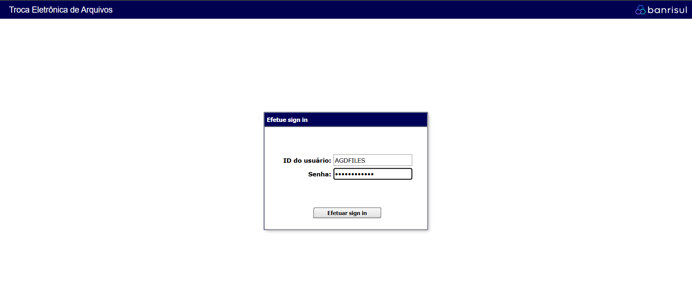
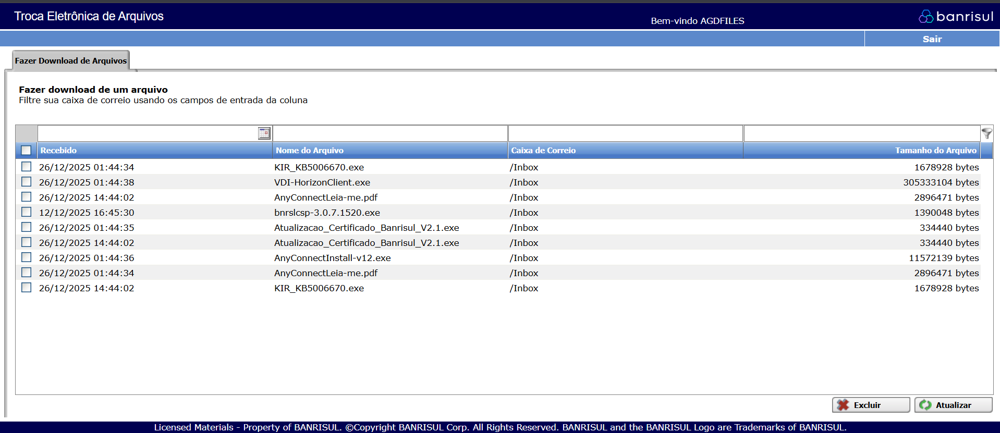
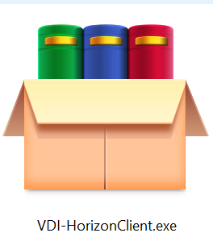
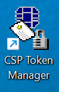
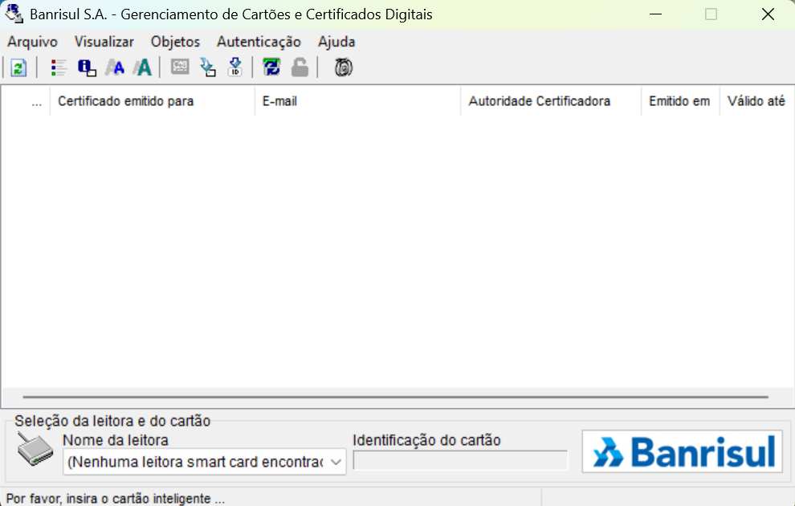
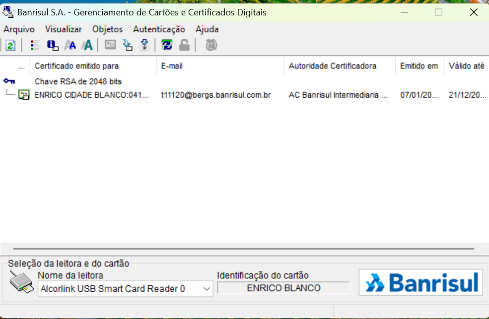
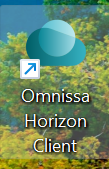
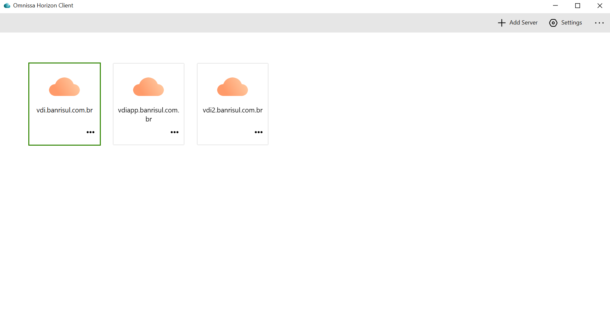
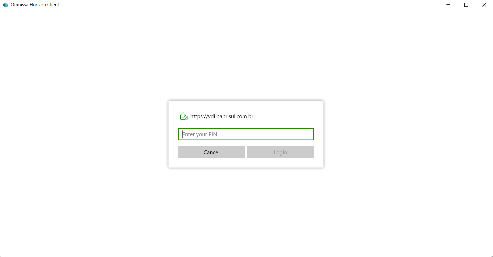
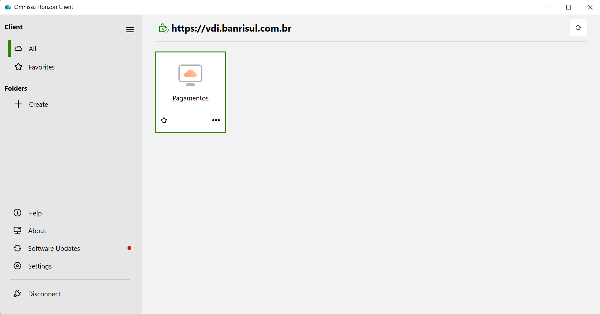

# Configuração de acesso à estação virtualizada

### Primeira Etapa: Download dos Arquivos

Para acessar à sua estação virtualizada ([VDI - Infraestrutura de Desktop Virtual](../../dicionario-banrisul.md#vdi---virtual-desktop-infrastructure)) é necessário seguir os seguintes passos:

1. Acesse o site https://edi.banrisul.com.br/. 
2. Ao acessar o link, você será direcionado a uma tela de login da Troca de arquivos, onde deverá ser inserido:
   - **LOGIN:** AGDFILES (tudo maiúsculo)
   - **SENHA:** contingencia (tudo minúsculo)

   

3. Posterior ao login, você será levado a uma tela onde consta uma série de arquivos para download. 

   

   Nesta tela, inicialmente vamos baixar o **“VDI -HorizonCliente.exe”**, este qual será o programa de acesso. Siga o processo de download até o final, deixando um acesso pronto na Área de Trabalho do seu computador. Depois de executar o download, pode deixá-lo fechado, para que sigamos com as demais configurações.

   

4. Reinicie o computador.

5. **Instalação do Gerenciador do Cartão (CSP Token Manager)**
   
   - Retorne à tela de downloads do passo anterior.
   - Baixe o arquivo `AnyConnectInstall-v12.exe`.
   - Execute o instalador. Ele instalará duas aplicações: o *AnyConnect* (VPN, que não utilizaremos) e o **CSP Token Manager** (essencial para a leitura do cartão).

   

### Pré-requisitos para a segunda etapa (Físico)

Para prosseguir, você precisará dos itens físicos que devem ser retirados presencialmente:

* **Leitora de Cartão:** Disponibilizada no **15º andar** (após a catraca, na porta com câmera frontal).
* **Cartão Identidade Digital Banrisul:** Solicitado no mesmo local da leitora.
    * *Atenção:* O cartão virá com a senha padrão `banrisul`.

### Segunda Etapa: Utilização do Cartão e Acesso à VDI

#### Ativando o cartão no CSP Token Manager

1. Insira a leitora de cartão na porta USB do seu notebook.
   > **Dica:** Se possível, utilize uma porta **USB 3.1** para evitar erros de leitura.
2. Abra o programa **CSP Token Manager**.
   
   

3. Valide se a leitora aparece identificada no programa (ex: *Dexton* ou outra marca).
4. Insira o **Cartão Identidade Digital** na leitora com o programa aberto.
   - O comportamento esperado é um *loading* seguido da identificação das informações do cartão na tela.
   
   

> **Troubleshooting:** É comum ocorrerem erros na leitura. Tente retirar e colocar o cartão até 5 vezes. Se persistir, feche o CSP Token Manager, remova a leitora do USB e tente novamente.

#### Acessando a VDI

1. Com o cartão devidamente identificado, abra o **Omnissa Horizon Client** na sua Área de Trabalho.

   
   
   

2. Selecione a opção de acesso: `vdi.banrisul.com.br`.
   > **Nota:** Se você logar no Horizon e a tela estiver **totalmente vazia**, significa que os fluxos de liberação do lado do Banco ainda não foram concluídos. Neste caso, contate seu gestor para que se faça a solicitação ao time **Fábrica do Banrisul** para a disponibilização da máquina virtual. O processo de liberação leva, em média, de **2 a 4 dias**.

3. Uma janela solicitará sua senha. Digite a senha do seu Cartão Identidade Digital (padrão `banrisul` ou a que você definiu).
   
   

4. Clique no ícone **"Pagamentos"**.
   
   

5. O sistema fará o login automático utilizando a credencial do seu cartão.

> **Nota:** Caso solicite usuário/senha novamente e apareça "Outras opções de acesso", selecione a opção **Cartão**.
