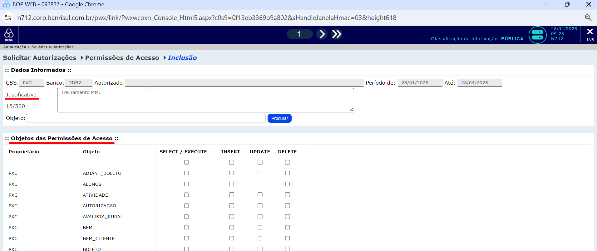
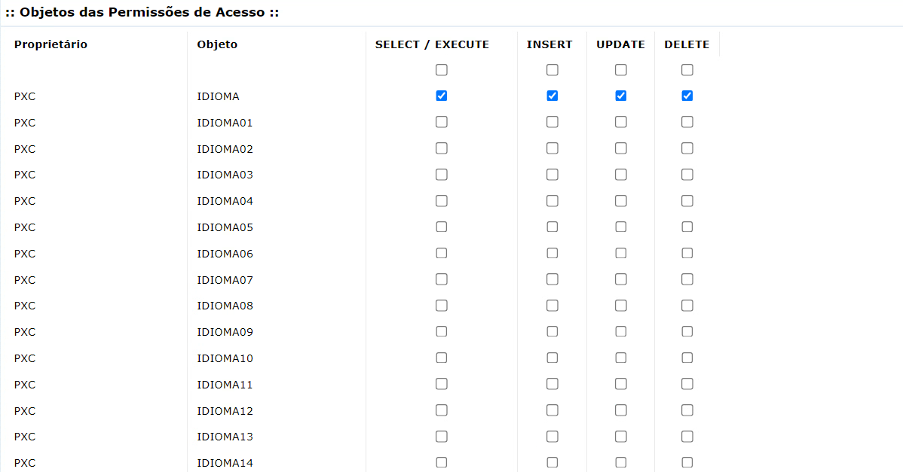
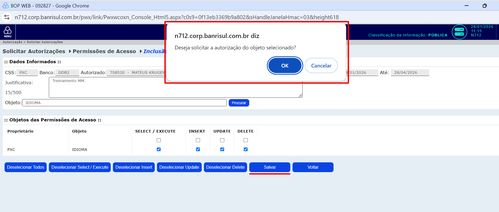

### Requisitando Acesso a Tabelas

Para realizarmos operações de leitura nas tabelas presentes no banco DB2 do Banrisul, precisaremos pedir permissão. O processo funciona por meio do sistema **BOP WEB**, onde apontaremos as tabelas que queremos adquirir o acesso e registraremos o pedido.
Após o pedido ter sido feito precisaremos esperar um pouco, pois o processo de atendimento das requisições não é instantâneo. Mesmo assim, caso acabar levando muito tempo, talvez seja necessário contatar o [HelpDesk](../../../../dicionario-banrisul.md#equipe-helpdesk).

### 1. Acesse a página do BOP

Acesse o [MMDesenv](../../../../dicionario-banrisul.md#mmdesenv---ambiente-operacional-de-desenvolvimento) e, após a página carregar e obter os dados da sua matrícula pelo cartão de acesso,
preencha a sua senha no campo **pin**, mantendo o campo **produto** em branco.

O menu de aplicativos então irá aparecer. Você deve escolher a opção **BOP WEB**.

### 2. Solicitando Autorização

Após a página do **BOP WEB** ter aberto, clique em "Autorização" no menu lateral esquerdo.

Selecione agora a opção "Solicitar Autorizações".

Preencha o campo **CSS** com o valor **PXC** e selecione **DDB2** no campo **Banco** e **Tabela** no campo **Tipo Objeto**. Após fornecer as informações necessárias, clique em **Cadastrar**.

Agora, a tela de seleção de tabelas e operações irá aparecer. O primeiro passo aqui é preencher o campo **Justificativa** com a razão de estarmos requisitando acesso às tabelas que escolheremos em seguida. A justificativa sempre vai depender do contexto da solicitação — para o nosso caso, onde precisamos das tabelas para prosseguir com o treinamento, podemos colocar "Treinamento MM.". Agora devemos buscar a tabela `IDIOMA` nos **Objetos das Permissões de Acesso** e selecionar todas as operações relacionadas a ela.

Para selecionar as operações desejadas em cada tabela, basta clicar nos respectivos checkboxes.

Caso você deseje buscar as tabelas pelo mecanismo de pesquisa utilizando o nome do objeto, **elas deverão ser requisitadas separadamente**, pois, ao realizar a busca por uma segunda tabela após selecionar operações na primeira, o sistema desmarca automaticamente os itens previamente selecionados, ocasionando a perda da seleção inicial.
Após selecionar a tabela desejada, basta clicar no botão "Salvar" que está localizado abaixo da lista de tabelas e, após ter clicado, uma mensagem de confirmação aparecerá, bastando clicar em "Ok" para concluir o processo.

Repita o processo da solicitação para todas as tabelas necessárias (`IDIOMA`, `CATEGORIA`, `CLIENTE_PXC`, `CAD_PRODUTO`, `CONTA` e `CONTRATO`).

Após estes passos terem sido concluídos teremos já conseguido acesso a todas as tabelas necessárias e damos o processo como encerrado.
