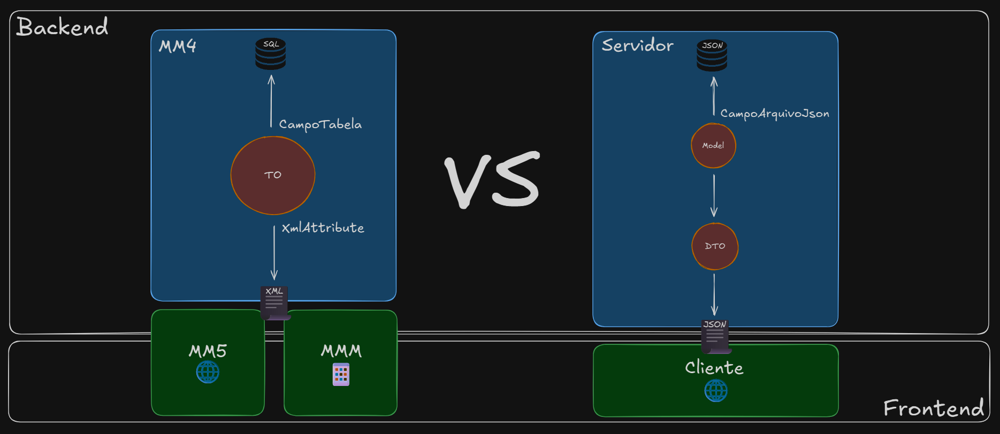
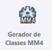
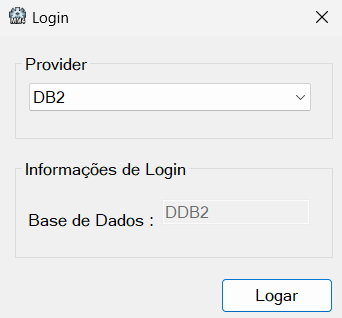
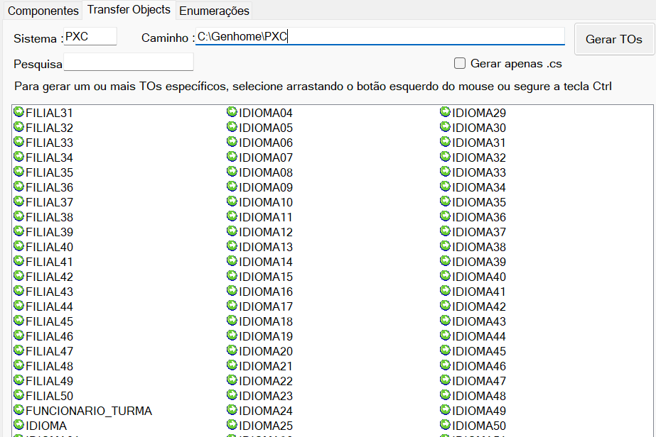

# TOs

Os padrões Model, DTO e Wrapper formam a base para entender o tipo de objeto mais importante no desenvolvimento MM4: o [**TO**](../../dicionario-banrisul.md#to---transfer-object).

Relembrando:

- **Models** representam espelho da **estrutura persistida** dos dados (tabela/colunas).
- **DTOs** representam o **dado em trânsito**, usado para trafegar entre camadas ou sistemas.
- **Wrappers** adicionam **contexto**, **estado** ou **metadados**, complementando Models e DTOs.

Compreendendo isso, podemos considerar um **TO** uma espécie de "super-objeto" dentro do MM4, pois ele **combina características de Model e DTO** e **faz uso interno intensivo de Wrappers**.

## TOs no MM4

Os **TOs (Transfer Objects)** são estruturas centrais no ecossistema MM4 porque unificam três papéis:

- Representam tabelas e campos da base de dados (como uma Model);
- Transportam dados entre diferentes partes da aplicação (como um DTO);
- Carregam wrappers de controle de estado por campo (wrappers de dados).

Isso faz com que um TO seja capaz de refletir com precisão o esquema da base de dados, trafegar dados de forma consistente entre camadas e manter estados e informações extras de objeto e de seus respectivos campos;

Essa combinação — apesar de contra-intuitiva quando pensamos em separação de responsabilidades e boas práticas de engenharia de software — torna os TOs muito poderosos no ecossistema.

## Anatomia geral de um TO

A estrutura típica de um TO dentro de um projeto MM4 é semelhante a isso:

```csharp
namespace Bergs.Pxc.Pxcbtoxn
{
    public class TOUsuario: TOTabela
    {
        public const string TABELA = "PXC.USUARIO";

        public const string ID_USUARIO = "ID_USUARIO";
        public const string NOME_USUARIO = "NOME_USUARIO";
        public const string DATA_NASCIMENTO = "DT_NASCIMENTO";

        [XmlAttribute("id_usuario")]
        [CampoTabela(ID_USUARIO, Chave = true, Obrigatorio = true, TipoParametro = DbType.Int32, Tamanho = 8, Precisao = 8)]
        public CampoObrigatorio<int> IdUsuario { get; set; } 

        [XmlAttribute("nome_usuario")] 
        [CampoTabela(NOME_USUARIO, Obrigatorio = true, TipoParametro = DbType.String, Tamanho = 35, Precisao = 35)]
        public CampoObrigatorio<string> Nome { get; set; }
        
        [XmlAttribute("data_nasc")]
        [CampoTabela(DATA_NASCIMENTO, TipoParametro = DbType.Date)]
        public CampoOpcional<DateTime> DataNascimento { get; set; }
    }
}
```

> Nota: Essa estrutura é somente lúdica e não reflete a estrutura real do TO de usuários.

Possui quatro elementos fundamentais:

### Herança da classe base `TOTabela`

Essa classe base fornece:

- Comportamento de mapeamento objeto–relacional (mecanismo de apoio à persistência de dados);
- Regras internas de _serialização_ e _desserialização_ [XML](../../dicionario-banrisul.md#xml---extensible-markup-language) (mecanismo de apoio ao transporte de dados);
- Infraestrutura para manipulação dos wrappers de dados.

### Wrappers de dados para controle de estado (por campo)

TOs não usam tipos nativos simples como `string`, `int` etc em seus campos. Ao invés disso, utilizam wrappers como `CampoObrigatorio<T>` e `CampoOpcional<T>`, esses wrappers fornecem:

- Controles extras de estado dos campos;
- Validações automáticas;
- Tratamento seguro de dados;
- Padronização de acesso de valores.

### Atributo de mapeamento objeto-relacional `CampoTabelaAttribute`

Conectam o TO à tabela e suas colunas.

O atributo `[CampoTabela]` permite informar:

- Nome do campo na base;
- Se é uma chave primária;
- Se é um campo obrigatório (não nulo);
- Tipo respectivo em contexto da base de dados;
- Tamanho, precisão e escala.

Esses parâmetros de atributo permitem que o framework MM4 faça persistência automática nas devidas camadas de dados.

### Atributo de mapeamento objeto-XML `XmlAttribute`

Como a maior parte da comunicação entre aplicações no ecossistema do Banrisul se dá através de formato XML, o TO pode definir como cada campo será _serializado_ e _desserializado_ nas comunicações.

### Detalhando

```csharp
/*
 * Nome do projeto - TOs é "Pxcbtoxn", onde:
 *  "Pxc" = CSS do sistema de treinamentos
 *  "b" = Identificador de um projeto - TOs
 *  "to" = Identificador curto para o TO alvo (ex.: IDIOMA - id, CATEGORIA - ct ) — como nesse caso utilizaremos um só projeto para todos os TOs, o id será literalmente "to"
 *  "xn" = Identificador de um projeto do tipo MM4
*/
namespace Bergs.Pxc.Pxcbtoxn
{
    public class TOUsuario: TOTabela // Herança da classe base
    {
        /*
         * Constantes públicas centralizando os nomes da tabela e dos campos de tabela — uma boa prática, pois esses nomes 
         * são usados em outros lugares ao longo da aplicação
        */
        public const string TABELA = "PXC.USUARIO";

        public const string ID_USUARIO = "ID_USUARIO";
        public const string NOME_USUARIO = "NOME_USUARIO";
        public const string DATA_NASCIMENTO = "DT_NASCIMENTO";

        /*
         * Indica que o campo IdUsuario do TO se chamará "id_usuario" nos XMLs
        */
        [XmlAttribute("id_usuario")]
        /*
         * Indica que o campo IdUsuario do TO será mapeado com o campo de tabela "ID_USUARIO" (valor da constante) do 
         * banco de dados — que é um uma chave primária, não nulo (obrigatório), do tipo Int32 (possivelmente INTEGER) 
         * e de tamanho e precisão 8 (a precisão é desnecessária pois int não tem casa decimal, mas se manda o mesmo valor
         * do tamanho por convenção)
        */
        [CampoTabela(ID_USUARIO, Chave = true, Obrigatorio = true, TipoParametro = DbType.Int32, Tamanho = 8, Precisao = 8)]
        /*
         * Envelopado com o wrapper CampoObrigatorio<int> para agregar comportamentos adicionais de controle ao TO
        */
        public CampoObrigatorio<int> IdUsuario { get; set; } 

        /*
         * Indica que o campo Nome do TO se chamará "nome_usuario" nos XMLs
        */
        [XmlAttribute("nome_usuario")] 
        /*
         * Indica que o campo Nome do TO será mapeado com o campo de tabela "NOME_USUARIO" (valor da constante) do 
         * banco de dados — que é não nulo (obrigatório), do tipo STRING (possivelmente VARCHAR) e de tamanho e precisão 35
         * (a precisão é desnecessária pois CHAR e VARCHAR não tem nenhum tipo de configuração de precisão, mas se 
         * manda o mesmo valor do tamanho por convenção)
        */
        [CampoTabela(NOME_USUARIO, Obrigatorio = true, TipoParametro = DbType.String, Tamanho = 35, Precisao = 35)]
        /*
         * Envelopado com o wrapper CampoObrigatorio<string> para agregar comportamentos adicionais de controle ao TO
        */
        public CampoObrigatorio<string> Nome { get; set; }
        
        /*
         * Indica que o campo DataNascimento do TO se chamará "data_nasc" nos XMLs
        */
        [XmlAttribute("data_nasc")]
        /*
         * Indica que o campo DataNascimento do TO será mapeado com o campo de tabela "DT_NASCIMENTO" (valor da constante) do 
         * banco de dados — que é do tipo Date (possivelmente DATE)
        */
        [CampoTabela(DATA_NASCIMENTO, TipoParametro = DbType.Date)]
        /*
         * Envelopado com o wrapper CampoOpcional<DateTime> para agregar comportamentos adicionais de controle ao TO
        */
        public CampoOpcional<DateTime> DataNascimento { get; set; }
    }
}
```

> Nota: Essa estrutura é somente lúdica e não reflete a estrutura real do TO de usuários.

&nbsp; <!-- Manter para que haja a separação entre os dois blocos -->
> Curiosidade:
>
> **Por que o atributo `CampoTabelaAttribute` não aparece como `[CampoTabelaAttribute]` na hora do seu uso?**
> Essa é uma convenção do C#: todo atributo configurado para trabalhar como "anotação" em classes, propriedades, etc. tem o sufixo _Attribute_ opcional na hora do uso — ou seja, pode-se usar ou não.
>
> **Mas então por que o atributo `XmlAttribute` aparece como `[XmlAttribute]` na hora do uso?**
> Essa classe é nativa do .NET, e na verdade seu real nome é  `XmlAttributeAttribute` — uma redundância não intencional, devido à (infeliz) coincidência histórica de que o nome funcional desejado também já terminava com _Attribute_.
>
> Referência: <https://learn.microsoft.com/pt-br/dotnet/api/system.xml.serialization.xmlattributeattribute?view=netframework-4.8.1>
>

## Mini-laboratório de atributos

Vamos trabalhar agora na **v4 da nossa solução Cliente-Servidor** (fornecida na pasta da aula). Aqui vamos usar um novo atributo de classe fornecido pelo framework: `CampoArquivoJsonAttribute`, que vai nos auxiliar a personalizar o nome dos campos no momento que persistimos as models nos arquivos JSON de armazenamento. Vamos adaptar a model de idiomas:
<!-- Boilerplate em [./_assets/01-cliente-servidor-boilerplate-v4/] -->

```csharp
using PseudoFramework.ServidorUtils;
using System;

namespace Servidor.Models
{
    public class IdiomaModel
    {
        public int Id { get; set; }
        [CampoArquivoJson("descricao-idioma")]
        public string Descricao { get; set; }
        [CampoArquivoJson("usuario-ult-alteracao-idioma")]
        public string UsuarioUltimaAlteracao { get; set; }
        [CampoArquivoJson("Data-hora-ult-alteracao-idioma")]
        public DateTime DataHoraUltimaAlteracao { get; set; }
    }
}
```

Execute as operações e verifique dentro do arquivo JSON de idiomas as novas chaves armazenadas.

> Atenção: Limpe a pasta `data` caso já tenha arquivos JSON armazenados.

### Dica extra

Exercitando através deste mini-laboratório, conseguimos fazer uma análise de similaridades entre as soluções contidas no MM4 e no framework fake:



> Nota: Analisadas as similaridades, perceba que na solução com o framework fake (nosso Cliente-Servidor) não faria sentido ter um atributo de personalização de mapeamento de transporte (assim como é feito com o `[XmlAttribute]` no MM4), justamente porque na nossa solução as Models e os DTOs estão separados, então o mapeamento é feito de um tipo para o outro — é o mesmo problema sendo resolvido através de duas estratégias diferentes.

## Complemento sobre os wrappers de dados

Os wrappers de dados `CampoObrigatorio<T>` e `CampoOpcional<T>` utilizados nos campos dos TOs agregam algumas funcionalidades interessantes:

### Controle de estados

Agregam 3 estados possíveis:

- _SETADO COM CONTEÚDO_;
- _NÃO SETADO_;
- _SETADO SEM CONTEÚDO_ (exclusivo para o `CampoOpcional<T>`).

As características que definem essas possibilidades de estados são:

- bool `FoiSetado`: Propriedade que indica se o conteúdo encapsulado foi definido (setado) ou não.
  - Construir um novo `CampoObrigatorio<T>`/`CampoOpcional<T>` **com um parâmetro T não nulo** ou **atribuir um valor T não nulo** a um objeto existente são a forma de se obter um objeto _SETADO COM CONTEÚDO_:
  
  ```csharp
  var obrigatorio = new CampoObrigatorio<int>(150);
  obrigatorio.FoiSetado; // true  

  var opcional = new CampoOpcional<int>(150);
  opcional.FoiSetado; // true

  var opcional2 = new CampoOpcional<int>();
  opcional2 = 170;
  opcional2.FoiSetado; // true
  ```

  - Construir um novo `CampoObrigatorio<T>`/`CampoOpcional<T>` **sem parâmetro** é a foma de se obter um objeto _NÃO SETADO_:
  
  ```csharp
  var obrigatorio = new CampoObrigatorio<int>();
  obrigatorio.FoiSetado; // false

  var opcional = new CampoOpcional<int>();
  opcional.FoiSetado; // false
  ```

- bool `TemConteudo` (exclusivo no `CampoOpcional<T>`): Propriedade que indica se o conteúdo encapsulado é não nulo.
  - Construir um novo `CampoOpcional<T>` **com um parâmetro T nulo** ou **atribuir um valor T nulo** a um objeto existente é a forma de se obter um objeto _SETADO SEM CONTEÚDO_:

  ```csharp
  var opcional = new CampoOpcional<string>(null);
  opcional.FoiSetado; // true
  opcional.TemConteudo; // false

  var opcional2 = new CampoOpcional<string>("ABC");
  opcional2.FoiSetado; // true
  opcional2.TemConteudo; // true
  
  opcional2 = null;
  opcional2.FoiSetado; // true
  opcional2.TemConteudo; // false
  ```

  > Nota: Por design, não é possível a obtenção de um `CampoObrigatorio<T>` _SETADO SEM CONTEÚDO_, pois esse wrapper não suporta nem construção **com parâmetro T nulo**, e nem **atribuição de um valor T nulo** — esse é um exemplo de benefício de um wrapper.

O mapa de estados resultante das combinações acima pode ser descrito como:

| _Wrapper_ | `FoiSetado` | `TemConteudo` | _SETADO COM CONTEÚDO_ | _NÃO SETADO_ | _SETADO SEM CONTEÚDO_ |
| :- | :-: | :-: | :-: | :-: | :-: |
| `CampoObrigatorio<T>` | _true_ | _-_ | ✘ | | |
| `CampoObrigatorio<T>` | _false_ | _-_ | | ✘ | |
| `CampoOpcional<T>` | _true_ | _true_ | ✘ | | |
| `CampoOpcional<T>` | _false_ | _false_ | | ✘ | |
| `CampoOpcional<T>` | _true_ | _false_ | | | ✘ |

### Obtenção dos valores envelopados

Para se obter os valores de fato dos wrappers, existem as seguintes propriedades:

- T `Conteudo`: Propriedade que possui o valor encapsulado e é altamente sujeita a _erros de runtime_ em casos de tentativa de obtenção quando em estado _NÃO SETADO_:

```csharp
  var obrigatorio = new CampoObrigatorio<int>();
  obrigatorio.Conteudo; // InvalidOperationException

  var opcional = new CampoOpcional<string>();
  opcional.Conteudo; // InvalidOperationException

  var opcional2 = new CampoOpcional<decimal>();
  if (opcional2.FoiSetado)
    opcional2.Conteudo; // pega o valor sem erros
```

- Método `LerConteudoOuPadrao(...)`: Método para obtenção do valor encapsulado, porém nesse caso efetua um tratamento silencioso de falhas, fazendo com que, em caso de o objeto estar em estado _NÃO SETADO_, retorne como [Fallback](../../dicionario-banrisul.md#fallback) o valor default para o tipo T ou um valor especificado como parâmetro na chamada:

```csharp
  var obrigatorio = new CampoObrigatorio<int>();
  obrigatorio.LerConteudoOuPadrao(); // 0 (default de int)
  obrigatorio.LerConteudoOuPadrao(999); // 999
  
  var opcional = new CampoOpcional<string>();
  opcional.LerConteudoOuPadrao(); // null (default de string)
  opcional.LerConteudoOuPadrao("Plano B"); // Plano B
```

### Comparadores

`CampoObrigatorio<T>` e `CampoOpcional<T>` tem operadores de conversão implícita e operadores de igualdade configurados, que permitem atribuição e _checks_ de igualdade/diferença utilizando diretamente os valores, e desconsiderando os wrappers em si:

```csharp
var johnDoe = new CampoObrigatorio<string>("John Doe");
var janeDoe = new CampoObrigatorio<string>("Jane Doe");
var maryMonroe = new CampoObrigatorio<string>("Mary Monroe");

maryMonroe = janeDoe.Conteudo; // Conversão implícita — já joga a string diretamente pra dentro do valor envelopado

janeDoe == maryMonroe; // Check de igualdade — já compara os valores envelopados diretamente — nesse caso: true
```

## Laboratório

Chegou a hora de _"tirarmos as rodinhas da bicicleta"_ e começarmos a andar com o MM4. Nesse laboratório, vamos gerar nosso projeto de TOs com o primeiro TO: `TOIdioma`.

A partir daqui, vamos fazer algumas revisitações na solução Cliente-Servidor, porém em grande parte agora vamos aproveitar as user stories e casos de teste confeccionados nos laboratórios de negócio e requisitos e casos de teste, para trabalhar diretamente em cima dos projetos MM4.

Relembrando as stories (de forma resumida) de idiomas:

```gherkin
US1 - Inclusão de novo idioma

Como um analista de operações globais
Eu quero incluir um novo idioma informando seu código textual ISO combinado e sua descrição
Para que o banco possa registrar oficialmente os idiomas suportados nas operações internacionais
```

```gherkin
US2 - Remoção de idioma

Como um analista de operações globais
Eu quero remover um idioma previamente cadastrado
Para evitar que equipes selecionem idiomas obsoletos e reduzir erros operacionais
```

```gherkin
US3 - Alteração de dados de idioma

Como um analista de operações globais
Eu quero alterar a descrição de um idioma já cadastrado
Para corrigir descrições incorretas ou melhorar sua clareza
```

```gherkin
US4 - Listagem de idiomas

Como um gerente de expansão global
Eu quero visualizar a lista de todos os idiomas cadastrados
Para verificar se o banco já possui suporte linguístico para regiões com as quais estamos negociando
```

```gherkin
US5 - Consulta de idioma por código

Como um gerente de produtos digitais
Eu quero consultar um idioma pelo seu código
Para validar rapidamente operações com parceiros estrangeiros
```

### Passo 1: Modelagem dos dados pela equipe Bancos de Dados

Agora a premissa de modelagem dos dados anterior à implementação se torna ainda mais concreta, pois de fato temos na base **IBM DB2** uma tabela já criada para idiomas:

```sql
SELECT
    COD_IDIOMA     -- INTEGER  NN PK
  , DESC_IDIOMA    -- CHAR(50) NN
  , COD_USUARIO    -- CHAR(6)
  , DTHR_ULT_ATU   -- TIMESTAMP
FROM PXC.IDIOMA;
```

> Nota: É comum os nomes de tabelas, campos, projetos, sistemas, produtos, etc. aplicarem recursos da linguagem portuguesa como abreviações, acrônimos, composições de palavras, etc. Isso tudo pode ser um pouco desafiador no início — faça o máximo de uso possível do dicionário.

### Passo 2: Criar o projeto de TOs

Para criar o projeto de TOs vamos fazer uso da nossa primeira ferramenta do [PZP](../../dicionario-banrisul.md#pzp---ferramenta-de-apoio-ao-desenvolvimento): O **Gerador de Classes MM4**:



O Gerador de classes MM4 é um utilitário que possibilita a geração dos projetos que contém as classes para construção agilizada das aplicações MM4, fornecendo, entre outros recursos, a criação do projeto de TOs com base nos dados contidos nas bases de dados.

Com o gerador aberto, vamos selecionar **DB2** como _Provider_ (nossa base de dados alvo):



Após o "login", com o metamodelo **MM4** selecionado, vamos navegar até a aba _Transfer Objects_, e vamos preencher os campos **Sistema** com o [CSS](../../dicionario-banrisul.md#css---código-de-sigla-de-sistema) do nosso interesse (nesse caso _PXC_), e **Caminho** com o caminho PXC da pasta Genhome (`C:\Genhome\PXC`).

Isso vai ocasionar um _loading_ automático dos objetos na lista, então, vamos localizar a tabela **IDIOMA**, selecioná-la e clicar em **Gerar TOs**:



Com isso, uma mensagem de sucesso será exibida e uma pasta de projeto de TOs será gerada na `Genhome`.
Podemos fechar o gerador.

> Atenção: O projeto de TOs deve ser gerado **uma única vez**. Isso significa que para os outros TOs que gerarmos no futuro, a opção **Gerar apenas .cs** deverá ser marcada antes da geração. Isso vai fazer com que os arquivos gerais de projeto não sejam gerados novamentes — vamos colocar todos os TOs dentro do único projeto criado.

### Passo 3: Revisão manual de conformidade do projeto e movimentação para a `Desenvhome`

Essa revisão é apenas uma ação de segurança, onde vamos conferir se o material gerado dentro da pasta está conforme o que esperávamos em termos de "esqueleto" de projeto. A nossa expectativa nesse caso é encontrar uma estrutura de arquivos semelhante a essa:

```makefile
PXC\
└── pxcbtoxn\                         # Pasta do projeto - TOs
    ├── pgm\                          # Pasta de arquivos do "programa"
    |   ├── pxcbtoxn_AssemblyInfo.cs  # Arquivo de metadados de compilação
    |   └── pxcbtoxn_TOIdioma.cs      # Arquivo do TO de idiomas
    └── pxcbtoxn.csproj               # Arquivo .NET do projeto
```

Se o material gerado conferir com essa estrutura, está tudo ok para ser movido para a `Desenvhome`.

Vamos mover toda a pasta **pxcbtoxn** para dentro de `C:\Desenvhome\PXC`.

> Atenção: Seguindo a mesma ideia mencionada também no passo 2, a partir da segunda vez que estivermos gerando outros TOs, a estrutura gerada será bem semelhante, porém não terá os arquivos de metadados de compilação (`[...]Assembly.cs`) e nem o arquivo .NET do projeto (`[...].csproj`). Nesse caso basta mover os TOs necessários para dentro do projeto já criado e incluí-los pelo Visual Studio.

### Passo 4: Refinamento preliminar do código

Vamos abrir o projeto `pxcbtoxn.csproj` no Visual Studio, acessando o arquivo `pxcbtoxn_TOIdioma` para fazer alguns refinamentos:

- Vamos utilizar as sugestões de simplificação trazidas pelo intellisense;
- Vamos reorganizar os blocos `#region`;
- Vamos reorganizar os summaries;
- Vamos reorganizar os imports;

> Nota: Por mais que no Visual Studio estejamos vendo uma solution envolvendo o projeto, isso é um recurso "fake" do Visual Studio — fisicamente o projeto ainda não possui um arquivo concreto de solution `.sln`. Nos próximos tópicos vamos criar uma solution e organizar melhor essa estrutura.

### Passo 5: Implementação da lógica para o Código ISO combinado

O código ISO combinado é um recurso fictício, implementado exclusivamente para os laboratórios. Ele não existe oficialmente no sistema PXC. Vamos implementá-lo:

#### Passo 5.1: Adicionar o utilitário FECONID ao projeto

Dentro da pasta `pgm`, vamos adicionar o arquivo `Pxcbtoxn_Feconid` para agregar o utilitário ao projeto, seguindo o mesmo padrão de convenções de nomenclaturas:

```csharp
using System;
using System.Text;

namespace Bergs.Pxc.Pxcbtoxn
{
    /// <summary>
    /// Ferramenta de conversão de códigos de idiomas
    /// </summary>
    public static class Feconid
    {
        private const int B_27 = 27;

        /// <summary>
        /// Método para converter código ISO combinado para código numérico
        /// </summary>
        /// <param name="iso">Código ISO combinado</param>
        /// <returns>Código numérico</returns>
        public static int IsoToCodigo(string iso)
        {
            if (string.IsNullOrEmpty(iso))
                throw new ArgumentException("código combinado ISO não pode ser nulo ou vazio.");

            var parts = iso.Split('-');
            if (parts.Length != 2)
                throw new ArgumentException("Formato inválido do código combinado ISO. Deve ser 'll-PP' ou 'lll-PP'.");

            string idioma = parts[0].ToLower();
            string pais = parts[1].ToUpper();

            if (idioma.Length < 2 || idioma.Length > 3)
                throw new ArgumentException("Idioma deve ter 2 a 3 caracteres.");
            
            if (pais.Length != 2)
                throw new ArgumentException("País deve ter 2 caracteres.");

            int idiomaLength = idioma.Length;

            int codigo = idiomaLength;

            foreach (var caractere in idioma)
                codigo = codigo * B_27 + CaractereToNumero(caractere);

            foreach (var ch in pais)
                codigo = codigo * B_27 + CaractereToNumero(ch);

            return codigo;
        }

        /// <summary>
        /// Método para converter código numérico p0ara código ISO combinado
        /// </summary>
        /// <param name="codigo">Código numérico</param>
        /// <returns>Código ISO combinado</returns>
        public static string CodigoToIso(int codigo)
        {
            if (codigo <= 0)
                throw new ArgumentException("Código numérico inválido.");

            var iso = new StringBuilder();

            while (codigo > 0)
            {
                int remainder = codigo % B_27;

                iso.Insert(0, NumeroToCaractere(remainder));

                codigo = codigo / B_27;
            }

            if (iso.Length < 3)
                throw new Exception("Número inválido de caracteres para conversão.");

            int idiomaLength = CaractereToNumero(iso[0]);
            if (idiomaLength < 2 || idiomaLength > 3)
                throw new ArgumentException("Idioma deve ter 2 a 3 caracteres.");

            string idioma = iso.ToString(1, idiomaLength).ToLower();

            string pais = iso.ToString(1 + idiomaLength, iso.Length - 1 - idiomaLength).ToUpper();

            return $"{idioma}-{pais}";
        }

        private static int CaractereToNumero(char caractere)
        {
            caractere = char.ToUpper(caractere);

            if (caractere < 'A' || caractere > 'Z')
                throw new ArgumentException($"Caractere {caractere} inválido.");

            return caractere - 'A' + 1;
        }

        private static char NumeroToCaractere(int numero)
        {
            if (numero < 1 || numero > 26)
                throw new ArgumentException($"Número {numero} inválido.");

            return (char)('A' + numero - 1);
        }
    }
}
```

#### Passo 5.2: Adicionar campo no TO

No TO de idiomas, vamos adicionar o campo do código ISO combinado:

```csharp
using Bergs.Pwx.Pwxodaxn;
using Bergs.Pwx.Pwxoiexn;
using System;
using System.Data;
using System.Xml.Serialization;

namespace Bergs.Pxc.Pxcbtoxn
{
    /// <summary>
    /// Representa um registro da tabela IDIOMA da base de dados PXC
    /// </summary>
    public class TOIdioma: TOTabela
    {
        // [...]

        /// <summary>
        /// Campo calculado código ISO combinado de idioma
        /// </summary>
        [XmlAttribute("cod_iso_idioma")]
        public CampoObrigatorio<string> CodigoIsoCombinado { get; set; }

        // [...]
    }
}
```

Ele não vai ser anotado com o atributo `[CampoTabela]`, pois não é persistido na base de dados, logo não há configurações a serem feitas para isso.

#### Passo 5.3: Implementar mapeamento no método `PopularRetorno(...)`

Antes de qualquer coisa, vamos entender que o método `PopularRetorno(...)` é um _método virtual_ da classe base `TOTabela`, e sua principal função é fazer o mapeamento dos dados advindos das consultas na base de dados para dentro dos campos do TO.
Por exemplo, converter para uma propriedade `string` do TO um campo `VARCHAR` resultante de uma consulta na base de dados.

Este método está sobrescrito no TO de idiomas, com os comportamentos de mapeamento explícitos. Vamos aproveitar isso pra já fazer com que o código ISO combinado seja calculado assim que uma consulta retorna um código numérico:

```csharp
using Bergs.Pwx.Pwxodaxn;
using Bergs.Pwx.Pwxoiexn;
using System;
using System.Data;
using System.Xml.Serialization;

namespace Bergs.Pxc.Pxcbtoxn
{
    /// <summary>
    /// Representa um registro da tabela IDIOMA da base de dados PXC
    /// </summary>
    public class TOIdioma: TOTabela
    {
        // [...]
        
        /// <summary>
        /// Constante com o nome do campo COD_IDIOMA na tabela IDIOMA
        /// </summary>
        public const string CODIGO_IDIOMA = "COD_IDIOMA";
        
        // [...]

        /// <summary>
        /// Popula os atributos da classe a partir de uma linha de dados.</summary>
        /// <param name="linha">Registro de dados retornado pelo acesso à base de dados.</param>
        public override void PopularRetorno(Linha linha)
        {
            // Percorre os campos que foram retornados pela consulta e converte seus valores para tipos do .NET
            foreach (Campo campo in linha.Campos)
            {
                switch (campo.Nome)
                {
                    case CODIGO_IDIOMA:
                        {
                            CodIdioma = Convert.ToInt32(campo.Conteudo);

                            CodigoIsoCombinado = Feconid.CodigoToIso(CodIdioma);

                            break;
                        }
                        
                    // [...]
                }
            }
        }

        // [...]
    }
}
```

Pronto. Nosso TO de idiomas está preparado para ser utilizado na aplicação, ainda vamos precisar implementar os locais que o utilizam.

## [Exercícios](02-exercicios.md)
