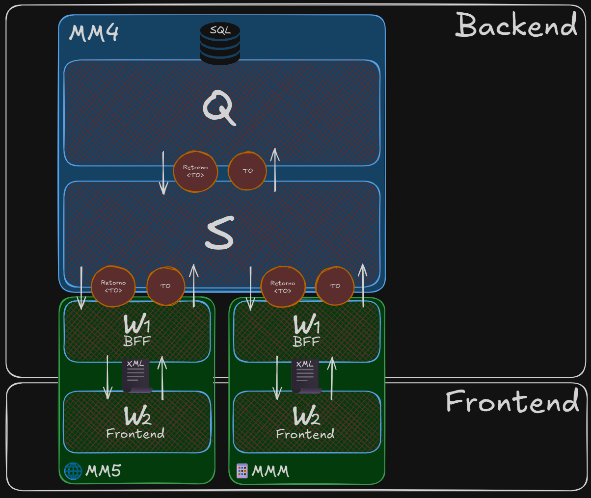

# Arquitetura 3 camadas MM4

A arquitetura tradicional em 3 camadas indica a forma como vamos enxergar a distribuição arquitetônica de uma aplicação MM4 através das camadas [**Q**](../../dicionario-banrisul.md#camada-q---camada-query), [**S**](../../dicionario-banrisul.md#camada-s---camada-service) e [**W**](../../dicionario-banrisul.md#camada-w---camada-web) (direcionada para MM5/MMM).

> Nota: Neste e nos próximos conteúdos abordaremos principalmente as camadas Q e S — pois estas são as camadas contidas no MM4. A camada W será abordada em maior detalhe no **Curso Framework MM5 Banrisul**.

Relembrando a forma como DAL, BLL e UI são separadas e se relacionam:

Nas camadas Q, S e W do MM4 a mecânica é muito semelhante. Os objetivos de organização de responsabilidades, separação de fluxos, redução de acoplamento e melhores definições de como a informação se move seguem os mesmos, porém agora, na arquitetura do MM4, os objetos trafegados entre-camadas são diferentes:

- No caminho de ida são enviados os TOs;
- No caminho de volta é retornado um wrapper de dados `Retorno<T>`, que envelopa TOs.

