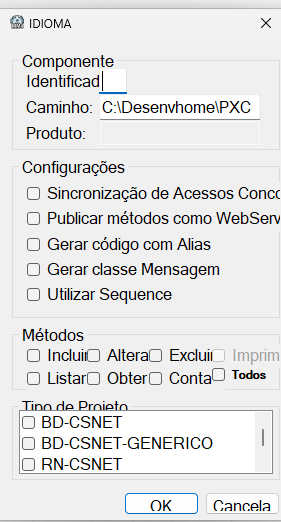
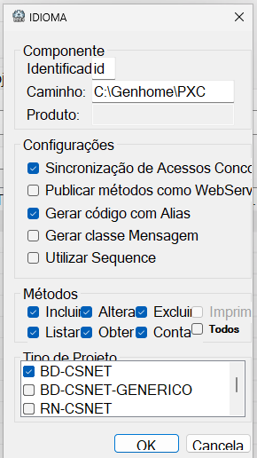
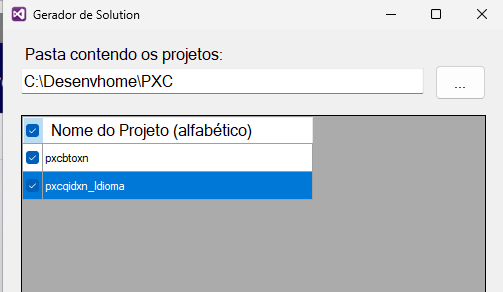

# Camada Q

A **camada Q**, em uma comparação direta, poderia ser vista como **algo equivalente a uma DAL**, sendo responsável por tudo que envolve **manipulação de dados junto às bases de dados** como: gerenciamento de conexão, tradução de informações para envio à base, execuções de comandos SQL e tradução de resultados para estruturas manipuláveis pela aplicação.

> Nota: No treinamento nossas camadas Q interagirão com a base de dados **IBM DB2**, mas camadas Q em geral também tem capacidade de interagir com bases de dados **Oracle**.

## Camada Q no MM4

Na **camada Q**, toda a interação com a base de dados de dados acontece por meio de **comandos SQL montados manualmente**, construídos diretamente como `string`.

Diferentemente de estratégias que utilizam **[ORM](../../dicionario-banrisul.md#orm---object-relational-mapping)s**, na camada Q não há geração automática de comandos SQL, nem processos intermediários que traduzem objetos em informação para a base de dados e vice versa. Aqui, o SQL é explícito — totalmente visível e controlado pelo desenvolvedor.

Apesar dessa abordagem mais direta, a camada Q não trabalha 100% "no bruto". Ela se apoia em um conjunto de **classes base e utilitários de infraestrutura**, responsáveis por padronizar tarefas recorrentes, como:

- Montagem de trechos comuns de SQL (`INSERT`, `WHERE`, `SET`, etc.);
- Gerenciamento de parâmetros;
- Execução segura e tipada dos comandos SQL;
- Manipulação de conexões e sessões;
- Tratamento uniforme de retornos e exceções.

Essas ferramentas reduzem duplicação e minimizam erros, mas a responsabilidade pelo conteúdo lógico do SQL — quais colunas, filtros, joins e regras de dados aplicar — permanece nas mãos do desenvolvedor.

Essa estratégia oferece vantagens como:

- **Performance:** O comando SQL é escrito sob medida, permitindo otimizações específicas para cada operação;
- **Previsibilidade:** O desenvolvedor sempre sabe exatamente o comando SQL que será executado na base de dados;
- **Flexibilidade:** Como os comandos SQL são manuais, fica mais fácil adaptar a mesma camada Q para trabalhar com diferentes bases de dados (como as já mencionadas **IBM DB2** e **Oracle**) sem depender das limitações de um ORM.

## Anatomia geral da camada Q

Na camada Q, normalmente é criado **um projeto por TO**. Isso significa que cada TO da aplicação possui seu próprio projeto de camada Q, contendo um **objeto BD** responsável por gerenciar todo o acesso a dados relacionado a aquele TO. Em outras palavras, um objeto BD pode ser comparado a um DAO, especializado em manipular exclusivamente os dados para aquele TO:

```makefile
PXC\
|
├── pxcbtoxn\                         # Pasta do projeto - TOs
|   ├── pgm\                          # Pasta de arquivos do "programa"
|   |   ├── pxcbtoxn_AssemblyInfo.cs  # Arquivo de metadados de compilação
|   |   ├── pxcbtoxn_TOIdioma.cs      # Arquivo do TO de idiomas
|   |   └── pxcbtoxn_TOUsuario.cs     # Arquivo do TO de usuários
|   └── pxcbtoxn.csproj               # Arquivo .NET do projeto
|
├── pxcqusxn_Usuario\                 # Pasta do projeto - Camada Q de usuários
|   ├── pgm\                          # Pasta de arquivos do "programa"
|   |   ├── pxcqusxn_AssemblyInfo.cs  # Arquivo de metadados de compilação
|   |   └── pxcqusxn_Usuario.cs       # Arquivo do objeto BD (semelhante ao DAO) de usuários
|   └── pxcqusxn.csproj               # Arquivo .NET do projeto
|
├── pxcqidxn_Idioma\                  # Pasta do projeto - Camada Q de idiomas
|   ├── pgm\                          # Pasta de arquivos do "programa"
|   |   ├── pxcqidxn_AssemblyInfo.cs  # Arquivo de metadados de compilação
|   |   └── pxcqidxn_Idioma.cs        # Arquivo do objeto BD (semelhante ao DAO) de idiomas
|   └── pxcqidxn.csproj               # Arquivo .NET do projeto
|
└── pxckcfxn.sln                      # Arquivo .NET da solução
```

## Anatomia geral de um objeto BD

A estrutura típica de um objeto BD dentro de um projeto MM4 é semelhante a isso:

```csharp
namespace Bergs.Pxc.Pxcqusxn
{
    public class Usuario: AplicacaoDados
    {
        /*
         * Alias centralizado em uma única propriedade imutável (deixá-lo como string.Empty significa que não vamos usar alias)
        */
        private static readonly string Alias = string.Empty;

        /*
         * Métodos principais da interface pública CRUD
        */

        public virtual Retorno<int> Incluir(TOUsuario toUsuario)
        {
            /* [INSERT...] */
        }

        public virtual Retorno<long> Contar(TOUsuario toUsuario)
        {
            /* [SELECT COUNT...] */
        }

        public virtual Retorno<List<TOUsuario>> Listar(TOUsuario toUsuario, TOPaginacao toPaginacao)
        {
            /* [SELECT...N] */
        }
        
        public virtual Retorno<TOUsuario> Obter(TOUsuario toUsuario) 
        {
            /* [SELECT...1] */
        }
        
        public virtual Retorno<int> Alterar(TOUsuario toUsuario)
        {
            /* [UPDATE...] */
        }
        
        public virtual Retorno<int> Excluir(TOUsuario toUsuario) 
        { 
            /* [DELETE...] */
        }

        /*
         * Sobrescrita do método responsável por definir a relação entre o campo do TO
         * e o parâmetro SQL correspondente
        */

        protected override Parametro CriarParametro(string nomeCampo, object conteudo)
        {
            // [...]
        }

        /*
         * Métodos privados auxiliares para apoiar os métodos principais
        */

        private void ResetarControlesComando()
        {
            // [...]
        }

        private string QualificarTabela(string nomeTabela)
        {
            // [...]
        }

        private string QualificarCampo(string nomeCampo)
        {
            // [...]
        }
    }
}
```

Possui quatro elementos fundamentais:

### Herança da classe base `AplicacaoDados`

Essa classe base fornece:

- Controle completo sobre o fluxo:
  TO ⟹ Parametrização SQL ⟹ Execução na base ⟹ Coleta de resultado ⟹ `Retorno<TO>`
- Métodos para execução de SQLs para operações [**CRUD**](../../dicionario-banrisul.md#crud):

  | Operação CRUD | Método em `AplicacaoDados` | Comando SQL Relacionado |
  | :-: | :-: | :-: |
  | CREATE | `IncluirDados(...)` | `INSERT...` |
  | READ | `ContarDados(...)` | `SELECT COUNT...` |
  | READ | `ListarDados(...)` | `SELECT...N` |
  | READ | `ObterDados(...)` | `SELECT...1` |
  | UPDATE | `AlterarDados(...)` | `UPDATE...` |
  | DELETE | `ExcluirDados(...)` | `DELETE...` |

- Gestão centralizada de parâmetros SQL, através de uma coleção nomeada `Parametros` do tipo `IListaAcessivel<Parametro, string>` com possibilidade de personalização da relação campo TO x parâmetro SQL em cada objeto BD através da sobrescrita do método `CriarParametro(...)`;
- **Objeto `Sql`**, que fornece funcionalidades utilitárias para facilitar a construção dos comandos SQL;
- **Super objeto `Infra`**, que reúne funcionalidades tais como:
  - Objetos de contexto de sessão e identificação do usuário;
  - Gerenciadores de comunicação com serviços internos (MMD e MM4) e externos (outros serviços/APIs web);
  - Fábricas de construção dinâmica de objetos BD e objetos RN (trataremos de RNs na camada S);
  - Utilitários para implementação de transações atômicas;
  - Utilitários de serialização e desserialização de XML e JSON;
  - Utilitários de logs e auditoria;
  - Utilitários de tratamento de exceções;
  - Utilitários de wrappers de transporte e dados.

### Métodos principais da interface pública CRUD

As operações CRUD principais constituem a **interface pública** do objeto BD — ou seja — as funcionalidades que realmente são úteis para quem utiliza esses objetos.
As funcionalidades são compostas pelos métodos `Incluir(...)`, `Contar(...)`, `Listar(...)`, `Obter(...)`, `Alterar(...)`, `Excluir(...)`. Internamente esses métodos servem como **orquestradores** do fluxo de montagem dos comandos SQL, parametrização e envio para os respectivos métodos da classe base `AplicacaoDados`:

| Operação CRUD | Método no objeto BD | Método em `AplicacaoDados` |
| :-: | :-: | :-: |
| CREATE | `Incluir(...)` | `IncluirDados(...)` |
| READ | `Contar(...)` | `ContarDados(...)` |
| READ | `Listar(...)` | `ListarDados(...)` |
| READ | `Obter(...)` | `ObterDados(...)` |
| UPDATE | `Alterar(...)` | `AlterarDados(...)` |
| DELETE | `Excluir(...)` | `ExcluirDados(...)` |

> Nota: O termo "interface" aqui é usado em seu sentido conceitual — isto é, o conjunto de operações públicas expostas pelo objeto BD. Não se refere ao tipo `interface` da linguagem C#, mas sim ao **contrato funcional** que a classe oferece a quem a utiliza.

### Sobrescrita do método `CriarParametro(...)`

Esse método define como cada campo do TO é convertido em um parâmetro SQL durante os comandos SQL do objeto BD.

Sobrescrevê-lo permite personalizar a relação entre os campos de TOs e sua respectiva parametrização em SQL. Isso pode ser útil para:

- Ajustar nomes de campos e aliases;
- Transformar valores antes de enviar à base;
- Aplicar regras específicas de formatação;
- Ignorar ou tratar campos de forma diferenciada.

### Métodos privados auxiliares

A camada Q normalmente é gerada com alguns métodos privados destinados a apoiar montagens específicas de SQL que não fazem sentido serem generalizadas na classe base. Muitos desses métodos têm pouca utilidade prática, por isso é recomendável **repadronizá-los** e manter apenas aqueles que realmente simplificam etapas recorrentes ou evitam repetição desnecessária de código.

O ponto essencial é: **este espaço serve para qualquer tipo de lógica auxiliar** necessária para apoiar o funcionamento dos métodos CRUD públicos — seja normalização de nomes de campos, limpeza de estados internos, preparação de valores ou qualquer outra operação que facilite a implementação das rotinas de acesso a dados.

## Detalhando

Vamos detalhar um pouco mais da anatomia de um objeto BD visualizando um código real de uma classe com operações CRUD de **inclusão** e **contagem**:

```csharp
/*
 * Nome do projeto - Camada Q de usuários é "Pxcqusxn", onde:
 *  "Pxc" = CSS do sistema de treinamentos
 *  "q" = Identificador de um projeto - Camada Q
 *  "us" = Identificador curto para o TO alvo (USUARIO) — nesse caso: "us"
 *  "xn" = Identificador de um projeto do tipo MM4
*/
namespace Bergs.Pxc.Pxcqusxn
{
    /*
     * Apesar de não conter o sufixo "BD", essa classe é referente a um objeto BD
     */
    public class Usuario: AplicacaoDados // Herança da classe base
    {
        /*
         * Alias centralizado em uma única propriedade imutável (deixá-lo como string.Empty significa que não vamos usar alias)
        */
        private static readonly string Alias = string.Empty;

        /*
         * Método principal da interface pública CRUD - CREATE
        */
        public virtual Retorno<int> Incluir(TOUsuario toUsuario)
        {
            try
            {
                /*
                 * Executa limpeza de segurança para não haver restos de comandos anteriores
                */
                ResetarControlesComando();

                /*
                 * Monta campos que serão inseridos e já prepara os valores nos parâmetros equivalentes, preenchendo-os na propriedade Sql.Temporario
                */
                Sql.Comando.Append($"INSERT INTO {TOUsuario.TABELA} (");

                Sql.MontarCampoInsert(TOUsuario.ID_USUARIO, toUsuario.IdUsuario);
                Sql.MontarCampoInsert(TOUsuario.NOME_USUARIO, toUsuario.Nome);
                Sql.MontarCampoInsert(TOUsuario.DATA_NASCIMENTO, toUsuario.DataNascimento);
                
                /*
                 * Une os parâmetros equivalentes que estão na propriedade Sql.Temporario
                */
                Sql.Comando.Append(") VALUES (");
                Sql.Comando.Append(Sql.Temporario);
                Sql.Comando.Append(")");

                /*
                 * Executa o comando e retorna o resultado na variável de registros afetados
                */
                var registrosAfetados = IncluirDados();

                /*
                 * Retorna o número de registros afetados envelopado no wrapper "Retorno<int>"
                */
                return Infra.RetornarSucesso(registrosAfetados);
            }
            catch (RegistroDuplicadoException exception)
            {
                /*
                 * Tratamento para evitar que registros duplicados sejam inseridos na base
                 * Retorna a exceção envelopada no wrapper "Retorno<int>"
                */
                return Infra.RetornarFalha<int>(new RegistroDuplicadoMensagem(exception));
            }
            catch (ChaveEstrangeiraInexistenteException exception)
            {
                /*
                 * Tratamento de erro de tentativa de inclusão de registro que aponta para 
                 * um registro inexistente de outra tabela relacionada
                 * Retorna a exceção envelopada no wrapper "Retorno<int>"
                */
                return Infra.RetornarFalha<int>(new ChaveEstrangeiraInexistenteMensagem(exception));
            }
            catch (Exception exception)
            {
                /*
                 * Tratamento genérico, para todos os outros casos não previstos
                 * Retorna a exceção envelopada no wrapper "Retorno<int>"
                */
                return Infra.TratarExcecao<int>(exception);
            }
        }

        /*
         * Método principal da interface pública CRUD - READ¹
        */
        public virtual Retorno<long> Contar(TOUsuario toUsuario)
        {
            try
            {
                /*
                 * Executa limpeza de segurança para não haver restos de comandos anteriores
                */
                ResetarControlesComando();

                /*
                 * Monta o comando básico de contagem
                */
                Sql.Comando.Append($"SELECT COUNT(*) FROM {QualificarTabela(TOUsuario.TABELA)}");

                /*
                 * Une a filtragem com os possíveis valores dos campos do TO
                 * Só vão ser agregados ao comando os campos abaixo do TO que estiverem em estados
                 * SETADO COM CONTEÚDO ou SETADO SEM CONTEÚDO
                 * - Lembrando dos estados possíveis: SETADO COM CONTEÚDO, NÃO SETADO e 
                 * SETADO SEM CONTEÚDO (exclusivo para campos CampoOpcional<T>)
                */
                Sql.MontarCampoWhere(QualificarCampo(TOUsuario.ID_USUARIO), toUsuario.IdUsuario);
                Sql.MontarCampoWhere(QualificarCampo(TOUsuario.NOME_USUARIO), toUsuario.Nome);
                Sql.MontarCampoWhere(QualificarCampo(TOUsuario.DATA_NASCIMENTO), toUsuario.DataNascimento);

                /*
                 * Executa o comando e retorna o resultado na variável de quantidade de registros
                */
                var quantidadeRegistros = ContarDados();

                /*
                 * Retorna a quantidade de registros envelopada no wrapper "Retorno<long>"
                */
                return Infra.RetornarSucesso(quantidadeRegistros);
            }
            catch (Exception exception)
            {
                /*
                 * Tratamento genérico, para todos os casos não previstos 
                 * (aqui nenhum em específico está sendo previsto com antecedência)
                 * Retorna a exceção envelopada no wrapper "Retorno<long>"
                */
                return Infra.TratarExcecao<long>(exception);
            }
        }

        /*
         * Sobrescrita do método responsável por definir a relação entre o campo do TO
         * e o parâmetro SQL correspondente
         * Exemplo: "WHERE [nome definido no atributo [CampoTabela] da propriedade no TO] = [valor da propriedade no TO]"
        */
        protected override Parametro CriarParametro(string nomeCampo, object conteudo)
        {
            Parametro parametro = new Parametro();

            switch (nomeCampo)
            {
                case TOUsuario.ID_USUARIO:
                    {
                        parametro.DbType = DbType.Int32;
                        parametro.Size = 8;
                        parametro.Precision = 8;

                        break;
                    }
                case TOUsuario.NOME_USUARIO:
                    {
                        parametro.DbType = DbType.String;
                        parametro.Size = 35;
                        parametro.Precision = 35;

                        break;
                    }
                case TOUsuario.DATA_NASCIMENTO:
                    {
                        parametro.DbType = DbType.Date;

                        break;
                    }
                default:
                    {
#if DEBUG // Diretiva de compilação condicional - Só vai constar na aplicação quando rodando em modo debug
                        parametro = null; // Força um erro para alertar o desenvolvedor, pois todo parâmetro deve ser tratado no switch
#endif
                        break;
                    }
            }

            parametro.Direction = ParameterDirection.Input;

            parametro.SourceColumn = nomeCampo;

            if (BDUtils.IsParametroPontoFlutuante(parametro.DbType, parametro.Scale) && conteudo != null)
                parametro.Value = BDUtils.FormatarParametroPontoFlutuante(conteudo, parametro.Scale);
            else
                parametro.Value = conteudo;

            return parametro;
        }

        /*
         * Auxiliar que reseta/limpa os controles utilizados para a montagem dos comandos (operação de segurança)
        */
        private void ResetarControlesComando()
        {
            Sql.Comando.Clear();

            Sql.Temporario.Clear();

            Parametros.Clear();
        }

        /*
         * Auxiliar que controla a inserção ou não do alias SQL nos nomes de tabelas durante a montagem dos comandos
        */
        private string QualificarTabela(string nomeTabela)
        {
            return !string.IsNullOrWhiteSpace(Alias)
                ? $"{nomeTabela} {Alias}"
                : nomeTabela;
        }

        /*
         * Auxiliar que controla a inserção ou não do alias SQL nos nomes de campo durante a montagem dos comandos
        */
        private string QualificarCampo(string nomeCampo)
        {
            return !string.IsNullOrWhiteSpace(Alias)
                ? $"{Alias}.{nomeCampo}"
                : nomeCampo;
        }
    }
}
```

<!-- TODO Renato 
Verificar e alterar se possível:

Eu suspeito que, no código acima, no método CriarParametro(...), ao invés de fazer um switch verificando nomes de campos e setando manualmente DbType, Size e Precision, poderíamos simplesmente buscar o que foi setado nos metadados da respectiva propriedade equivalente do TO (onde essas configurações já foram definidas).

Talvez vá demandar muito "back and forth" com reflection. Analisar se vale a pena.

Pergunta extra: Será que na verdade isso não é feito no método original da base? E a ideia aqui na sobrescrita é justamente deixar isso pra lá? Mas daí precisamos fazer switch pra todo mundo? Não dá pra ter uma abordagem híbrida chamando o método da classe base?
-->

### Novos elementos após detalhamento

#### O objeto `Sql`

O objeto `Sql`, disponível na classe base `AplicacaoDados`, é uma instância da classe `ConstrutorSql`.

Essa classe concentra um conjunto de funcionalidades utilitárias que facilitam a **montagem dinâmica de comandos SQL**, evitando concatenações manuais e garantindo padronização na geração do SQL a partir dos metadados contidos nos TOs.

Grande parte dos métodos do `ConstrutorSql` recebe objetos que implementam a interface `ICampo`.
Nos TOs, essa interface é implementada pelos wrappers `CampoObrigatorio<T>` e `CampoOpcional<T>`, que encapsulam:

- O **valor** da propriedade no TO;
- Os **metadados** derivados do atributo `[CampoTabela]` (nome da coluna, tipo, tamanho etc.);
- Regras adicionais como obrigatoriedade, nulabilidade e validações.

Dessa forma, o `ConstrutorSql` sempre constrói o SQL a partir do mapeamento consistente entre **propriedade de TO** e **campo físico de tabela**.

##### Montagem de comandos `INSERT`

Os métodos `MontarCampoInsert(...)` adicionam colunas e valores em comandos `INSERT`.

Como recebem parâmetros `ICampo`, eles automaticamente:

- Determinam o **nome da coluna** com base no `[CampoTabela]`;
- Extraem o **valor** do wrapper (`CampoObrigatorio<T>` ou `CampoOpcional<T>`);
- Geram parâmetros correspondentes na coleção interna de parâmetros.

Isso elimina a necessidade de manipulação manual de nomes de colunas e valores.

##### Montagem de cláusulas `WHERE`

Os métodos `MontarCampoWhere(...)` constroem filtros usando as informações dos wrappers de campo.

Eles suportam:

- Operadores de comparação (`=`, `<>`, `>`, `<` etc.) via `OperadoresUnitarios`;
- Conectores lógicos (`AND`, `OR`);
- Geração automática de parâmetros.

Isso permite montar cláusulas `WHERE` complexas com segurança e sem manipulação manual de strings.

##### Montagem de cláusulas `SET`

Usados principalmente em comandos `UPDATE`, os métodos `MontarCampoSet(...)` também trabalham com campos mapeados via `ICampo`.

O nome da coluna vem do atributo `[CampoTabela]`, e o valor do próprio wrapper — garantindo coerência entre TO e base de dados.

##### Montagem de cláusulas multivalor (`IN`, `BETWEEN`)

Os métodos `MontarCampoMultivalor(...)` suportam listas e intervalos, permitindo gerar:

- `IN`
- `NOT IN`
- `BETWEEN`
- `NOT BETWEEN`

Eles podem trabalhar tanto com coleções de valores simples quanto com coleções de TOs, agregando todos os valores em um único operador multivalor.

##### Montagem de cláusulas `JOIN`

Os métodos `MontarCampoJoin(...)` utilizam os metadados do `ICampo` para relacionar tabelas através de operadores definidos, mantendo o padrão de construção de conjuntos de dados.

##### Parâmetros de stored procedures

`MontarParametroStoredProcedure(...)` adiciona valores a parâmetros nomeados de forma padronizada, usando a mesma infraestrutura de parâmetros utilizada para comandos SQL diretos.

##### Estruturas utilitárias expostas

A classe disponibiliza duas estruturas internas importantes:

- **`Comando`:** `StringBuilder` que contém o SQL final;
- **`Temporario`:** `StringBuilder` auxiliar utilizado em montagens intermediárias.

Além disso, define operadores (`OperadoresUnitarios`, `OperadoresMultivalor`), conectores (`Conectores`) e delegates (`MontarCampo`, `MontarParametro`) que padronizam a forma de construção dos comandos SQL.

#### O super objeto `Infra`

O super objeto `Infra` não só faz parte da classe base `AplicacaoDados`, como também é exposto para todas as camadas do MM4, funcionando como a **central de infraestrutura do ambiente**, agregando serviços essenciais como contexto de sessão, chamadas a serviços internos/externos, criação dinâmica de objetos, gerência transacional, logging, auditoria e padronização de retornos.

Ele fornece uma abstração única para recursos que seriam repetidos em múltiplos pontos da aplicação, garantindo consistência e reduzindo acoplamento entre as camadas.

Grande parte de suas operações trabalha com os tipos estruturais básicos do MM4, como `ICampo`, `TOTabela`, `Retorno<T>`, `AplicacaoDados` e `AplicacaoRegraNegocio`, e é responsável por padronizar comunicações, transações, exceções e estruturas em geral.

##### Contexto de sessão e identificação do usuário

O `Infra` expõe objetos como:

- `Usuario`;
- `Sessao`;
- `Produto`;
- `ContextoCartao`.

Esses objetos fornecem identidade, permissões, ambiente, produto/tela ativa e demais dados complementares necessários à execução de operações internas.

Eles representam o **contexto de execução** de qualquer operação no MM4.

##### Comunicação com serviços e aplicações externos

O `Infra` padroniza chamadas a:

- **Serviços MMD** via `ChamarServicoMmd(...)`;
- **WebServices de outros backends MM4** via `ChamarTransacaoExterna(...)`.

Essas operações:

- Aceitam TOs de entrada como entrada;
- Retornam `Retorno<T>` quando necessário;
- Permitem controles de _permissionamento_, _timeout_, _retentativas_ e etc.

Com isso, uma camada pode invocar serviços externos sem conhecer detalhes de transporte, autenticação, sessão ou formatação.

##### Gerenciamento transacional

O método `CriarEscopoTransacional(...)` permite abrir escopos transacionais **atômicos**, ou seja, garantir que uma operação seja protegida dentro de um fluxo de **tudo ou nada**, protegendo as operações de deixarem os dados em estados inconsistentes.

> Nota: Entraremos mais em detalhes sobre escopos transacionais na camada S.

##### Fábrica de instâncias de camadas

O `Infra` contém uma série de fábricas que instanciam dinamicamente objetos internos do MM4, entre eles os objetos das camadas Q e S:

- Objetos BD (Camada Q):
  - `InstanciarBD<T>(...)`;
  - `InstanciarBDGenerica<TEntrada, TSaida>()`;
- Objetos RN (Camada S);
  - `InstanciarRN<T>(...)`;
  - `InstanciarRNE<T>(...)`.

Isso permite a criação de objetos "válidos", ou seja, objetos BD e RN que tem todas as configurações internas de framework setadas e funcionando.

##### Serialização e padronização de retornos

O `Infra` também provê uma série de métodos que convertem `Retorno<T>` em objetos com formatos apropriados para tráfego de retorno aos frontends MM5 e MMM:

- `Retornar(...)` para gerar objetos `XmlDocument` (que posteriormente vão ser serializadas como XML);
- `RetornarJson(...)` para gerar strings em formato JSON (que posteriormente vão ser serializadas como JSON);
- `RetornarMobile(...)` para gerar strings com formato compatível com a forma como MMM interpreta dados.

Assim, qualquer operação do MM4 devolve saída consistente e previsível.

##### Tratamento de exceções

Métodos como `TratarExcecao(...)` encapsulam toda a cadeia de:

- Logging;
- Auditoria;
- Construção do objetos `Retorno<T>` com mensagens de erro apropriadas;
- Conversão para XML/JSON/Mobile quando necessário.

Isso evita repetição de código nas camadas BD e RN.

##### Logging e auditoria

O `Infra` fornece:

- `GetLogAplicacao(...)` para logs padronizados por contexto;
- `Auditoria` para rastrear operações sensíveis;
- `TokenTransacao` para gerar um ponto comum de ratreio de diversas chamadas.

Com isso, o fluxo de aplicação pode ser devidamente rastreado e auditado.

##### Utilidades diversas do ambiente MM4

O super objeto também oferece utilidades como:

- `GerarJson(...)` para criação simplificada de JSON;
- `EncerrarSessao(...)` para encerramento seguro de um contexto de aplicação;
- `CaminhoRepositorioSistema` para acesso ao repositórios locais de arquivos da aplicação;
- Métodos para gerar objetos de `Retorno<T>` com bem sucedidos ou mal sucedidos:
  - `RetornarSucesso(...)`
  - `RetornarFalha(...)`

Esses métodos ajudam a manter a lógica de infraestrutura centralizada e reutilizável.

## Laboratório

Mais uma vez, seguindo a nossa ordem de progressão da criação de partes de um projeto MM4, vamos agora criar a camada Q para idiomas, na figura do **objeto BD de idiomas**.

Na etapa de criação de TOs, já havíamos criado o projeto de TOs com o `TOIdioma`. Agora, criando a camada Q, já vamos juntar os dois projetos.

> Na pasta desta aula você pode baixar o projeto de TOs usado no laboratório e nos exercícios anteriores, já com os TOs de idiomas e categorias prontos para uso.
<!-- Boilerplate em [./_assets/01-projeto-to-boilerplate/] -->

Vamos revisitar mais uma vez as stories resumidas de idiomas, para podermos garantir que todas as funcionalidades vão estar cobertas pela camada Q:

```gherkin
US1 - Inclusão de novo idioma

Como um analista de operações globais
Eu quero incluir um novo idioma informando seu código textual ISO combinado e sua descrição
Para que o banco possa registrar oficialmente os idiomas suportados nas operações internacionais
```

```gherkin
US2 - Remoção de idioma

Como um analista de operações globais
Eu quero remover um idioma previamente cadastrado
Para evitar que equipes selecionem idiomas obsoletos e reduzir erros operacionais
```

```gherkin
US3 - Alteração de dados de idioma

Como um analista de operações globais
Eu quero alterar a descrição de um idioma já cadastrado
Para corrigir descrições incorretas ou melhorar sua clareza
```

```gherkin
US4 - Listagem de idiomas

Como um gerente de expansão global
Eu quero visualizar a lista de todos os idiomas cadastrados
Para verificar se o banco já possui suporte linguístico para regiões com as quais estamos negociando
```

```gherkin
US5 - Consulta de idioma por código

Como um gerente de produtos digitais
Eu quero consultar um idioma pelo seu código
Para validar rapidamente operações com parceiros estrangeiros
```

e também revisitar a modelagem SQL implementada na base **IBM DB2**;

```sql
SELECT
    COD_IDIOMA     -- INTEGER  NN PK
  , DESC_IDIOMA    -- CHAR(50) NN
  , COD_USUARIO    -- CHAR(6)
  , DTHR_ULT_ATU   -- TIMESTAMP
FROM PXC.IDIOMA;
```

### Passo 1: Criar o projeto de camada Q

Para criar o projeto de camada Q vamos continuar utilizando o **Gerador de Classes MM4**.

Com o gerador aberto, vamos novamente selecionar **DB2** como _Provider_ (nossa base de dados alvo):


Após o "login", com o metamodelo **MM4** selecionado, vamos agora utilizar a aba _Componentes_, e vamos preencher o campo **Sistema** com o [CSS](../../dicionario-banrisul.md#css---código-de-sigla-de-sistema) do nosso interesse (nesse caso _PXC_). Isso já vai ocasionar um _loading_ automático dos objetos na lista, mas vamos ainda complementar o filtro, preenchendo o campo **Pesquisa** com o nome da tabela de idiomas: "IDIOMA". Então, vamos localizar a tabela **IDIOMA** na lista e dar um duplo clique na mesma, abrindo uma tela de detalhes para a devida configuração de geração:



Nesa tela, temos opções para gerar tanto camadas Q quanto camadas S. Neste momento vamos gerar apenas a camada Q.

- No campo **Identificador** vamos atribuir o _identificador curto para o TO_ de idiomas, no nosso caso o identificador será "id";
  > Nota: Os identificadores curtos de TOs também são definidos em uma etapa anterior, já nas fases preliminares de projeto.
- No campo **Caminho** vamos alterar para a pasta Genhome (`C:\Genhome\PXC`);
- Nas configurações, vamos marcar as opções _Sincronização de Acessos Concorrentes_ e _Gerar código com Alias_ (serão explicadas em seguida);
- Vamos pular a seleção de **Métodos** e no **Tipo de Projeto**, vamos selecionar somente _BD-CSNET_ (ou seja, projeto de BDs em C# .NET);
  > Nota: A opção _BD-CSNET-GENERICO_ serve para criar uma camada Q **completamente vazia**, fazendo apenas herança de uma classe com métodos CRUD genéricos (`AplicacaoDadosGenerica<TOIn, TOOut>`). Não vamos explorar esse recurso mais "rudimentar" nesse momento.
- Voltando à etapa de **Métodos**, agora vamos selecionar todos os métodos que de alguma forma atendem às user stories:
  
  - US1 - Inclusão de novo idioma ⟹ **_Incluir_**;
  - US2 - Remoção de idioma ⟹ **_Excluir_**;
  - US3 - Alteração de dados de idioma ⟹ **_Alterar_**;
  - US4 - Listagem de idiomas ⟹ **_Listar_**;
  - US5 - Consulta de idioma por código ⟹ **_Obter_**;
  - Vamos deixar **_Contar_** também selecionado como um recurso extra a explorarmos.

Após, vamos clicar em **OK** e depois em **Gerar**:



> Nota: Algumas opções contidas nesta tela são **exclusivas para utilização durante a geração de camadas S**, então **vamos ignorá-las por enquanto** (serão abordadas no conteúdo de camada S):
>
> - Configurações:
>   - _Publicar métodos como WebServices_;
>   - _Gerar classe Mensagem_.
> - Métodos:
>   - _Imprimir_;
> - Tipo de Projeto
>   - _RN-CSNET_;
>   - _RN-CSNET-GENERICO_.
>

Com isso, uma mensagem de sucesso será exibida e uma pasta de projeto de camada Q será gerada na `Genhome`.

Antes de fecharmos o gerador, vamos voltar na tela de configurações de idiomas para analisarmos as configurações.

### Pausa: Entendendo as configurações de camadas Q

#### Gerar código com Alias

Quando esta configuração é habilitada, o código gerado passa a incluir um parâmetro _alias_ que é propagado entre os métodos internos da camada Q. Esse alias é utilizado para agregar aos comandos SQL o uso das formatações com alias `TABELA AS alias` e `alias.campo` (ex.: `PXC.IDIOMA as id` e `id.DESCRICAO`).
A presença desse parâmetro permite gerar SQLs mais explícitos e com menos riscos de ambiguidades, principalmente quando trabalhando com múltiplas tabelas especialmente em operações complexas ou joins, exatamente como estudado no **Curso SQL DB2**.

#### Utilizar Sequence

Aqui é configurada uma das estratégias comuns de **auto-numeração** em bases de dados:

##### Entendendo as abordagens

1. **Identity - Sequence (auto-numeração) automática de campo:** Nessa estratégia o próprio campo da tabela é configurado como `IDENTITY`, fazendo com que a base de dados gere o valor automaticamente durante a execução do comando `INSERT`;
2. **Objeto `Sequence` - Recurso independente de auto-numeração:** Nessa estratégia uma `Sequence` isolada é criada como recurso na base de dados, sem nenhuma dependência com tabelas ou campos, e ela pode ser "chamada" manualmente, via comando SQL, para se obter o próximo valor.

Quando a opção _Utilizar Sequence_ é marcada, se trata de uma opção de uso da segunda estratégia — a tela permite selecionar um objeto de sequence existente na base de dados — e esse objeto é então incorporado ao código gerado, permitindo que a camada Q invoque a sequence durante a etapa de pré-inclusão para obter o próximo valor a ser usado na chave primária, ao invés de depender do campo estar configurado como `IDENTITY`.

#### Sincronização de Acessos Concorrentes

O MM4 utiliza uma técnica chamada [**SAC**](../../dicionario-banrisul.md#sac---sincronização-de-acessos-concorrentes), que funciona como um mecanismo de **lock lógico** baseado em um campo _timestamp_ de data e hora de última atualização (ex.: `DATA_HORA_ULT_ATUALIZACAO` ou `DT_HR_ULT_ATUALIZACAO`).

O processo funciona assim:

- Durante a inclusão (`INSERT`), data e hora da última atualização recebe `current_timestamp`;
- Em qualquer operação de alteração (`UPDATE`), o "autor" da atualização precisa estar em posse desse valor, e enviá-lo à operação de atualização na camada Q;
- O SQL de alteração na camada Q vai incluir no `WHERE` uma verificação se o valor recebido de data e hora de última atualização é igual ao valor atual do registro na base de dados:
  - **Se o valor passado for igual ao do registro na base**, o registro poderá ser atualizado com as novas informações, e neste momento da atualização, também vai atualizar novamente o campo de data e hora da última atualização com `current_timestamp`;
  - **Se o valor passado não for igual ao do registro na base**, significa que alguém já atualizou o registro depois do início da operação deste autor, logo a operação é bloqueada para evitar sobrescrita indevida.
- Esse ciclo se repete a cada alteração, garantindo que apenas a última versão válida seja atualizada.

Exemplos típicos nos códigos de objetos BD da camada Q:

- No `Incluir(...)`:
  
  ```csharp
  // [...]

  /*
   * Aplicando via comando SQL a atribuição do "carimbo temporal" da data e hora atuais no campo durante a execução do INSERT
  */
  Sql.MontarCampoInsert(TOIdioma.DATA_HORA_ULTIMA_ALTERACAO);
  Sql.Temporario.Append("CURRENT_TIMESTAMP");
  
  // [...]
  ```

- No `Alterar(...)`:
  
  ```csharp
  // [...]

  /*
   * Na porção SET do UPDATE
  */
  Sql.MontarCampoSet(TOIdioma.DATA_HORA_ULTIMA_ALTERACAO);
  Sql.Comando.Append("CURRENT_TIMESTAMP");

  // [...]

  /*
   * Na filtragem WHERE do Update
  */
  Sql.MontarCampoWhere(NormalizarNomeCampo(TOIdioma.DATA_HORA_ULTIMA_ALTERACAO, string.Empty), toIdioma.DthrUltAtu);
  
  // [...]
  ```

Esse mecanismo garante **consistência transacional** sem necessidade de bloqueios físicos na base de dados, funcionando de forma leve e eficiente dentro do ecossistema do Banrisul.

Tudo compreendido, agora sim podemos fechar o gerador.

### Passo 2: Revisão manual de conformidade do projeto e movimentação para a `Desenvhome`

Assim como fizemos com os TOs no tópico anterior, vamos novamente fazer a revisão de segurança para conferir se o material gerado dentro da pasta está conforme o que esperávamos em termos de "esqueleto" de projeto de camada Q. A nossa expectativa nesse caso é encontrar uma estrutura de arquivos semelhante a essa:

```makefile
PXC\
└── pxcqidxn_Idioma\                  # Pasta do projeto - Camada Q de idiomas
    ├── pgm\                          # Pasta de arquivos do "programa"
    |   ├── pxcqidxn_AssemblyInfo.cs  # Arquivo de metadados de compilação
    |   └── pxcqidxn_Idioma.cs        # Arquivo do objeto BD (semelhante ao DAO) de idiomas
    └── pxcqidxn.csproj               # Arquivo .NET do projeto
```

Se o material gerado conferir com essa estrutura, está tudo ok para ser movido para a `Desenvhome`.

Vamos mover toda a pasta **pxcqidxn_Idioma** para dentro de `C:\Desenvhome\PXC`.

Agora vamos ter duas pastas na raíz de _PXC_ da `Desenvhome`: **pxcbtoxn** e **pxcqidxn_Idioma**.
Precisamos integrar os dois projetos, e para isso, vamos retornar a uma etapa que havia ficado pendente durante o conteúdo de TOs.

### Passo 3: Agregar projetos em uma solução

No conteúdo de TO foi mencionado que ainda não se tinha uma solução concreta (arquivo `.sln`) e que no momento certo iríamos fazer esse processo. O momento chegou.

Para isso, vamos fazer uso da nossa segunda ferramenta do [PZP](../../dicionario-banrisul.md#pzp---ferramenta-de-apoio-ao-desenvolvimento): O **Gerador de Solution**:


O Gerador de Solution é um utilitário que auxilia na criação da solução (arquivo `.sln`) e na configuração das dependências entre os projetos. Ter uma solução bem estruturada é particularmente importante em aplicações MM4, pois os sistemas do Banrisul tendem a agregar um número considerável de projetos (`.csproj`).

Com o gerador aberto, vamos no campo **Pasta contendo os projetos** selecionar `C:\Desenvhome\PXC`. Após selecionado o endereço, os dois projetos aparecerão na lista, vamos selecioná-los e clicar em **Gerar Solution**:



Aparecerá uma janela de seleção para o local de escolha para o armazenamento do arquivo de solução (`pxckcfxn.sln`), vamos selecionar a raíz de _PXC_ da `Desenvhome` (`C:\Desenvhome\PXC`) e clicar em **Salvar**.

Com isso, uma mensagem de sucesso será exibida e o arquivo `pxckcfxn.sln` passará a existir na raíz de _PXC_ da `Desenvhome`. O projeto de camada Q de idiomas também já estará com a devida referência para o projeto de TOs.
Podemos fechar o gerador.

Agora devemos ter uma estrutura semelhante a essa dentro de `C:\Desenvhome\PXC`:

```makefile
PXC\
|
├── pxcbtoxn\                         # Pasta do projeto - TOs
|   ├── pgm\                          # Pasta de arquivos do "programa"
|   |   ├── pxcbtoxn_AssemblyInfo.cs  # Arquivo de metadados de compilação
|   |   ├── pxcbtoxn_TOCategoria.cs   # Arquivo do TO de categorias
|   |   ├── pxcbtoxn_TOIdioma.cs      # Arquivo do TO de idiomas
|   |   └── pxcbtoxn_Utils.cs         # Arquivo de funcionalidades utilitárias para a aplicação
|   └── pxcbtoxn.csproj               # Arquivo .NET do projeto
|
├── pxcqidxn_Idioma\                  # Pasta do projeto - Camada Q de idiomas
|   ├── pgm\                          # Pasta de arquivos do "programa"
|   |   ├── pxcqidxn_AssemblyInfo.cs  # Arquivo de metadados de compilação
|   |   └── pxcqidxn_Idioma.cs        # Arquivo do objeto BD (semelhante ao DAO) de idiomas
|   └── pxcqidxn.csproj               # Arquivo .NET do projeto
|
└── pxckcfxn.sln                      # Arquivo .NET da solução
```

Podemos passar a abrir a solução completa através do arquivo `pxckcfxn.sln` no Visual Studio.

### Passo 4: Refinamento do código

Vamos abrir a solução `pxckcfxn.sln` no Visual Studio, acessando o arquivo `pxcqidxn_Idioma` do projeto `pxcqidxn` para fazer alguns refinamentos:

- Vamos utilizar as sugestões de simplificação trazidas pelo intellisense;
- Vamos reorganizar os blocos `#region`;
- Vamos reorganizar os summaries;
- Vamos reorganizar os imports;
- Vamos remover complexidades desnecessárias nos métodos privados auxiliares e implemementar outros que nos sejam úteis.

Pronto. Nosso primeiro exemplar de camada Q com o objeto BD de idiomas está preparado para ser utilizado na aplicação. Ele já referencia e faz uso do TO de idiomas que criamos no tópico anterior, e agora falta apenas uma camada (a S) para podermos implementar um fluxo completo de backend.

## [Exercícios](02-exercicios.md)
