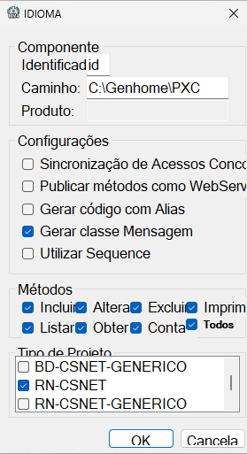
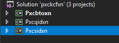

# Camada S

A **camada S**, também em uma comparação direta aos componentes da arquitetura 3 camadas, poderia ser vista como **algo equivalente a uma BLL**, responsável por tudo que envolve **validações e aplicações/imposições das regras de negócio**, determinando como os dados devem ser tratados, qual sua forma correta de criação, de alteração e de consulta, e em quais cenários e sob quais critérios podem ser excluídos. Enquanto a camada Q se concentra exclusivamente em conversar com a base de dados, a camada S atua como um **orquestrador da aplicação**, garantindo que todas as operações sigam corretamente as regras previstas. Também é nessa camada que normalmente ocorre a **integração com outras aplicações e serviços**, centralizando chamadas externas, validações adicionais e fluxos que não necessariamente são direcionados à base de dados (via camada Q).

## Camada S no MM4

Na **camada S** costumeiramente vamos ter uma instância de objeto BD da camada Q equivalente, contaremos com utilitários para validações, cálculos, e quaisquer outras ferramentas que apoiem a aplicação correta das regras de negócio.

Essa camada também geralmente será muito orientada a CRUDs, oferecendo métodos muito semelhantes aos oferecidos pela Q, com a diferença de que aqui o objetivo será manipulação com base nas regras de negócio, acionando a Q quando qualquer uma das operações envolver qualquer tipo de interação com a base de dados.

## Anatomia geral da camada S

Na camada S, também são criados **projetos por TO**. O que significa que cada TO da aplicação vai possuir seu próprio projeto de camada S (assim como ocorre com as camadas Q), contendo um **objeto RN** responsável por gerenciar tudo relacionado a validações, cálculos e operações voltadas para o atingimento dos objetivos de negócio, principalmente com o enfoque que aquele TO exige dentro do contexto. Em outras palavras, um objeto RN pode ser comparado a um Serviço, especializado em orquestrar operações de negócio para aquele TO:

```makefile
PXC\
|
├── pxcbtoxn\                         # Pasta do projeto - TOs
|   ├── pgm\                          # Pasta de arquivos do "programa"
|   |   ├── pxcbtoxn_AssemblyInfo.cs  # Arquivo de metadados de compilação
|   |   ├── pxcbtoxn_TOIdioma.cs      # Arquivo do TO de idiomas
|   |   └── pxcbtoxn_TOUsuario.cs     # Arquivo do TO de usuários
|   └── pxcbtoxn.csproj               # Arquivo .NET do projeto
|
├── pxcqusxn_Usuario\                 # Pasta do projeto - Camada Q de usuários
|   ├── [...]                         # Estrutura omitida por brevidade
|
├── pxcqidxn_Idioma\                  # Pasta do projeto - Camada Q de idiomas
|   ├── [...]                         # Estrutura omitida por brevidade
|
├── pxcsusxn_Usuario\                 # Pasta do projeto - Camada S de usuários
|   ├── pgm\                          # Pasta de arquivos do "programa"
|   |   ├── pxcsusxn_AssemblyInfo.cs  # Arquivo de metadados de compilação
|   |   └── pxcsusxn_Usuario.cs       # Arquivo do objeto RN (semelhante ao Serviço) de usuários
|   └── pxcsusxn.csproj               # Arquivo .NET do projeto
|
├── pxcsidxn_Idioma\                  # Pasta do projeto - Camada S de idiomas
|   ├── pgm\                          # Pasta de arquivos do "programa"
|   |   ├── pxcsidxn_AssemblyInfo.cs  # Arquivo de metadados de compilação
|   |   └── pxcsidxn_Idioma.cs        # Arquivo do objeto RN (semelhante ao Serviço) de idiomas
|   └── pxcsidxn.csproj               # Arquivo .NET do projeto
|
└── pxckcfxn.sln                      # Arquivo .NET da solução
```

## Anatomia geral de um objeto RN

A estrutura típica de um objeto RN dentro de um projeto MM4 é semelhante a isso:

```csharp
namespace Bergs.Pxc.Pxcsusxn
{
    public class Usuario: AplicacaoRegraNegocio
    {
        /*
         * Métodos principais da interface pública CRUD
        */

        public virtual Retorno<int> Alterar(TOUsuario toUsuario)
        {
            /* [bdUsuario.Alterar(toUsuario)...] */
        }

        public virtual Retorno<long> Contar(TOUsuario toUsuario)
        {
            /* [bdUsuario.Contar(toUsuario)...] */
        }

        public virtual Retorno<int> Excluir(TOUsuario toUsuario)
        {
            /* [bdUsuario.Excluir(toUsuario)...] */
        }

        public virtual Retorno<int> Incluir(TOUsuario toUsuario)
        {
            /* [bdUsuario.Incluir(toUsuario)...] */
        }

        public virtual Retorno<List<TOUsuario>> Listar(TOUsuario toUsuario, TOPaginacao toPaginacao)
        {
            /* [bdUsuario.Listar(toUsuario, toPaginacao)...] */
        }

        public virtual Retorno<TOUsuario> Obter(TOUsuario toUsuario)
        {
            /* [bdUsuario.Obter(toUsuario)...] */
        }

        public virtual Retorno<string> Imprimir(TOUsuario toUsuario)
        {
            /* [Método extra: Pode usar qualquer tipo de obtenção de dados, seja do objeto BD ou dos próprios métodos de RN...] */
        }

        /*
         * Métodos privados auxiliares para apoiar os métodos principais
        */
    }
}
```

Possui três elementos fundamentais:

### Herança da classe base `AplicacaoRegraNegocio`

Essa classe base fornece métodos para facilitar a validação automática de TOs antes de verificações e execuções mais complexas voltadas para o negócio. Esses métodos são expressados através de diferentes sobrecargas do `ValidarTO(...)`, e consideram um grupo de atributos para _anotação_ em propriedades de TOs. Esses atributos ainda não foram explorados. Estão contidos dentro do namespace/pacote `Bergs.Pwx.Pwxoiexn.Validacoes`.

#### Validações automáticas

Com base em um vasto conjunto de atributos de validação disponibilizados a partir do namespace/pacote `Bergs.Pwx.Pwxoiexn.Validacoes`, é possível _anotar_ as propriedades de um TO com características de validação, para que em qualquer momento da execução de um método da camada S, se possa chamar o método `ValidarTO(...)` assim fazendo uma verificação total e automatizada dessas validações, obtendo uma lista de falhas em caso de validações não atendidas.

Alguns atributos contidos nesse conjunto de validações são:

- `[Alfanumerico]`;
- `[NaoNulo]`, `[NaoBranco]` e `[Nulo]`;
- `[Positivo]` e `[Negativo]`;
- `[Minimo]` e `[Maximo]`;
- `[Tamanho(min, max)]` e `[Intervalo(min, max)]`;
- `[CPF]` e `[CNPJ]`;
- `[Email]`;
- `[Futuro]`, `[FuturoOuPresente]` e `[Passado]`;
- `[ExpressaoRegular]`.

Os atributos são aplicados diretamente no TO — exemplo:

```csharp
namespace Bergs.Pxc.Pxcbtoxn
{
    public class TOUsuario: TOTabela
    {
        // [...]

        // [...]
        [NaoNulo]
        public CampoObrigatorio<int> IdUsuario { get; set; } 

        // [...]
        [NaoBranco]
        [Alfanumerico]
        [Tamanho(10, 35)]
        public CampoObrigatorio<string> Nome { get; set; }
        
        // [...]
        [Passado(mensagemErro: "Data de nascimento precisa ser anterior à data atual.")] // Em todos os atributos de validação é possível de se personalizar a mensagem de erro
        public CampoOpcional<DateTime> DataNascimento { get; set; }

        // [...]
    }
}
```

E dentro de um método qualquer da camada S (no exemplo abaixo o método `Incluir(...)`), a qualquer momento um TO pode ser completamente validado com base nos atributos através do método da classe base:

```csharp
public virtual Retorno<int> Incluir(TOUsuario toUsuario)
{
    // [...]
    
    if (!ValidarTO(toUsuario, out var listaRetornoValidacao))
        return Infra.RetornarFalha<int>(new ObjetoInvalidoMensagem(listaRetornoValidacao));
    
    // [...]
}
```

### Métodos principais da interface pública CRUD

As operações CRUD principais constituem a **interface pública** do objeto RN — ou seja — novamente (a exemplo do objeto BD), as funcionalidades que realmente são úteis para quem utiliza esses objetos.
As funcionalidades são compostas também pelos métodos `Incluir(...)`, `Contar(...)`, `Listar(...)`, `Obter(...)`, `Alterar(...)`, `Excluir(...)` e o método extra `Imprimir(...)` e convencionalmente, quando precisarem interagir com dados da base, vão utilizar seus respectivos pares da interface pública da camada Q:

| Operação CRUD | Método no objeto RN | Método no objeto BD |
| :-: | :-: | :-: |
| CREATE | `Incluir(...)` | `Incluir(...)` |
| READ | `Contar(...)` | `Contar(...)` |
| READ | `Listar(...)` | `Listar(...)` |
| READ | `Obter(...)` | `Obter(...)` |
| UPDATE | `Alterar(...)` | `Alterar(...)` |
| DELETE | `Excluir(...)` | `Excluir(...)` |
| - | `Imprimir(...)` | `Listar(...)` ou `Obter(...)` |

> Nota: O termo "interface" aqui é usado em seu sentido conceitual — isto é, o conjunto de operações públicas expostas pelo objeto RN. Não se refere ao tipo `interface` da linguagem C#, mas sim ao **contrato funcional** que a classe oferece a quem a utiliza.

### Métodos privados auxiliares

A exemplo da camada Q, na camada S também há convencionalmente um espaço destinado aos métodos auxiliares privados, destinados a apoiar nas implementações de validações e fluxos de regras de negócio, de forma a simplificar etapas recorrentes ou evitar repetição desnecessária de código.

## Detalhando

Vamos detalhar um pouco mais da anatomia de um objeto RN visualizando um código real de uma classe com as operações CRUD de **inclusão** e **contagem**, e o método extra de **impressão**:

```csharp
/*
 * Nome do projeto - Camada S de usuários é "Pxcsusxn", onde:
 *  "Pxc" = CSS do sistema de treinamentos
 *  "s" = Identificador de um projeto - Camada S
 *  "us" = Identificador curto para o TO alvo (USUARIO) — nesse caso: "us"
 *  "xn" = Identificador de um projeto do tipo MM4
*/
namespace Bergs.Pxc.Pxcsusxn
{
    /*
     * Apesar de não conter o sufixo "RN", essa classe é referente a um objeto RN
    */
    public class Usuario: AplicacaoRegraNegocio // Herança da classe base
    {
        /*
         * Método principal da interface pública CRUD - READ²
        */
        public virtual Retorno<long> Contar(TOUsuario toUsuario)
        {
            try
            {
                /*
                 * Validações de Campos (obrigatoriedade, formatos, etc — um bom local pra usar o método ValidarTO(...))
                */
                // [Não há nenhuma aqui neste momento]

                /*
                 * Validações mais específicas em cima das regras de negócio
                */
                // [Não há nenhuma aqui neste momento]

                /*
                 * Instancia um objeto BD através de uma fábrica utilitária contida dentro do super objeto Infra
                */
                var bdUsuario = Infra.InstanciarBD<Pxcqusxn.Usuario>();

                /*
                 * Chama o método de contagem da camada Q e retorna o resultado na variável de contagem
                */
                var resultado = bdUsuario.Contar(toUsuario);

                /*
                 * Se o objeto BD não foi bem sucedido em sua execução interna, ele já vai fazer um tratamento
                 * de exceção internamente e retornar um objeto Retorno<long> com todos os detalhes do problema.
                 * Logo, o que é feito aqui é simplesmente repassar adiante esse retorno com os detalhes da falha
                */
                if (!resultado.OK)
                    return resultado;

                /*
                 * Se o objeto BD foi bem sucedido, a contagem é extraída de dentro do wrapper de retorno que 
                 * veio do objeto BD, e é envelopada em um novo objeto de retorno (Retorno<long>) com um tipo 
                 * diferente de mensagem de feedback que havia vindo do objeto BD
                */
                return Infra.RetornarSucesso(resultado.Dados, new OperacaoRealizadaMensagem());
            }
            catch (Exception exception)
            {
                /*
                 * Tratamento genérico, para todos os outros casos não previstos
                 * (aqui nenhum em específico está sendo previsto com antecedência)
                 * Retorna a exceção envelopada no wrapper "Retorno<long>"
                */
                return Infra.TratarExcecao<long>(exception);
            }
        }

        /*
         * Método principal da interface pública CRUD - CREATE
        */
        public virtual Retorno<int> Incluir(TOUsuario toUsuario)
        {
            try
            {

                /*
                 * Validações de Campos (obrigatoriedade, formatos, etc — um bom local pra usar o método ValidarTO(...))
                */
                if (!toUsuario.IdUsuario.FoiSetado)
                    return Infra.RetornarFalha<int>(new CampoObrigatorioMensagem(TOUsuario.ID_USUARIO));

                if (!toUsuario.Nome.FoiSetado)
                    return Infra.RetornarFalha<int>(new CampoObrigatorioMensagem(TOUsuario.NOME_USUARIO));
                
                if (!ValidarTO(toUsuario, out var listaRetornoValidacao))
                    return Infra.RetornarFalha<int>(new ObjetoInvalidoMensagem(listaRetornoValidacao));

                /*
                 * Validações mais específicas em cima das regras de negócio
                */
                // [Não há nenhuma aqui neste momento]

                /*
                 * Instancia um objeto BD através de uma fábrica utilitária contida dentro do super objeto Infra
                */
                var bdUsuario = Infra.InstanciarBD<Pxcqusxn.Usuario>();

                /*
                 * Executa uma transação atômica com o auxílio do utilitário contigo no super objeto Infra
                 * O início é implícito, começa a partir da declaração. O final, é sinalizado através 
                 * do método EfetivarTransacao(...)
                */
                using (EscopoTransacional escopo = Infra.CriarEscopoTransacional())
                {
                    /*
                     * Chama o método de inclusão da camada Q e retorna o resultado na variável resultado
                    */
                    var resultado = bdUsuario.Incluir(toUsuario);

                    /*
                     * Se o objeto BD não foi bem sucedido em sua execução interna, ele já vai fazer um tratamento
                     * de exceção internamente e retornar um objeto Retorno<int> com todos os detalhes do problema.
                     * Logo, o que é feito aqui é simplesmente repassar adiante esse retorno com os detalhes da falha
                    */
                    if (!resultado.OK)
                        return resultado;

                    /*
                     * Efetiva a transação atômica, "liberando" de fato a conclusão de execução de todas as operações 
                     * contidas dentro do escopo 
                    */
                    escopo.EfetivarTransacao();

                    /*
                     * Se o objeto BD foi bem sucedido, o número de registros incluídos é extraído de dentro do 
                     * wrapper de retorno que veio do objeto BD, e é envelopado em um novo objeto de retorno 
                     * (Retorno<int>) com um tipo diferente de mensagem de feedback que havia vindo do objeto BD
                    */
                    return Infra.RetornarSucesso(resultado.Dados, new OperacaoRealizadaMensagem("Inclusão"));
                }
            }
            catch (Exception exception)
            {
                /*
                 * Tratamento genérico, para todos os outros casos não previstos
                 * (aqui nenhum em específico está sendo previsto com antecedência)
                 * Retorna a exceção envelopada no wrapper "Retorno<int>"
                */
                return Infra.TratarExcecao<int>(exception);
            }
        }

        /*
         * Método principal da interface pública - EXTRA
        */
        public virtual Retorno<string> Imprimir(TOUsuario toUsuario)
        {
            try
            {
                /*
                 * Chama o próprio método de listagem aqui da camada S e retorna o resultado na variável de listagem
                */
                var resultado = Listar(toUsuario, null);

                /*
                 * Se a listagem aqui da camada S não foi bem sucedida, ela vai ter feito um tratamento que condiz 
                 * com a ação CRUD de listagem. 
                 * Como o objetivo aqui é usar a listagem como meio, e não como fim, Vai ser criado um novo retorno 
                 * de falha e o retorno da listagem (que já possui os detalhes da falha por si só) será envelopado nele
                */
                if (!resultado.OK)
                    return Infra.RetornarFalha<List<TOUsuario>, string>(resultado);

                /*
                 * Vai ser executada uma dinâmica de criação de um arquivo, linha a linha de acordo com a lista
                 * obtida. Esses relatórios usualmente são criados automaticamente dentro da pasta C:\[...]\PXC\DATA\
                */
                using (var relatorio = new RelatorioPadrao(Infra))
                {
                    /*
                     * Configura as definições de colunas que o relatório terá, com base no nome do campo e tamanho
                    */
                    relatorio.Colunas.Add(new Coluna(TOUsuario.ID_USUARIO, 8));
                    relatorio.Colunas.Add(new Coluna(TOUsuario.NOME_USUARIO, 35));
                    relatorio.Colunas.Add(new Coluna(TOUsuario.DATA_NASCIMENTO, 10)); 

                    var relatorioBuilder = new StringBuilder();

                    /*
                     * Utiliza um builder auxiliar durante a iteração de usuário a usuário obtido da lista
                     * para montar uma expressão em string contendo os valores, que será "impressa" quando 
                     * chamado o método relatorio.AdicionarLinha(...)
                    */
                    foreach (var toUsuarioAtual in resultado.Dados)
                    {
                        var definicaoColunas = relatorio.Colunas;

                        relatorioBuilder.Append(
                            toUsuarioAtual.IdUsuario
                                .ToString()
                                .PadRight(definicaoColunas[TOUsuario.ID_USUARIO].Tamanho)
                        );

                        relatorioBuilder.Append(
                            toUsuarioAtual.Nome
                                .ToString()
                                .PadRight(definicaoColunas[TOUsuario.NOME_USUARIO].Tamanho)
                        );

                        relatorioBuilder.Append(
                            toUsuarioAtual.DataNascimento
                                .ToString("dd/MM/yyyy")
                                .PadRight(definicaoColunas[TOUsuario.DATA_NASCIMENTO].Tamanho)
                        );

                        relatorio.AdicionarLinha(relatorioBuilder.ToString());

                        relatorioBuilder.Clear();
                    }

                    /*
                     * Se a geração do relatório foi bem sucedida, o nome do arquivo de destino do relatório é 
                     * então envelopado em um objeto de retorno de sucesso
                    */
                    return Infra.RetornarSucesso(relatorio.NomeArquivoVirtual, new OperacaoRealizadaMensagem());
                }
            }
            catch (Exception exception)
            {
                /*
                 * Tratamento genérico, para todos os outros casos não previstos
                 * (aqui nenhum em específico está sendo previsto com antecedência)
                 * Retorna a exceção envelopada no wrapper "Retorno<string>"
                */
                return Infra.TratarExcecao<string>(exception);
            }
        }
    }
}
```

### Novos elementos após detalhamento

#### Gerenciamento transacional com o objeto `EscopoTransacional`

No conteúdo da camada Q, quando exploramos o super objeto `Infra`, exploramos rapidamente o método `CriarEscopoTransacional(...)`. É aqui na camada S que ele realmente passa a ser utilizado com frequência.

Relembrando sua função: É um mecanismo que permite executar operações de forma **atômica**, ou seja: ou tudo é realizado com sucesso, ou nada é aplicado na base de dados. Ele funciona como uma "caixa de segurança" onde diversas operações da camada Q podem ser encadeadas sem risco de deixar a aplicação em um estado inconsistente.

Por _baixo do capô_, quando um `EscopoTransacional` é criado, o super objeto `Infra` solicita à camada Q um comando `begin transaction` (ou similar) na base de dados, e enquanto a aplicação estiver executando comandos de camada Q dentro do bloco **using**, todas as operações executadas participarão dessa mesma transação.

Se o método `EfetivarTransacao(...)` for chamado explicitamente em algum momento dentro do **using**, o super objeto `Infra` solicita então à camada Q que execute um `commit` (ou similar) na base de dados, concluindo então o processo de persistência de tudo que estava em um estado temporário dentro do escopo.

Se o bloco **using** terminar **sem uma chamada ao `EfetivarTransacao()`**, o objeto será descartado (`Dispose`), e a camada Q realizará automaticamente um `rollback` (ou similar) na base de dados, revertendo tudo que estava em um estado temporário dentro do escopo.

Vamos imaginar uma transação mais complexa através de um exemplo lúdico:
Em uma aplicação de atendimentos, um **ticket** é criado com um **número de protocolo** e uma **data de criação**. O porém é que essas duas informações são criadas via `sequence` e `current timestamp` a nível de base de dados. Então, primeiro o registro precisa ser inserido, depois consultado, e com base nas duas informações obtidas, um `token de segurança` poderá ser calculado. Posteriormente esse `token de segurança` deve ser armazenado no registro de ticket recém criado. Se qualquer parte da transação falhar, nada deve ser persistido.

Os passos então seriam:

1. Inserir o registro de ticket na base de dados (geração automática do número de protocolo e data de criação a nível de base de dados);
2. Consultar o registro para obtenção dos valores atribuídos;
3. Calcular o token de segurança;
4. Atualizar o registro recém criado com o token de segurança.

```csharp
namespace Bergs.Pxc.Pxcstaxn
{
    public class TicketAtendimento: AplicacaoRegraNegocio
    {
        // [...]
        
        public virtual Retorno<int> Incluir(TOTicketAtendimento toTicket)
        {
            try
            {
                // [...]

                using (EscopoTransacional escopo = Infra.CriarEscopoTransacional())
                {
                    var resultadoInclusao = bdTicket.Incluir(toTicket);

                    var resultadoListagem = bdTicket.Listar(toTicket, null);

                    if (!resultadoListagem.OK)
                        return Infra.RetornarFalha<int>(new RegistroInexistenteMensagem());

                    var ticketIncluido = resultadoListagem.Dados.LastOrDefault();

                    ticketIncluido.TokenSeguranca = CalcularTokenSeguranca(ticketIncluido.Protocolo, ticketIncluido.Data);

                    var resultadoAlteracao = bdTicket.Alterar(ticketIncluido);

                    if (!resultadoAlteracao.OK)
                        return resultadoAlteracao; // Retornando diretamente o resultado falho da alteração, mas poderia personalizar o retorno para indicar uma falha em um "pedaço da transação"

                    escopo.EfetivarTransacao();

                    return Infra.RetornarSucesso(resultadoInclusao.Dados, new OperacaoRealizadaMensagem("Inclusão"));
                }
            }
            
            // [...]
        }

        // [...]
    }
}
```

Esse mecanismo garante **consistência**, **segurança** e **previsibilidade** na aplicação das regras de negócio: nada fica parcialmente salvo, e toda operação segue o mesmo padrão obrigatório de sucesso ou reversão completa.

#### O objeto `RelatorioPadrao`

O objeto `RelatorioPadrao` é um recurso voltado para **geração de arquivos de relatório em formato texto**, geralmente armazenados dentro da pasta `C:\[...]\[CSS]\DATA\` da aplicação.

A ideia central é permitir que a camada S gere **relatórios tabulares estruturados**, úteis para auditorias, exportações com automações de outras aplicações, rastreamentos ou simplesmente como representação humana de dados retornados da base. Esses relatórios são sempre construídos com colunas fixas, onde cada coluna tem um nome e um tamanho, e cada linha é composta por valores alinhados respeitando os limites definidos.

O objeto `RelatorioPadrao` herda da classe base `Relatorio`, que encapsula a infraestrutura comum usada por todos os relatórios da aplicação — como abertura e fechamento seguro de arquivos, formatação padronizada das linhas, tratamento de quebra de linha, controle centralizado do `StreamWriter` e convenções gerais de escrita.

A classe base fornece o **esqueleto fundamental ("template")** do processo de geração de relatórios, enquanto o `RelatorioPadrao` adiciona a lógica específica da construção coluna-a-coluna, incluindo definição da estrutura tabular e alinhamento dos campos dentro de larguras fixas.

#### Comunicação com serviços e aplicações externos

A camada S pode, em determinados cenários, acionar **outros módulos MM4 externos** ou **serviços MMD** para execução de rotinas especializadas. Esses acessos sempre ocorrem **via infraestrutura**, nunca por referência direta a bibliotecas de outros contextos. Isso mantém o isolamento das aplicações, respeita fronteiras de domínio e garante que os ambientes possam evoluir de forma independente.

Existem dois grandes tipos de integração adotados:

- **Chamada a outros backends MM4:** Expostos normalmente via **webservices `.asmx`**, que funcionam como portas de entrada para operações de uma camada S remota;
- **Chamada a serviços MMD:** Aplicações (daemons) Java orientadas a automação, integração e processamentos de backoffice, acessadas via protocolos internos encapsulados pelo super objeto `Infra`.

##### Chamada a outros backends MM4

Esses webservices são criados quando uma camada S precisa ser exposta a outras aplicações. A comunicação é realizada enviando objetos TO em formato `XML` para o endpoint remoto, utilizando o método unificado `Infra.ChamarTransacaoExterna(...)`:

```csharp
// [...]

/*
 * Endereço do webservice de acesso à aplicação MM4 externa
*/
var webService = "Pxcsuaxn_ExecutaViaWebService.asmx/incluirAuditoriaUsuario";

/*
 * O objeto de TO que de fato se quer passar à aplicação MM4 externa
*/
TOUsuarioAuditoria toUsuarioAuditoria = new TOUsuarioAuditoria()
{
    Usuario = toUsuario.Nome,
    Evento = "Criação de usuário",
    Data = DateTime.Now
};

/*
 * Conteúdo a ser enviado à aplicação MM4 externa em forma de dicionário de parâmetros chave/valor
*/
var parametros = new Dictionary<string, ITO>
{
    { "xmlEntrada", toUsuarioAuditoria }
};

/*
 * Chamada à aplicação MM4 externa através do super objeto Infra, passando o endereço
 * do webservice e o dicionário de parâmetros de conteúdo — recebendo após a resposta da requisição
*/
var retorno = Infra.ChamarTransacaoExterna<int, TOUsuarioAuditoria>(webService, parametros);

// [...]
```

##### Chamada a serviços MMD

Os serviços (daemons) MMD são processos Java orientados a automações internas, integrações com sistemas legados, operações massivas e rotinas com forte demanda de disponibilidade e desempenho.

A camada S nunca acessa esses serviços diretamente — toda a comunicação passa pelo `Infra.ChamarServicoMmd(...)`, que encapsula toda a operação de _serialização_/_desserialização_ e transporte:

```csharp
// [...]

/*
 * Parâmetros de acesso ao serviço MMD externo
*/
var parametrosServicoMmd = new TOServicoMmd
{
    Servidor = "SW-UADLD-EXT1", // Nome do servidor de destino
    Url = "bergs.uad.auditorias.servico.rn.Pxcsuajm_Servico/incluirAuditoriaUsuario", // Rota no servidor de destino
    Programa = "Pxcsuajm",
    VersaoRotina = 2,
    RespostaCompactada = true
};

/*
 * O objeto de TO que de fato se quer passar para o serviço MMD externo
*/
TOUsuarioAuditoria toUsuarioAuditoria = new TOUsuarioAuditoria()
{
    Usuario = toUsuario.Nome,
    Evento = "Criação de usuário",
    Data = DateTime.Now
};

var namespaceAtual = MethodBase.GetCurrentMethod().DeclaringType.Namespace;
var metodoAtual = MethodBase.GetCurrentMethod().Name;

/*
 * Wrapper de comunicação, que envelopa o conteúdo e define origem e destino
*/
var usuarioAuditoriaComunicacao = new TOUsuarioAuditoriaComunicacao<TOUsuarioAuditoria>
{
    PgmCliente = $"{namespaceAtual}.{metodoAtual}", // Origem
    Servico = "RegistrarAuditoriaUsuario", // Destino
    TOParametro = toUsuarioAuditoria // Conteúdo
};

/*
 * Chamada do serviço MMD externo através do super objeto Infra, passando os parâmetros
 * de acesso e wrapper de comunicação — recebendo após a resposta da requisição
*/
var retorno = Infra.ChamarServicoMmd(parametrosServicoMmd, usuarioAuditoriaComunicacao);

// [...]
```

##### Regras de arquitetura

- **Uma camada S MM4 nunca instancia diretamente uma camada Q MM4 de outro contexto**;
- **Uma camada S MM4 não referencia outra camada S MM4 diretamente via projeto**;
- **Por design (diferentes linguagens), é impossível uma camada S MM4 referenciar uma camada S MMD**;
- **Toda a mecânica de comunicação inter-serviços é feita através do super objeto `Infra`**.

Essas regras garantem independência, isolamento, coesão e segurança entre aplicações distintas do ecossistema do Banrisul.

> Nota (disclaimer): Os exemplos de chamada de serviços e aplicações externos mostrados acima são uma versão simplificada. No dia a dia, em projetos, podem existir várias camadas de abstração e diferenças de configuração e parametrização. Via de regra sempre consulte a documentação do seu projeto ou os membros do seu time em relação às melhores práticas de implementação dessas rotinas.

#### Executor de RNs (Obsoleto)

O **Executor de RNs** é uma ferramenta do [PZP](../../dicionario-banrisul.md#pzp---ferramenta-de-apoio-ao-desenvolvimento) usada para criar e executar métodos de objetos RN de forma automatizada. Apesar de mencionada aqui por questão de informação, ela **se tornou obsoleta** devido à adoção da nova dupla de ferramentas (também do PZP) **Gerador de testes MM C#** e **Testador MM C#**, que introduz uma abordagem mais alinhada com conceitos de mercado para criação de testes automatizados independentes (unitários e de integração).

Para permitir um processo intermediário de migração de uma abordagem para outra surgiu a ferramenta (também do PZP) **Conversor de Testes**, que transforma os arquivos criados pelo **Executor de RNs** em projetos de teste compatíveis com o novo formato. O conversor gera uma pasta contendo o projeto convertido, estruturado especialmente para operar em _modo compatibilidade_.

Para novos testes (já criados através da ferramenta do [PZP](../../dicionario-banrisul.md#pzp---ferramenta-de-apoio-ao-desenvolvimento) **Gerador de testes MM C#**) essa compatibilidade não é necessária, e os projetos já são criados totalmente dentro dos padrões atuais.

> Nota: Trataremos sobre a nova abordagem de testes e suas ferramentas no próximo tópico.

## Laboratório

**Estamos quase lá.** Seguindo nossa progressão de criação de partes de um projeto MM4, vamos partir agora para a criação da camada S de idiomas, através do seu respectivo **objeto RN de idiomas**. Nesse momento vamos começar a realmente lidar com mais detalhes das user stories, nos preocupando um pouco mais com regras, critérios de aceitação e etc.

Na etapa da camada Q, já conseguimos criar uma solução e agregar o projeto de camada Q e o projeto de TOs em um único lugar. Dessa vez vamos precisar gerar o projeto e o incorporar manualmente a essa solução já existente.

> Na pasta desta aula você pode baixar a solução contendo os projeto de TOs e camada Q usados nos laboratórios e exercícios anteriores, já com os TOs de idiomas e categorias, e suas camadas Q respectivas, todos prontos para uso.
<!-- Boilerplate em [./_assets/01-solucao-to-camada-q-boilerplate/] -->

Vamos revisitar aqui as user stories em sua forma completa, com foco também nas regras e critérios de aceitação:

> Nota: Por questão de brevidade, não vamos focar em todos os detalhes, mas vamos explorar juntos alguns aqui.

```gherkin
US1 - Inclusão de novo idioma

Como um analista de operações globais
Eu quero incluir um novo idioma informando seu código textual ISO combinado e sua descrição
Para que o banco possa registrar oficialmente os idiomas suportados nas operações internacionais

Regras
    - O código textual ISO combinado é obrigatório
    - O código textual ISO combinado deve seguir o padrão: ISO 639-1 + "-" + ISO 3166-1 (2 letras para idioma e 2 letras para país)
    - O código textual informado deve ser convertido para um código numérico único e reversível usando a ferramenta FECONID
    - O código numérico resultante deve ser único na base
    - A descrição é obrigatória
    - A descrição deve conter apenas letras, números e acentuação

Critérios de Aceitação
    - Dado que informo um código textual ISO combinado válido e que resulta em um código numérico ainda não utilizado, e uma descrição válida, então a aplicação inclui o idioma com sucesso
    - Dado que informo um código textual ISO combinado inválido ou que resulta em um código numérico que já existe na base, então a aplicação rejeita a inclusão
    - Dado que a descrição não é informada ou é inválida, então a aplicação rejeita a inclusão
```

```gherkin
US2 - Remoção de idioma

Como um analista de operações globais
Eu quero remover um idioma previamente cadastrado
Para evitar que equipes selecionem idiomas obsoletos e reduzir erros operacionais

Regras
    - A remoção deve eliminar o idioma fisicamente da base
    - A remoção deve se dar tanto por código numérico quanto por código textual ISO combinado

Critérios de Aceitação
    - Dado que informo o código numérico de um idioma existente, então a aplicação remove o idioma com sucesso
    - Dado que informo o código textual ISO combinado de um idioma existente, então a aplicação remove o idioma com sucesso
    - Dado que o código (seja textual ISO combinado ou numérico) informado não existe na base, então a aplicação rejeita a remoção e informa que o idioma não foi encontrado
```

> Nota: O analista de operações globais não deixou claro no seu depoimento por qual código o idioma deve ser localizado para ser removido. Mas o gerente de produtos digitais nos deu uma pista importante para uma tomada de decisão, dizendo que na consulta ele deve ser buscado por ambos os códigos.

```gherkin
US3 - Alteração de dados de idioma

Como um analista de operações globais
Eu quero alterar a descrição de um idioma já cadastrado
Para corrigir descrições incorretas ou melhorar sua clareza

Regras
    - Apenas a descrição pode ser alterada
    - O código numérico não pode ser modificado
    - A nova descrição é obrigatória
    - A nova descrição deve conter apenas letras, números e acentuação
    - A alteração deve registrar informações de auditoria: usuário responsável e data/hora atuais

Critérios de Aceitação
    - Dado que informo uma nova descrição válida, então a aplicação atualiza o idioma e registra as informações de auditoria com sucesso
    - Dado que o código numérico informado não existe na base, então a aplicação rejeita a alteração e informa que o idioma não foi encontrado
    - Dado que o código textual ISO combinado informado resulta em um código numérico que não existe na base, então a aplicação rejeita a alteração e informa que o idioma não foi encontrado
    - Dado que a nova descrição não é informada ou é inválida, então a aplicação rejeita a alteração e informa que a descrição é inválida
```

> Nota: O analista de operações globais não deixou claro no seu depoimento por qual código o idioma deve ser localizado para ser alterado. Mas o gerente de produtos digitais nos deu uma pista importante para uma tomada de decisão, dizendo que na consulta ele deve ser buscado por ambos os códigos.

```gherkin
US4 - Listagem de idiomas

Como um gerente de expansão global
Eu quero visualizar a lista de todos os idiomas cadastrados
Para verificar se o banco já possui suporte linguístico para regiões com as quais estamos negociando

Regras
    - A listagem deve retornar todos os idiomas cadastrados
    - A listagem deve exibir: código numérico, código textual ISO combinado, descrição e informações de auditoria (última alteração)

Critérios de Aceitação
    - Ao solicitar a listagem, a aplicação retorna todos os idiomas existentes com suas informações
    - Se não houver idiomas cadastrados, então a aplicação rejeita a consulta e informa que a lista está vazia
```

```gherkin
US5 - Consulta de idioma por código

Como um gerente de produtos digitais
Eu quero consultar um idioma pelo seu código
Para validar rapidamente operações com parceiros estrangeiros

Regras
    - A consulta pode ser realizada pelo código numérico ou pelo código textual ISO combinado
    - A consulta deve retornar exatamente 1 idioma caso cadastrado
    - A consulta deve retornar: código numérico, código textual ISO combinado, descrição e informações de auditoria (última alteração)
    - Caso não exista idioma correspondente, a aplicação deve informar inexistência

Critérios de Aceitação
    - Dado que informo um código numérico válido de um idioma existente, então a aplicação retorna seus dados completos com sucesso
    - Dado que informo um código textual ISO combinado que resulta em um código numérico de um idioma existente, então a aplicação retorna seus dados completos com sucesso
    - Dado que informo um código numérico inexistente, então a aplicação rejeita a consulta e informa que o idioma não foi encontrado
    - Dado que informo um código textual ISO combinado inválido ou que resulta em um código numérico inexistente, então a aplicação rejeita a consulta e informa que o idioma não foi encontrado
```

> Nota: Agora que conhecemos o recurso de [SAC](../../dicionario-banrisul.md#sac---sincronização-de-acessos-concorrentes), sabemos que existe um **requisito não funcional (técnico) implícito** principalmente nas stories de remoção e alteração, que é a necessidade do uso da data/hora de alteração como **token de atualização**. E esse requisito não funcional também reforça muito uma das regras envolvidas na story de alteração: _"- A alteração deve registrar informações de auditoria: usuário responsável e data/hora atuais"_.

Recuperando novamente a modelagem na base **IBM DB2**;

```sql
SELECT
    COD_IDIOMA     -- INTEGER  NN PK
  , DESC_IDIOMA    -- CHAR(50) NN
  , COD_USUARIO    -- CHAR(6)
  , DTHR_ULT_ATU   -- TIMESTAMP
FROM PXC.IDIOMA;
```

### Passo 1: Criar o projeto de camada S

Para criar o projeto de camada S vamos utilizar os outros recursos não explorados do **Gerador de Classes MM4**.

Com o gerador aberto, vamos novamente selecionar **DB2** como _Provider_ (nossa base de dados alvo):


Após o "login", com o metamodelo **MM4** selecionado, vamos voltar à aba _Componentes_, vamos preencher o campo **Sistema** com o [CSS](../../dicionario-banrisul.md#css---código-de-sigla-de-sistema) _PXC_ (do nosso interesse). Vamos aguardar novamente o _loading_ da lista, e vamos complementar o filtro **Pesquisa** com o termo "IDIOMA". Vamos novamente à tabela **IDIOMA**, duplo clique, e agora na tela de detalhes vamos trabahar com a camada S.

- No campo **Identificador** vamos atribuir o _identificador curto para o TO_ de idiomas, novamente "id";
- Campo **Caminho** para a pasta Genhome (`C:\Genhome\PXC`);
- Nas configurações, vamos marcar a opção _Gerar classe Mensagem_ (será explicada em seguida);
- Vamos pular a seleção de **Métodos** e no **Tipo de Projeto**, vamos selecionar somente _RN-CSNET_ (ou seja, projeto de RNs em C# .NET);
  > Nota: A exemplo da _BD-CSNET-GENERICO_ explicada no tópico anterior, a _RN-CSNET-GENERICO_ tem função semelhante: também cria uma camada S **sem personalizações**. Porém, nesse caso não é vazia, ela tem a implementação dos métodos, mas eles apenas fazem uso dos métodos genéricos herdados da classe base `AplicacaoRegraNegocioGenerica<TOIn, TOOut>`. Também não vamos explorar esse tipo de recurso nesse momento.
- Voltando à etapa de **Métodos**, agora vamos selecionar todos os métodos que atendem às user stories (e alguns mais):
  
  - US1 - Inclusão de novo idioma ⟹ **_Incluir_**;
  - US2 - Remoção de idioma ⟹ **_Excluir_**;
  - US3 - Alteração de dados de idioma ⟹ **_Alterar_**;
  - US4 - Listagem de idiomas ⟹ **_Listar_**;
  - US5 - Consulta de idioma por código ⟹ **_Obter_**;
  - Vamos deixar **_Contar_** e **_Imprimir_** também selecionados como recursos extra a explorarmos.

Após, vamos clicar em **OK** e depois em **Gerar**:



Com isso, uma mensagem de sucesso será exibida e uma pasta de projeto de camada S será gerada na `Genhome`.

Antes de fecharmos o gerador, vamos voltar na tela de configurações de idiomas para analisarmos as duas configurações que restaram explorarmos (agora para o contexto de camadas S): _Publicar métodos como WebServices_ e _Gerar classe Mensagem_.

### Pausa: Entendendo as configurações de camadas S

#### Publicar métodos como WebServices

Em determinados cenários, uma camada S precisará ser acessada por outras aplicações MM4 (como exemplificamos acima em [Chamada a outros backends MM4](#chamada-a-outros-backends-mm4)), por sistemas legados ou por integrações externas. Para tornar isso possível, o MM4 permite a publicação de métodos da camada S como web services, utilizando o padrão **ASP.NET WebService (.asmx)** do .NET Framework.

Um web service é uma forma padronizada de expor funcionalidades pela rede, normalmente recebendo e devolvendo dados em **XML**. No contexto do MM4, ele funciona como uma _"fachada pública"_ da camada S: recebe o XML de entrada, converte o conteúdo para TOs, cria escopos transacionais quando necessário e encaminha as chamadas para a respectiva RN, respeitando todas as regras de negócio do backend em questão.

Essa abordagem é importante porque, por regra de arquitetura, **uma camada S nunca referencia diretamente outra camada S ou Q de outro contexto**. Dessa forma, quando uma aplicação precisa acessar funcionalidades de outra, essa comunicação pode ocorrer por meio dos web services expostos pela camada S, utilizando os mecanismos unificados oferecidos pela infraestrutura (super objeto `Infra`).

Ao marcar a configuração _Publicar métodos como WebServices_ no **Gerador de Classes MM4**, a estrutura de projeto gerada recebe alguns novos elementos:

```makefile
PXC\
|
├── [...]
|
├── pxcsusxn_Usuario\
|   ├── link\                                # Pasta de arquivos de "link" com frontends ou outros clientes (como outros backends MM4)                  
|   |   └── pxcsusxn_UsuarioWebService.asmx  # Arquivo de mapeamento do web service de usuários que aponta a direção da classe "controladora" das requisições
|   ├── pgm\
|   |   ├── pxcsusxn_AssemblyInfo.cs
|   |   ├── pxcsusxn_Usuario.cs
|   |   └── pxcsusxn_UsuarioWebService.cs    # Arquivo da classe "controladora" das requisições do web service de usuários
|   └── pxcsusxn.csproj
|
└── [...]
```

Em termos simplificados, a requisição chega e é roteada para os web metodos do arquivo `C:\[...]\PXC\pxcsusxn_Usuario\pgm\xcsusxn_UsuarioWebService.cs`, que contém a classe `UsuarioWebService` herdando da classe base `AplicacaoWebService`. Nessa classe haverão métodos que recebem e retornam arquivos `XML`, e fazem todas as operações necessárias através de uma instância da RN respectiva. Exemplo:

```csharp
namespace Bergs.Pxc.Pxcsusxn
{ 
    /*
     * Configurações de protocolos, transporte, formatos, etc. utilizadas pelo ASP.NET
    */
    [WebService(Namespace = "Bergs.Pxc.Pxcsusxn")]
    [WebServiceBinding(ConformsTo = WsiProfiles.BasicProfile1_1)]
    public class UsuarioWebService : AplicacaoWebService
    {
        // [...]

        /*
         * Web metodo exposto através do web service — por convenção a maioria dos web metodos vão receber XMLs de listas por padrão
        */
        [WebMethod()]
        public XmlDocument Incluir(string xmlUsuarios)
        {
            try
            {
                /*
                 * Desserializa a lista de TOs de usuário com auxílio do objeto "Conversor" contido na classe base AplicacaoWebService
                */
                var listaTOUsuario = Conversor.Deserializar<TOUsuario>(xmlUsuarios); // vai retornar um List<TOUsuario> — isso está abstraído no método deserializar

                /*
                 * Instancia um objeto RN através de uma fábrica utilitária contida dentro do super objeto Infra
                */
                var rnUsuario = Infra.InstanciarRN<Pxcsusxn.Usuario>();

                /*
                 * Nesse contexto o escopo transacional vai garantir que todos ou nenhum usuário da lista seja incluído
                */
                using (EscopoTransacional escopo = this.Infra.CriarEscopoTransacional())
                {
                    Retorno<int> inclusaoUsuario = null;

                    foreach (var toUsuario in listaTOUsuario)
                    {
                        /*
                         * Faz a inclusão do usuário atual em meio à iteração através do objeto RN de usuários
                        */
                        inclusaoUsuario = rnUsuario.Incluir(toUsuario);
                        
                        /*
                         * Se o objeto RN não foi bem sucedido em sua execução interna, ele já vai fazer um tratamento
                         * de exceção internamente e retornar um objeto Retorno<int> com todos os detalhes do problema.
                         * Logo, o que é feito aqui é simplesmente repassar adiante esse retorno com os detalhes da falha
                         * e a transação, por consequência, será revertida
                        */
                        if (!inclusaoUsuario.OK)
                            return Infra.Retornar(inclusaoUsuario);
                    }

                    /*
                     * Se todas as inclusões foram bem sucedidas, vai efetiva a transação atômica, "liberando" de fato a 
                     * conclusão de execução
                    */
                    escopo.EfetivarTransacao();

                    /*
                     * Retorna o resultado int da última inclusão, pois essa é uma sinalização genérica de que tudo
                     * foi bem sucedido
                    */
                    return Infra.Retornar(inclusaoUsuario);
                }
            }
            
            // [...]
        }

        // [...]
    } 
}
```

> Curiosidade: Para a criação de frontends MM5, quando criando a [camada W](../../dicionario-banrisul.md#camada-w---camada-web), haverá uma estrutura muito semelhante de web services providos no lado backend, porém nesse caso servindo exclusivamente como [BFF](../../dicionario-banrisul.md#bff---backend-for-frontend)s da W. Mais sobre isso será visto no **Curso Framework MM5 Banrisul**.

#### Gerar classe Mensagem

Já estamos mais do que acostumados a conviver com trechos de códigos como esses durante o uso das camadas Q e S:

```csharp
// [...]
return Infra.RetornarSucesso(inclusaoUsuario.Dados, new OperacaoRealizadaMensagem("Inclusão"));
// [...]
return Infra.RetornarFalha<long>(new RegistroDuplicadoMensagem(exception));
// [...]
return Infra.RetornarFalha<TOUsuario>(new ChaveEstrangeiraInexistenteMensagem(exception));
// [...]
return Infra.RetornarFalha<string>(new RegistroInexistenteMensagem());
// [...]
return Infra.RetornarFalha<int>(new ConcorrenciaMensagem());
// [...]
return Infra.RetornarFalha<TOIdioma>(new ObjetoInvalidoMensagem(listaRetornoValidacao));
// [...]
// Entre outros ...
```

Acontece que toda a interação de retornos, através da geração de objetos `Retorno<T>` pelo super objeto `Infra` exige que sejam passados objetos do tipo `Mensagem` para que seja efetuado algum tipo de **comunicação com o usuário**, seja através de retornos XML, pelo frontend MM5 ou mesmo através de logs e auditoria.

Os exemplos acima (entre outros) são mensagens padrão já configuradas em namespaces do próprio framework e disponibilizadas para uso geral. Porém, de forma mais específica, quando trabalhamos com objetos RN e suas diversas possibilidades de operações de validação, cálculos e etc., é possível que surja a necessidade de uma **comunicação mais refinada com o usuário**, direcionando possíveis problemas de validação e outras situações envolvendo as operações de negócio que ocorrem na camada S. Para isso então surge a opção _Gerar classe Mensagem_. Com essa opção marcada no **Gerador de Classes MM4** no momento da geração de um projeto de camada S, um novo elemento é então adicionado à estrutura geral do projeto:

```makefile
PXC\
|
├── [...]
|
├── pxcsusxn_Usuario\
|   ├── pgm\
|   |   ├── pxcsusxn_AssemblyInfo.cs
|   |   ├── pxcsusxn_Usuario.cs
|   |   └── pxcsusxn_Mensagem.cs    # Arquivo com o mapa de mensagens de usuários
|   └── pxcsusxn.csproj
|
└── [...]
```

O arquivo `pxcsusxn_Mensagem.cs` pode ser entendido como um **objeto de mapa central das mensagens de negócio** do objeto RN em questão, onde será definida toda a comunicação com o usuário, para posterior uso dentro dos devidos locais de validação no objeto RN. A versão inicial desse arquivo pós geração normalmente é apresentada desta forma:

```csharp
namespace Bergs.Pxc.Pxcsusxn
{
    /*
     * Enum central que vai servir como um dicionário de identificadores: para cada opção adicionada, 
     * haverá uma mensagem equivalente a ser apresentada quando usado o objeto de mensagem
     * - Para efeitos de simplificação, é uma boa prática e convenção renomear essa classe
     * para algo mais condizente com a RN em questão (ex.: TipoUsuarioMensagem, TipoIdiomaMensagem)
    */
    public enum TipoMensagem
    {
        Falha
    }

    /*
     * Classe de mensagem, herdando da classe base Mensagem
     * - Para efeitos de simplificação, é uma boa prática e convenção renomear essa classe
     * para algo mais condizente com a RN em questão (ex.: UsuarioMensagem, IdiomaMensagem)
    */
    class Mensagem : Bergs.Pwx.Pwxoiexn.Mensagens.Mensagem
    {
        private string mensagem;
        private Pxcsusxn.TipoMensagem tipoMensagem;
        
        // [...]

        /*
         * Método construtor que é o principal componente da classe, onde um tipo (do enum acima)
         * será recebido, e dentro de um switch haverá todo o mapeamento de um dado identificador
         * do enum para a sua mensagem equivalente
        */
        public Mensagem(Pxcsusxn.TipoMensagem mensagem, params string[] argumentos)
        {
            tipoMensagem = mensagem;

            switch (mensagem)
            {
                case Pxcsusxn.TipoMensagem.Falha:
                    this.mensagem = string.Empty;
                    break;
                default:
                    this.mensagem = "Mensagem não definida.";
                    break;
            }
        }
    }
}
```

Assim, a partir de uma versão inicial do arquivo de mensagens, podemos refatorá-lo e personalizá-lo para uso no nosso contexto:

```csharp
namespace Bergs.Pxc.Pxcsusxn
{
    public enum TipoUsuarioMensagem
    {
        FalhaRnValidarNomeComposto, // Regra de negócio fictícia: Só permite usuários com ao menos um nome e um sobrenome
        FalhaRnValidarMaioridade, // Regra de negócio fictícia: Só permite usuários com data de nascimento resultando em idade >= 18 anos 
        FalhaIndeterminada
    }

    public class UsuarioMensagem: Bergs.Pwx.Pwxoiexn.Mensagens.Mensagem
    {
        private const string SUFIXO_GENERICO_INDETERMINANCIA = "indeterminado(a)";
        
        private readonly TipoUsuarioMensagem _tipoMensagem;
        private readonly string _mensagem;

        // [...]

        public UsuarioMensagem(TipoUsuarioMensagem tipoMensagem, params string[] argumentos)
        {
            _tipoMensagem = tipoMensagem;

            _mensagem = MapearMensagem(argumentos);
        }

        private string MapearMensagem(params string[] argumentos)
        {
            switch (_tipoMensagem)
            {
                case TipoUsuarioMensagem.FalhaRnValidarNomeComposto:
                    return "Nome inválido. O nome deve ser composto de ao menos um nome e um sobrenome.";
                case TipoUsuarioMensagem.FalhaRnValidarMaioridade:
                    {
                        var idadeInvalida = argumentos.ElementAtOrDefault(0);
                        
                        idadeInvalida = string.IsNullOrWhiteSpace(idadeInvalida)
                            ? SUFIXO_GENERICO_INDETERMINANCIA
                            : $"{idadeInvalida} anos";

                        return $"Data de nascimento resultando em uma idade inválida ({idadeInvalida}). A data deve resultar em maioridade (18 anos ou mais).";
                    }
                case TipoUsuarioMensagem.FalhaIndeterminada:
                default:
                    return $"Houve uma falha {SUFIXO_GENERICO_INDETERMINANCIA} durante a execução das validações.";
            }
        }
    }
}
```

O uso dessa classe de mensagem, durante as operações na camada S, seria mais ou menos assim:

```csharp
// [...]

/*
 * Validações mais específicas em cima das regras de negócio
*/
if (!IsNomeComposto(toUsuario.Nome))
    return Infra.RetornarFalha<int>(new UsuarioMensagem(TipoUsuarioMensagem.FalhaRnValidarNomeComposto));

if (toUsuario.DataNascimento.TemConteudo)
{
    int idade = CalcularIdade(toUsuario.DataNascimento);

    if (idade < 18)
        return Infra.RetornarFalha<int>(new UsuarioMensagem(TipoUsuarioMensagem.FalhaRnValidarMaioridade, idade.ToString()));
}

// [...]
```

objetos de mensagem são muito úteis para a correta gestão da comunicação com o usuário com base nas regras de negócio aplicadas em cada camada S e cada objeto de RN. Você encontrará diversas classes como essa nos projetos.

Tudo compreendido, agora sim podemos fechar o gerador.

### Passo 2: Revisão manual de conformidade do projeto e movimentação para a `Desenvhome`

Como de praxe, vamos fazer a revisão de segurança para conferir se o material gerado dentro da `Genhome` está conforme o que esperávamos em termos de "esqueleto" de projeto de camada S. A nossa expectativa nesse caso é encontrar uma estrutura de arquivos semelhante a essa:

```makefile
PXC\
└── pxcsidxn_Idioma\                  # Pasta do projeto - Camada S de idiomas
    ├── pgm\                          # Pasta de arquivos do "programa"
    |   ├── pxcsidxn_AssemblyInfo.cs  # Arquivo de metadados de compilação
    |   ├── pxcsidxn_Idioma.cs        # Arquivo do objeto RN (semelhante ao Serviço) de idiomas
    |   └── pxcsidxn_Mensagem.cs      # Arquivo do objeto de mapa de mensagens de idiomas
    └── pxcsidxn.csproj               # Arquivo .NET do projeto
```

Se o material gerado conferir com essa estrutura, está tudo ok para ser movido para a `Desenvhome`.

Vamos mover toda a pasta **pxcsidxn_Idioma** para dentro de `C:\Desenvhome\PXC`.

Agora a estrutura na raíz de _PXC_ da `Desenvhome` vai estar semelhante a isso:

```makefile
PXC\
|
├── pxcbtoxn\                         # Pasta do projeto - TOs
|   ├── pgm\                          # Pasta de arquivos do "programa"
|   |   ├── pxcbtoxn_AssemblyInfo.cs  # Arquivo de metadados de compilação
|   |   ├── pxcbtoxn_TOCategoria.cs   # Arquivo do TO de categorias
|   |   ├── pxcbtoxn_TOIdioma.cs      # Arquivo do TO de idiomas
|   |   └── pxcbtoxn_Utils.cs         # Arquivo de funcionalidades utilitárias para a aplicação
|   └── pxcbtoxn.csproj               # Arquivo .NET do projeto
|
├── pxcqcaxn_Categoria\               # Pasta do projeto - Camada Q de categorias
|   ├── [...]                         # Estrutura omitida por brevidade
|
├── pxcqidxn_Idioma\                  # Pasta do projeto - Camada Q de idiomas
|   ├── pgm\                          # Pasta de arquivos do "programa"
|   |   ├── pxcqidxn_AssemblyInfo.cs  # Arquivo de metadados de compilação
|   |   └── pxcqidxn_Idioma.cs        # Arquivo do objeto BD (semelhante ao DAO) de idiomas
|   └── pxcqidxn.csproj               # Arquivo .NET do projeto
|
├── pxcsidxn_Idioma\                  # Pasta do projeto - Camada S de idiomas
|   ├── pgm\                          # Pasta de arquivos do "programa"
|   |   ├── pxcsidxn_AssemblyInfo.cs  # Arquivo de metadados de compilação
|   |   ├── pxcsidxn_Idioma.cs        # Arquivo do objeto RN (semelhante ao Serviço) de idiomas
|   |   └── pxcsidxn_Mensagem.cs      # Arquivo do objeto de mapa de mensagens de idiomas
|   └── pxcsidxn.csproj               # Arquivo .NET do projeto
|
└── pxckcfxn.sln                      # Arquivo .NET da solução
```

Porém, a camada S ainda não está incorporada na solução, vamos precisar fazer isso via _Visual Studio_.

### Passo 3: Incorporar o novo projeto de camada S à solução

Não é mais necessária a geração de soluções através do **Gerador de Solution**. Agora a incorporação desse projeto é manual dentro da solução. Um detalhe importante é que o **Gerador de Classes MM4** gera a camada S **já com referências adicionadas à respectiva camada Q e ao projeto de TOs**, então ao incorporar o projeto de camada S à solução, tudo deve estar prontamente compilável.

> Nota: As referências "prontas" que o gerador adiciona na camada S apontam para os binários já compilados dentro do espaço de provisionamento em ambiente local (`Soft`), ou seja: `C:\Soft\PXC\bin\`. Caso a aplicação apresente comportamento inconsistente ou algum tipo de problema de compilação. Basta remover essa referência automática e readicioná-la através da forma tradicional de referência entre projetos. Se necessário, revise no laboratório de arquitetura 3 camadas a forma como fazer referências entre projetos.

**Parte 1:** No _Visual Studio_, clicar com o botão direito em cima da solução `pxckcfxn` e selecionar a opção **Add (Adicionar) ⟹ Existing Project (Projeto Existente)**.

**Parte 2:** Na janela de diálogo de seleção de projeto, vamos buscar o arquivo de projeto (`.csproj`) do projeto de camada S, em `C:\Desenvhome\PXC\pxcsidxn_Idioma\` e selecioná-lo. Com isso, o projeto passará a existir dentro da estrutura de projetos da solução do _Visual Studio_:



### Passo 4: Refinamento do código

Agora vamos reabrir a solução `pxckcfxn.sln` no Visual Studio, e vamos refinar os arquivos `pxcsidxn_Idioma` e `pxcsidxn_Mensagem` do projeto `pxcsidxn` para:

- Utilizar as sugestões de simplificação trazidas pelo intellisense;
- Reorganizar os blocos `#region`;
- Reorganizar os summaries;
- Reorganizar os imports;
- Remover complexidades desnecessárias nos métodos privados auxiliares e implemementar outros que nos sejam úteis;
- Refatorar o enum e a classe de mensagens de idiomas para melhorar o uso prático do objeto de mapa de mensagens.

Feito isso, estamos prontos para começar a desenvolver algumas regras de negócio no objeto RN da camada S.

### Passo 5: Implementação dos aspectos de negócio (com base nas user stories)

Vamos focar em uma user story em específico por questão de brevidade:

```gherkin
US1 - Inclusão de novo idioma

Como um analista de operações globais
Eu quero incluir um novo idioma informando seu código textual ISO combinado e sua descrição
Para que o banco possa registrar oficialmente os idiomas suportados nas operações internacionais

Regras
    - O código textual ISO combinado é obrigatório
    - O código textual ISO combinado deve seguir o padrão: ISO 639-1 + "-" + ISO 3166-1 (2 letras para idioma e 2 letras para país)
    - O código textual informado deve ser convertido para um código numérico único e reversível usando a ferramenta FECONID
    - O código numérico resultante deve ser único na base
    - A descrição é obrigatória
    - A descrição deve conter apenas letras, números e acentuação

Critérios de Aceitação
    - Dado que informo um código textual ISO combinado válido e que resulta em um código numérico ainda não utilizado, e uma descrição válida, então a aplicação inclui o idioma com sucesso
    - Dado que informo um código textual ISO combinado inválido ou que resulta em um código numérico que já existe na base, então a aplicação rejeita a inclusão
    - Dado que a descrição não é informada ou é inválida, então a aplicação rejeita a inclusão
```

Para atingirmos os objetivos de negócio dessa user story, vamos precisar adaptar o TO, o objeto de mapa de mensagens e o objeto RN conforme os exemplos seguintes:

TO de idiomas:

```csharp
using Bergs.Pwx.Pwxodaxn;
using Bergs.Pwx.Pwxoiexn;
using Bergs.Pwx.Pwxoiexn.Validacoes;
using System;
using System.Data;
using System.Xml.Serialization;

namespace Bergs.Pxc.Pxcbtoxn
{
    /// <summary>
    /// Representa um registro da tabela IDIOMA da base de dados PXC
    /// </summary>
    public class TOIdioma: TOTabela
    {
        // [...]

        /// <summary>
        /// Campo calculado código ISO combinado de idioma
        /// </summary>
        [XmlAttribute("cod_iso_idioma")]
        [NaoBranco(mensagemErro: "Código ISO combinado deve ser informado.")]
        public CampoObrigatorio<string> CodigoIsoCombinado { get; set; }

        /// <summary>
        /// Campo DESC_IDIOMA da tabela IDIOMA
        /// </summary>
        [XmlAttribute("desc_idioma")]
        [CampoTabela(DESCRICAO_IDIOMA, Obrigatorio = true, TipoParametro = DbType.String, Tamanho = 50, Precisao = 50)]
        [Alfanumerico(mensagemErro: "Descrição inválida. A descrição deve ser composta de letras, números e acentuação.")]
        public CampoObrigatorio<string> DescIdioma { get; set; }

        // [...]
    }
}
```

Objeto de mapa de mensagens de idiomas:

```csharp
using System;
using System.Linq;

namespace Bergs.Pxc.Pxcsidxn
{
    /// <summary>
    /// Mensagens previstas para o componente
    /// </summary>
    public enum TipoIdiomaMensagem
    {
        /// <summary>
        /// Mensagem de aviso de necessidade de existência do código ISO combinado
        /// </summary>
        FalhaRnValidarExistenciaCodIso,

        // [...]
        
        /// <summary>
        /// Mensagem de aviso de necessidade de existência da descrição
        /// </summary>
        FalhaRnValidarExistenciaDescricao,
        
        // [...]
        
        /// <summary>
        /// Mensagem de aviso de falha ao converter um código ISO combinado para um código numérico
        /// </summary>
        FalhaRnConverterCodIsoParaCodNumerico,
        
        // [...]
        
        /// <summary>
        /// Mensagem genérica de falha indeterminada
        /// </summary>
        FalhaIndeterminada
    }

    /// <summary>
    /// Classe de mapa de mensagens de idiomas
    /// </summary>
    public class IdiomaMensagem: Pwx.Pwxoiexn.Mensagens.Mensagem
    {
        private const string MOTIVO_INDETERMINADO = "Motivo indeterminado.";
        private const string SUFIXO_GENERICO_INDETERMINANCIA = "indeterminado(a)";

        private readonly TipoIdiomaMensagem _tipoMensagem;
        private readonly string _mensagem;

        // [...]

        /// <summary>
        /// Construtor de uma nova mensagem de idioma
        /// </summary>
        /// <param name="tipoMensagem">Identificador do tipo de mensagem</param>
        /// <param name="argumentos">Argumentos extras a serem interpolados na mensagem</param>
        public IdiomaMensagem(TipoIdiomaMensagem tipoMensagem, params string[] argumentos)
        {
            _tipoMensagem = tipoMensagem;

            _mensagem = MapearMensagem(argumentos);
        }

        /// <summary>
        /// Construtor de uma mensagem de idioma a partir de outra mensagem já existente
        /// </summary>
        /// <param name="idiomaMensagem">Objeto de mensagem de idioma</param>
        public IdiomaMensagem(IdiomaMensagem idiomaMensagem)
        {
            _tipoMensagem = (TipoIdiomaMensagem)Enum.Parse(typeof(TipoIdiomaMensagem), idiomaMensagem.Identificador);

            _mensagem = idiomaMensagem.ParaUsuario;
        }

        private string MapearMensagem(params string[] argumentos)
        {
            switch (_tipoMensagem)
            {
                case TipoIdiomaMensagem.FalhaRnValidarExistenciaCodIso:
                    return "O código ISO combinado deve ser informado.";
                
                // [...]
                
                case TipoIdiomaMensagem.FalhaRnValidarExistenciaDescricao:
                    return "A descrição do idioma deve ser informada.";

                // [...]

                case TipoIdiomaMensagem.FalhaRnConverterCodIsoParaCodNumerico:
                    return $"A conversão do código ISO combinado {argumentos.ElementAtOrDefault(0) ?? SUFIXO_GENERICO_INDETERMINANCIA} para código numérico falhou: {argumentos.ElementAtOrDefault(1) ?? MOTIVO_INDETERMINADO}";
                    
                // [...]
                
                case TipoIdiomaMensagem.FalhaIndeterminada:
                default:
                    return $"Houve uma falha {SUFIXO_GENERICO_INDETERMINANCIA} durante a execução das validações de idioma.";
            }
        }
    }
}
```

RN de idiomas:

```csharp
using Bergs.Pwx.Pwxoiexn;
using Bergs.Pwx.Pwxoiexn.Mensagens;
using Bergs.Pwx.Pwxoiexn.Relatorios;
using Bergs.Pwx.Pwxoiexn.RN;
using Bergs.Pxc.Pxcbtoxn;
using System;
using System.Collections.Generic;
using System.Text;

namespace Bergs.Pxc.Pxcsidxn
{
    /// <summary>
    /// Classe que possui as regras de negócio para o acesso da tabela IDIOMA da base de dados PXC
    /// </summary>
    public class Idioma: AplicacaoRegraNegocio
    {
        // [...]
        
        /// <summary>
        /// Inclui registro na tabela IDIOMA
        /// </summary>
        /// <param name="toIdioma">Transfer Object de entrada referente à tabela IDIOMA</param>
        /// <returns>Classe de retorno contendo as informações de resposta ou as informações de erro</returns>
        public virtual Retorno<int> Incluir(TOIdioma toIdioma) // US1 - Inclusão de novo idioma
        {
            try
            {
                if (toIdioma.CodIdioma.FoiSetado)
                    toIdioma.CodIdioma = new CampoObrigatorio<int>(); // Desseta porque senão vai cair na validação do ValidarTO

                if (!toIdioma.CodigoIsoCombinado.FoiSetado)
                    return Infra.RetornarFalha<int>(new IdiomaMensagem(TipoIdiomaMensagem.FalhaRnValidarExistenciaCodIso));

                if (!toIdioma.DescIdioma.FoiSetado)
                    return Infra.RetornarFalha<int>(new IdiomaMensagem(TipoIdiomaMensagem.FalhaRnValidarExistenciaDescricao));

                if (!ValidarTO(toIdioma, out var listaRetornoValidacao))
                    return Infra.RetornarFalha<int>(new ObjetoInvalidoMensagem(listaRetornoValidacao));

                toIdioma.CodIdioma = Feconid.IsoToCodigo(toIdioma.CodigoIsoCombinado);

                var toIdiomaConsultado = Obter(toIdioma);

                if (!toIdiomaConsultado.OK && !(toIdiomaConsultado.Mensagem is RegistroInexistenteMensagem))
                    return Infra.RetornarFalha<int>(toIdiomaConsultado.Mensagem);

                if (toIdiomaConsultado.OK)
                    return Infra.RetornarFalha<int>(new IdiomaMensagem(TipoIdiomaMensagem.FalhaRnIncluirIdiomaJaExistente));

                toIdioma.CodUsuario = Infra.Usuario.Matricula;

                var bdIdioma = Infra.InstanciarBD<Pxcqidxn.Idioma>();

                using (EscopoTransacional escopo = Infra.CriarEscopoTransacional())
                {
                    var resultado = bdIdioma.Incluir(toIdioma);

                    if (!resultado.OK)
                        return resultado;

                    escopo.EfetivarTransacao();

                    return Infra.RetornarSucesso(resultado.Dados, new OperacaoRealizadaMensagem("Inclusão"));
                }
            }
            catch (ArgumentException exception)
            {
                return Infra.RetornarFalha<int>(new IdiomaMensagem(TipoIdiomaMensagem.FalhaRnConverterCodIsoParaCodNumerico, toIdioma.CodigoIsoCombinado, exception.Message));
            }
            catch (Exception exception)
            {
                return Infra.TratarExcecao<int>(exception);
            }
        }

        // [...]
    }
}
```

Pronto. Nosso primeiro exemplar de camada S com o objeto RN de idiomas está implementado e pronto para suportar as operações envolvendo os requisitos do negócio. Ele poderá ser exposto através de endpoints de webservice — ou para outras aplicações backend consumirem — ou para o frontend MM5 consumí-lo. Com isso já temos pronto o nosso **fluxo completo de backend**, porém, ainda está faltando uma etapa crucial: executar, testar e confirmar o funcionamento correto das funcinalidades, inclusive validando os casos de teste que criamos — Vamos descobrir como fazer isso no próximo tópico, que tratará da [camada (extra) U](../../dicionario-banrisul.md#camada-u---camada-unit-test).

## [Exercícios](02-exercicios.md)
