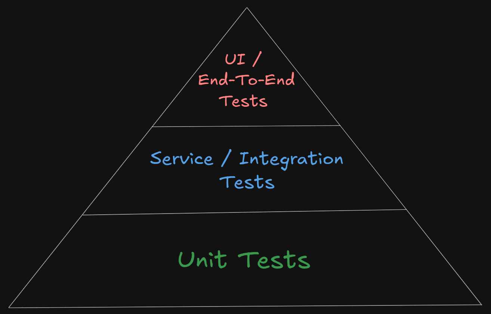
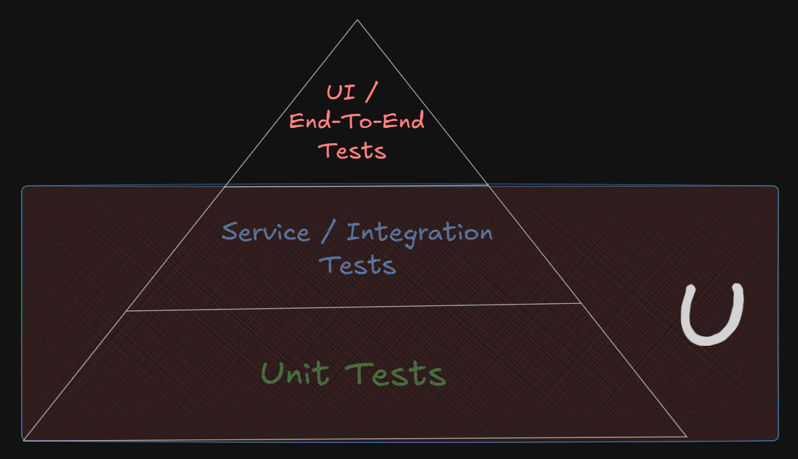
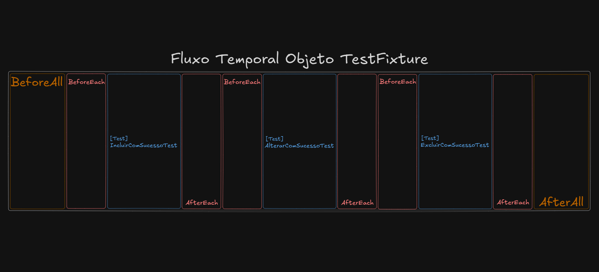
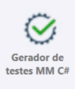
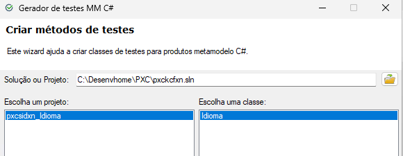
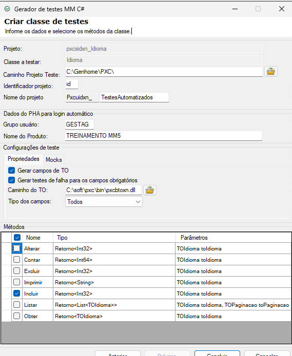
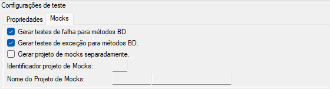
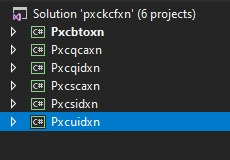

# Camada (extra) U

A **camada U** é responsável por concentrar os **testes automatizados**, desenvolvidos para validar o comportamento de um backend MM4. Ela exerce um papel essencial dentro do fluxo de desenvolvimento: garantir que a **camada S** esteja implementando corretamente as regras de negócio previstas nas user stories, verificar a interação controlada com a **camada Q** e validar os cenários de verificação definidos nos casos de teste.

Enquanto a camada Q realiza operações de persistência e a camada S executa e orquestra regras de negócio, a camada U funciona como a **camada de qualidade**, responsável por confirmar que todas as operações se comportam conforme o esperado em simulações isoladas de cenários reais.

A tratamos como uma "camada" apenas de forma simbólica, pois ela **não tem efeito prático dentro da arquitetura de uma aplicação MM4**.

## Testes automatizados

Enquanto testes **manuais** são executados por pessoas, interagindo com a aplicação parte a parte, repetitivamente, manualmente e com alta sujeitabilidade a erros, testes **automatizados** são scripts programados e determinísticos, que podem fazer essa mesma atividade com grande escala, controle e independência.

Testes manuais não são descartáveis, mas deveriam ser executados apenas em etapas estratégicas como verificações exploratórias ou etapas de aceite e usabilidade (tarefas que tem um alto grau de interação com usuários e partes interessadas na aplicação). Quando o assunto é validar funcionalidades, comportamentos e erros de forma replicável, escalável e com menos risco de erros, os testes automatizados tem mais valor.

Ou seja, testes automatizados tendem a ser mais:

- Reproduzíveis;
- Consistentes;
- Integráveis a esteiras de desenvolvimento ([CI](../../dicionario-banrisul.md#ci---continuous-integration)/[CD](../../dicionario-banrisul.md#cd---continuous-deliverydeployment));
- Executáveis a qualquer momento;
- Menos sujeitos a erro humano;
- Muito mais rápidos em ciclos sucessivos (escaláveis).

Algumas premissas sobre testes automatizados que asseguram confiabilidade, redução de interferências externas e facilitam o atingimento dos objetivos:

- Cada teste automatizado deve ser **completamente independente**, construindo sempre o seu próprio cenário e garantindo que nenhum dado residual de execuções anteriores seja utilizado;
- Um teste automatizado não pode assumir que outro já foi executado antes — uma _suíte de testes_ deve funcionar em qualquer ordem, inclusive de forma paralela, sem alterar o comportamento esperado;
- A execução de um teste automatizado precisa ser sempre previsível e determinística: dadas as mesmas entradas, os testes devem produzir os mesmos resultados, independentemente do momento ou do ambiente em que rodam;
- Bons testes automatizados tendem a ser [idempotentes](../../dicionario-banrisul.md#idempotência) — ou seja — executando uma ou cem vezes, seu impacto no ambiente permanece controlado e consistente.

## A pirâmide de testes

A pirâmide de testes (em sua forma mais comum e simplificada) organiza as categorias de testes em diferentes níveis:



- **Base:** Unit Tests (Testes Unitários);
- **Meio:** Service/Integration Tests (Testes de Serviço/Integração);
- **Topo:** UI/End-to-end Tests (Testes de UI/ponta a ponta).

Cada nível possui propósitos distintos, abrangendo diferentes graus de escopo, custo, complexidade e velocidade de execução.

### Base: Testes Unitários

Testes unitários **validam unidades isoladas de código**, normalmente métodos individuais ou pequenos componentes. Eles:

- Não dependem de uma base de dados;
- Não dependem de serviços externos;
- Não exigem aspectos complexos de infraestrutura;
- Rodam muito rapidamente;
- São "baratos", numerosos e fáceis de manter.

O objetivo é garantir que **cada pequena parte do código funcione sozinha**, de forma determinística.

### Meio: Testes de Serviço/Integração

Testes de integração verificam se **diferentes partes do sistema funcionam juntas de maneira coerente**. Eles:

- Validam interação real entre componentes;
- Exercitam regras que dependem de dados da base de dados;
- Podem envolver transações reais na base de dados com controle de _rollback_ ao final;
- São mais "caros" que os testes unitários, então precisam ser implementados em menor número e com maior assertividade.

Na pirâmide, ficam **no meio** devido a serem implementados em menor quantidade e com maior "custo" que os testes unitários. Trazem benefícios essenciais para garantir confiabilidade do domínio.

### Topo: Testes de UI/ponta a ponta

Testes de ponta a ponta validam o sistema **como um todo a partir de uma interface com o usuário**, simulando o comportamento real das funcionalidades que o usuário consome. Eles podem envolver:

- Frontend (UI);
- Backend a partir de endpoints de web services;
- Regras de negócio;
- Acesso a dados;
- Integrações externas;

Ou seja, **percorrem o fluxo real da aplicação**, do clique do usuário à persistência final na base de dados.

São testes muito mais lentos, menos numerosos, e são o tipo mais "caro" de teste que se pode implementar com base nas categorizações da pirâmide.

Embora muito importantes e válidos, **não fazem parte da camada U**, que se concentra exclusivamente nos testes unitários e de integração aplicados diretamente sobre a camada S.

## Camada U sob a pirâmide de testes



A camada U atua **principalmente nos dois níveis inferiores** da pirâmide:

- **Unitário:** Fazendo uso de artifícios como mocks (dublês);
- **Integração:** Quando de fato mantém o funcionamento padrão de comunicação acontecendo entre todas as camadas, inclusive persistindo (de forma temporária) os dados, com um rollback posterior.

Isso permite validar tanto a lógica isolada quanto os fluxos completos envolvendo persistência transacional.

## Camada U no MM4

A **camada U** é um projeto que faz uso interno do **NUnit** — framework .NET amplamente utilizado no mercado para criação e execução de testes automatizados. Ela passa por duas fases distintas em relação a ferramentas do [PZP](../../dicionario-banrisul.md#pzp---ferramenta-de-apoio-ao-desenvolvimento): em primeiro momento é criada através da ferramenta **Gerador de testes MM C#**, e depois de configurada e refinada, tem seus testes resultantes executados através da ferramenta **Testador MM C#**.

Alguns princípios fundamentais sobre o que a camada U deve fazer ou não fazer:

- A camada U **não interage com a base de dados para persistência de dados reais** (responsabilidade da Q) — apenas cria estados temporários e os elimina ao final das execuções de testes;
- A camada U **não implementa regras de negócio** (responsabilidade da S);
- A camada U **descreve cenários** (principalmente embasada nos casos de teste) e **valida comportamentos observáveis** das demais camadas.

## Anatomia geral da Camada U

Assim como na camada S — e principalmente porque uma _"suíte"_ de testes da camada U é muito voltada para **testar um projeto em específico de camada S** — a camada U normalmente também segue a mesma prática das demais de possuir **projetos por TO**. O que, na prática, novamente, significa que cada TO da aplicação vai possuir seu próprio projeto de camada U, contendo suas respectivas classes de testes. Convencionalmente chamamos os objetos de testes de **TestFixtures**:

```makefile
PXC\
|
├── pxcbtoxn\                         # Pasta do projeto - TOs
|   ├── pgm\                          # Pasta de arquivos do "programa"
|   |   ├── pxcbtoxn_AssemblyInfo.cs  # Arquivo de metadados de compilação
|   |   ├── pxcbtoxn_TOIdioma.cs      # Arquivo do TO de idiomas
|   |   └── pxcbtoxn_TOUsuario.cs     # Arquivo do TO de usuários
|   └── pxcbtoxn.csproj               # Arquivo .NET do projeto
|
├── pxcqusxn_Usuario\                 # Pasta do projeto - Camada Q de usuários
|   ├── [...]                         # Estrutura omitida por brevidade
|
├── pxcqidxn_Idioma\                  # Pasta do projeto - Camada Q de idiomas
|   ├── [...]                         # Estrutura omitida por brevidade
|
├── pxcsusxn_Usuario\                 # Pasta do projeto - Camada S de usuários
|   ├── [...]                         # Estrutura omitida por brevidade
|
├── pxcsidxn_Idioma\                  # Pasta do projeto - Camada S de idiomas
|   ├── [...]                         # Estrutura omitida por brevidade
|
├── pxcuusxn_TestesAutomatizados\     # Pasta do projeto - Camada U de usuários
|   ├── pgm\                          # Pasta de arquivos do "programa"
|   |   ├── pxcuusxn_AssemblyInfo.cs  # Arquivo de metadados de compilação
|   |   ├── pxcuusxn_UsuarioTests.cs  # Arquivo do objeto TestFixture de usuários
|   |   └── pxcuusxn_MockUsuario.cs   # Arquivo do objeto Mock de usuários (quando aplicável)
|   └── pxcuusxn.csproj               # Arquivo .NET do projeto
|
├── pxcuidxn_TestesAutomatizados\     # Pasta do projeto - Camada U de idiomas
|   ├── pgm\                          # Pasta de arquivos do "programa"
|   |   ├── pxcuidxn_AssemblyInfo.cs  # Arquivo de metadados de compilação
|   |   ├── pxcuidxn_IdiomaTests.cs   # Arquivo do objeto TestFixture de idiomas
|   |   └── pxcuidxn_MockIdioma.cs    # Arquivo do objeto Mock de idiomas (quando aplicável)
|   └── pxcuidxn.csproj               # Arquivo .NET do projeto
|
└── pxckcfxn.sln                      # Arquivo .NET da solução
```

> Notas:
>
> - No **Gerador de testes MM C#** existe a possibilidade de se personalizar o nome do projeto de camada U, porém, é sempre recomendado utilizar o padrão já sugerido por ele;
> - No **Gerador de testes MM C#** existe a possibilidade se se gerar um projeto _apartado_ para os mocks. Em caso de se utilizar essa opção, a diferença é que seria criada outra estrutura completa de projeto C# para conter o objeto Mock. Exemplo:
>
> ```makefile
> ├── pxcuusxn_Mocks\                   # Pasta do projeto - Mocks da Camada U de usuários
> |   ├── pgm\                          # Pasta de arquivos do "programa"
> |   |   ├── pxcuusxn_AssemblyInfo.cs  # Arquivo de metadados de compilação
> |   |   └── pxcuusxn_MockUsuario.cs   # Arquivo do objeto Mock de usuários
> |   └── pxcuusxn.Mocks.csproj         # Arquivo .NET do projeto
> ```
>
> - A seguir abordaremos um pouco mais sobre o conceito de mocks (dublês) e sua aplicabilidade.
>

## Anatomia geral de um objeto TestFixture

A estrutura típica de um objeto TestFixture dentro de um projeto MM4 é semelhante a isso:

```csharp
namespace Bergs.Pxc.Pxcuusxn.Tests
{
    [TestFixture(Description = "Classe de testes para a classe RN Usuario.", Author = "T07007")]
    public class UsuarioTests: AbstractTesteRegraNegocio<Pxcsusxn.Usuario>
    {
        /*
         * Métodos de preparação e fechamento
        */

        protected override void BeforeAll()
        {
            // [...]
        }

        protected override void BeforeEach()
        {
            // [...]
        }

        protected override void AfterAll()
        {
            // [...]
        }

        protected override void AfterEach()
        {
            // [...]
        }

        /*
         * Método para setar os dados necessários para conexão com o PHA no servidor de testes
        */

        protected override TOPhaServidorBuild SetarDadosServidorBuild()
        {
            return new TOPhaServidorBuild("GESTAG", "TREINAMENTO MM5"); // Configurações padrão para o treinamento — Nos projetos reais os parâmetros serão diferentes
        }

        /*
         * Métodos que testam as operações nos seus respectivos "caminhos felizes" de sucesso
        */

        [Test(Description = "Testa o método Alterar(TOUsuario).", Author = "T07007")]
        public void AlterarComSucessoTest()
        {
            // [TestarAlterar(toUsuario)...]
        }

        [Test(Description = "Testa o método Contar(TOUsuario).", Author = "T07007")]
        public void ContarComSucessoTest()
        {
            // [TestarContar(toUsuario)...]
        }

        [Test(Description = "Testa o método Excluir(TOUsuario).", Author = "T07007")]
        public void ExcluirComSucessoTest()
        {
            // [TestarExcluir(toUsuario)...]
        }

        [Test(Description = "Testa o método Imprimir(TOUsuario).", Author = "T07007")]
        public void ImprimirComSucessoTest()
        {
            // [TestarImprimir(toUsuario)...]
        }

        [Test(Description = "Testa o método Incluir(TOUsuario).", Author = "T07007")]
        public void IncluirComSucessoTest()
        {
            // [TestarIncluir(toUsuario)...]
        }

        [Test(Description = "Testa o método Listar(TOUsuario, TOPaginacao).", Author = "T07007")]
        public void ListarComSucessoTest()
        {
            // [TestarListar(toUsuario, toPaginacao)...]
        }

        [Test(Description = "Testa o método Obter(TOUsuario).", Author = "T07007")]
        public void ObterComSucessoTest()
        {
            // [TestarObter(toUsuario)...]
        }

        /*
         * Métodos que testam falhas nas operações
        */

        [Test(Description = "Testa o método Alterar(TOUsuario).", Author = "T07007")]
        public void AlterarComFalhaTest()
        {
            // [rnUsuario.Alterar(toUsuario)...]
        }

        [Test(Description = "Testa o método Contar(TOUsuario).", Author = "T07007")]
        public void ContarComFalhaTest()
        {
            // [rnUsuario.Contar(toUsuario)...]
        }

        [Test(Description = "Testa o método Excluir(TOUsuario).", Author = "T07007")]
        public void ExcluirComFalhaTest()
        {
            // [rnUsuario.Excluir(toUsuario)...]
        }

        [Test(Description = "Testa o método Imprimir(TOUsuario).", Author = "T07007")]
        public void ImprimirComFalhaTest()
        {
            // [rnUsuario.Imprimir(toUsuario)...]
        }

        [Test(Description = "Testa o método Incluir(TOUsuario).", Author = "T07007")]
        public void IncluirComFalhaTest()
        {
            // [rnUsuario.Incluir(toUsuario)...]
        }

        [Test(Description = "Testa o método Listar(TOUsuario, TOPaginacao).", Author = "T07007")]
        public void ListarComFalhaTest()
        {
            // [rnUsuario.Listar(toUsuario, toPaginacao)...]
        }

        [Test(Description = "Testa o método Obter(TOUsuario).", Author = "T07007")]
        public void ObterComFalhaTest()
        {
            // [rnUsuario.Obter(toUsuario)...]
        }

        /*
         * Métodos que testam erros/exceções nas operações
        */

        [Test(Description = "Testa o método Alterar(TOUsuario).", Author = "T07007")]
        public void AlterarComExcecaoTest()
        {
            // [rnUsuario.Alterar(toUsuario)...]
        }

        [Test(Description = "Testa o método Contar(TOUsuario).", Author = "T07007")]
        public void ContarComExcecaoTest()
        {
            // [rnUsuario.Contar(toUsuario)...]
        }

        [Test(Description = "Testa o método Excluir(TOUsuario).", Author = "T07007")]
        public void ExcluirComExcecaoTest()
        {
            // [rnUsuario.Excluir(toUsuario)...]
        }

        [Test(Description = "Testa o método Imprimir(TOUsuario).", Author = "T07007")]
        public void ImprimirComExcecaoTest()
        {
            // [rnUsuario.Imprimir(toUsuario)...]
        }

        [Test(Description = "Testa o método Incluir(TOUsuario).", Author = "T07007")]
        public void IncluirComExcecaoTest()
        {
            // [rnUsuario.Incluir(toUsuario)...]
        }

        [Test(Description = "Testa o método Listar(TOUsuario, TOPaginacao).", Author = "T07007")]
        public void ListarComExcecaoTest()
        {
            // [rnUsuario.Listar(toUsuario, toPaginacao)...]
        }

        [Test(Description = "Testa o método Obter(TOUsuario).", Author = "T07007")]
        public void ObterComExcecaoTest()
        {
            // [rnUsuario.Obter(toUsuario)...]
        }

        /*
         * Métodos privados auxiliares para apoiar os métodos principais
        */
    }
}
```

A **camada U** opera sempre **através da interface pública da camada S**:

- `Incluir(...)`;
- `Alterar(...)`;
- `Excluir(...)`;
- `Listar(...)`;
- `Obter(...)`;
- `Contar()...`;
- `Imprimir(...)`.

Isso significa que:

- Se uma regra de negócio estiver incorreta na camada S e estiver sendo corretamente verificada na U — o teste falhará;
- Se a camada Q estiver com problemas — o teste revelará inconsistências;
- Se um método estiver expondo mensagens incorretas ou incoerentes, desde que corretamente coberto na U — o teste capturará.

Possui sete elementos fundamentais:

### Herança da classe base `AbstractTesteRegraNegocio<RN>`

Essa classe fornece toda a base utilitária para a execução dos testes automatizados, englobando recursos como:

- Encapsulamento de um objeto RN instanciado automaticamente para uso nos testes;
- Execução de testes sob escopos transacionais descartáveis (com rollback ao final);
- Organização e execução do fluxo completo dos testes com o encadeamento dos métodos de preparação `BeforeAll(...)`, `BeforeEach(...)`, `AfterEach(...)` e `AfterAll(...)`;
- Disponibilização dos utilitários "de caminho feliz", através dos métodos `TestarIncluir(...)`, `TestarAlterar(...)`, `TestarExcluir(...)`, `TestarListar(...)`, `TestarObter(...)`, `TestarContar(...)` e `TestarImprimir(...)`.

### Métodos de preparação e fechamento

Os métodos de preparação e fechamento são eventos que funcionam como [hooks](../../dicionario-banrisul.md#hook), que são executados em um dado momento na linha temporal em relação aos testes. Sua inserção no fluxo permite facilitação de configurações comuns de ambiente, preparação de dados, montagens de estruturas auxiliares ou mesmo algum tipo de liberação ou limpeza de dados após conclusão.

São inseridos no fluxo da seguinte maneira:



- `BeforeAll(...)`: Executa **uma única vez antes do primeiro teste**;
- `BeforeEach(...)`: Executa **antes de cada** teste;
- `AfterEach(...)`: Executa **depois de cada** teste;
- `AfterAll(...)`: Executa **uma única vez após o final do último teste**.

> Nota: RNs são instanciadas e escopos transacionais são criados dentro do hook acionador do método `BeforeEach(...)`, ou seja, a partir do método `BeforeEach(...)` já há sempre um escopo transacional sendo controlado e um objeto RN disponível para uso — o que também significa que no `BeforeAll(...)` estes ainda não existem.

### Sobrescrita do método `SetarDadosServidorBuild(...)`

Esse método serve para que a aplicação consiga rodar seu "servidor" em memória — ou seja, consiga executar e carregar todas as configurações e objetos do framework, como por exemplo o super objeto `Infra`, que só é carregado na aplicação mediante uso correto de credenciais de segurança aprovadas pelo sistema [PHA](../../dicionario-banrisul.md#pha). Devido a isso as credenciais de acesso podem ser diferentes para cada tipo de projeto. Especificamente para o [sistema PXC](../../dicionario-banrisul.md#pxc), as credenciais de acesso são:

- Código do grupo: `GESTAG`;
- Produto `TREINAMENTO MM5`.

> Importante: Relembrando a relação sistema/produto entre [`PXC` e Treinamento MM5](../../dia-01/01-checkup-ambiente/01-conteudo.md#css-pxc---treinamento-mm5).

### Métodos de sucesso ("caminho feliz")

Os métodos de sucesso (popularmente e carinhosamente chamados de "caminho feliz") validam **o comportamento original esperado e correto** das operações da camada S — sem erros, sem dados inválidos e sem exceções. Nestes casos é bastante comum o uso dos métodos utilitários da classe base `AbstractTesteRegraNegocio<RN>`:

- `TestarIncluir(...)`;
- `TestarAlterar(...)`;
- `TestarExcluir(...)`;
- `TestarObter(...)`;
- `TestarListar(...)`;
- `TestarContar(...)`;
- `TestarImprimir(...)`.

Esses métodos já realizam internamente:

- A chamada ao respectivo método do objeto RN;
- Asserções de sucesso (retorno `OK = true`, dados não nulos, etc.) através dos métodos também auxiliares `ValidarIncluir(...)`, `ValidarAlterar(...)`, `ValidarExcluir(...)` e `ValidarImprimir(...)`.

### Métodos de falhas

Os métodos de falha validam **comportamentos negativos esperados**, ou seja, quando a entrada do usuário viola regras de negócio.

Aqui:

- A chamada dos métodos do objeto RN normalmente é feita diretamente (`rn.Alterar(to)`, `rn.Incluir(to)`, etc.);
- Geralmente a expectativa é que o retorno venha com `OK = false`;
- Mensagens de falha **precisam coincidir com o que o objeto de mapa de mensagens respectivo define**.

A checagem de falhas garante que:

- Regras de negócio obrigatórias estão devidamente protegidas;
- Fluxos impróprios estão sendo bloqueados adequadamente;
- Validações estão impedindo operações inválidas de serem efetivadas;
- Mensagens de falha são coerentes e expressivas.

### Métodos de erros/exceções

Os métodos de erro buscam validar **condições anormais**, nas quais:

- Algo inesperado acontece dentro dos fluxos;
- Dependências simuladas (mocks) produzem situações de ruptura;
- O TO entra em um estado de inconsistência que aciona comportamentos excepcionais nas operações;
- Falhas estruturais imprevistas emergem em alguma das camadas.

É importante destacar que, **ainda que exista um teste automatizado para capturar uma exceção**, isso **não significa que a exceção passou a ser um comportamento previsto ou desejado**. O teste apenas garante que quando **uma possibilidade de falha de alto nível** ocorre, a camada S reage da melhor forma possível sem comprometer a integridade da aplicação, principalmente deixando o problema causar efeitos colaterais nos dados.

Porém, **abaixo dessa exceção podem existir diversas causas distintas** — desde falhas de infraestrutura, erros de conversão, violações internas, inconsistências de dados ou problemas inesperados nas camadas inferiores.

Nesses testes:

- Utiliza-se `MMAssert.Excecao(...)`, `Assert.Throws(...)` ou equivalentes;
- A expectativa é que **uma exceção** tenha sido envelopada em um retorno ou de fato lançada diretamente.

> Curiosidade: **Qual a diferença entre falha e erro/exceção?**
> Essa distinção é importante:
>
> - **Falha:** O usuário fornece dados inválidos e o método retorna `OK = false`. É um comportamento esperado, parte das regras de negócio;
> - **Erro/Exceção:** ocorre uma condição inesperada e uma exceção é lançada. É um comportamento anômalo, geralmente ligado a falhas no design da aplicação.

### Métodos privados auxiliares

A exemplo das camadas Q e S, na camada U também há convencionalmente um espaço destinado aos métodos auxiliares privados, destinados a apoiar nas montagens de cenários para a execução dos testes por exemplo, de forma a simplificar o processo e evitar repetição desnecessária de código.

## Detalhando

Vamos detalhar um pouco mais da anatomia de um objeto TestFixture visualizando um código real de uma classe com testes de sucesso, falhas e erros/exceções para as operações CRUD de **inclusão** e **contagem**, e o método extra de **impressão**:

```csharp
/*
 * Nome do projeto - Camada U de usuários é "Pxcuusxn", onde:
 *  "Pxc" = CSS do sistema de treinamentos
 *  "u" = Identificador de um projeto - Camada U
 *  "us" = Identificador curto para um TO alvo (USUARIO) - nesse caso: "us" 
 *  "xn" = Identificador de um projeto do tipo MM4
*/
namespace Bergs.Pxc.Pxcuusxn.Tests
{
    /*
     * Indica que a classe em questão vai constituir um objeto TestFixture, que define uma descrição e um nome de autor 
     * (convencionado fazer o uso da própria matrícula) a serem exibidos para melhor organização nas devidas ferramentas 
     * de execução dos testes
    */
    [TestFixture(Description = "Classe de testes para a classe RN Usuario.", Author = "T07007")]
    public class UsuarioTests: AbstractTesteRegraNegocio<Usuario> // Herança da classe base passando o tipo RN de usuários
    {
        /*
         * O uso de regions para separar em grupos os métodos testados pela S é apenas uma sugestão — não sendo uma 
         * convenção obrigatória dentro de camadas U
        */
        #region Testes de Contar

        /*
         * Indica que o método em questão vai constituir um Teste, que define uma descrição e um nome de autor 
         * (convencionado fazer o uso da própria matrícula) a serem exibidos para melhor organização nas devidas ferramentas 
         * de execução dos testes
        */
        [Test(Description = "Testa o método Contar(TOUsuario).", Author = "T07007")]
        public void ContarComSucessoTest()
        {
            // A1 Arrange

            /*
             * Define a contagem alvo, à qual todo o cenário será montado para esse 
             * retorno, possibilitando sua validação
            */
            var contagemEsperada = 4;

            /*
             * Chama o método privado auxiliar para montagem do cenário deste teste
            */
            MontarCenarioContarComSucessoTest(contagemEsperada);

            /*
             * Define o TO de filtragem sem dados — para executar uma contagem total 
            */
            var toUsuarioFiltragem = new TOUsuario();

            /*
             * A2 Act e A3 Assert normalmente são blocos separados, mas nesse caso estão 
             * juntos devido a estarmos utilizando um método da classe base, que 
             * efetua a execução (act) e já executa também algumas asserções (assert)
            */

            /*
             * Act e Assert através do método utilitário da classe base
            */
            var resultado = TestarContar(toUsuarioFiltragem);

            /*
             * Efetua uma asserção adicional para validar a contagem exata que 
             * definimos como alvo
            */
            Assert.That(resultado.Dados, Is.EqualTo(contagemEsperada));
        }

        #endregion

        #region Testes de Imprimir
        
        /*
         * Indica que o método em questão vai constituir um Teste, que define uma descrição e um nome de autor 
         * (convencionado fazer o uso da própria matrícula) a serem exibidos para melhor organização nas devidas ferramentas 
         * de execução dos testes
        */
        [Test(Description = "Testa o método Imprimir(TOUsuario).", Author = "T07007")]
        public void ImprimirComSucessoTest()
        {
            // A1 Arrange

            /*
             * Define um nome de usuário alvo, o qual todo o cenário será montado para que esse 
             * nome conste no relatório que será validado
            */
            var nomeEsperado = "John Doe";

            /*
             * Define uma quantidade total de itens (usuários) que o relatório deverá conter, o qual 
             * todo o cenário será montado para que esse total de usuários seja impresso no relatório
             * e possa ser validado
            */
            var totalItensRelatorio = 10;

            /*
             * Define a posição esperada do usuário alvo que terá o nome definido como esperado, à qual 
             * o cenário será montado para que o usuário seja colocado nessa posição dentro do relatório,
             * podendo ser validada no teste
            */
            var posicaoEsperadaNomeEsperado = 4;

            /*
             * Chama o método privado auxiliar para montagem do cenário deste teste, especificando que
             * o 4º usuário a ser adicionado, de um total de 10 usuários, deve ter o nome "John Doe"
            */
            MontarCenarioImprimirComSucessoTest(nomeEsperado, posicaoEsperadaNomeEsperado, totalItensRelatorio);

            /*
             * Define o TO de filtragem sem dados — para executar uma montagem de relatório com 
             * a totalidade de registros da tabela
            */
            var toUsuarioFiltragem = new TOUsuario();

            /*
             * A2 Act e A3 Assert normalmente são blocos separados, mas nesse caso estão 
             * juntos devido a estarmos utilizando um método da classe base, que 
             * efetua a execução (act) e já executa também algumas asserções (assert)
             * entre elas a verificação da existência do arquivo do relatório na
             * pasta especificada
            */

            /*
             * Act e Assert através do método utilitário da classe base
            */
            var resultado = TestarImprimir(toUsuarioFiltragem);

            /*
             * Para efetuarmos asserções adicionais, vamos ler o relatório
             * da pasta especificada através de um método privado auxiliar,
             * e retornar os dados lidos em um List<TOUsuario>
            */
            var dadosRelatorio = LerRelatorio(resultado.Dados);

            /*
             * Efetua uma asserção adicional para validar se a quantidade total
             * de itens no relatório corresponde às expectativas
            */
            Assert.That(dadosRelatorio, Has.Count.EqualTo(totalItensRelatorio));

            /*
             * Efetua uma asserção adicional para validar se o usuário 
             * com nome "John Doe" está na 4ª posição do relatório
            */
            Assert.That(dadosRelatorio[posicaoEsperadaNomeEsperado - 1].Nome, Is.EqualTo(nomeEsperado));
        }

        /*
         * Indica que o método em questão vai constituir um Teste, que define uma descrição e um nome de autor 
         * (convencionado fazer o uso da própria matrícula) a serem exibidos para melhor organização nas devidas ferramentas 
         * de execução dos testes
        */
        [Test(Description = "Testa o método Imprimir(TOUsuario) com exceção durante a listagem de usuários.", Author = "T07007")]
        public void ImprimirComExcecaoTest()
        {
            // A1 Arrange

            /*
             * Instancia o objeto Mock que pode possuir uma série de funcionalidades de mocks para 
             * substituição de comportamentos de métodos dos objetos BD e RN
            */
            var mockUsuario = new MockUsuario(Infra);

            /*
             * Chama o método que "substitui" o método Listar do objeto BD, fazendo com que essa 
             * versão substituta (o dublê/mock) lance uma exceção na operação
            */
            mockUsuario.MockarListarQComExcecao();

            /*
            * Define o TO de filtragem sem dados — para executar uma montagem de relatório com 
            * a totalidade de registros da tabela
           */
            var toUsuarioFiltragem = new TOUsuario();

            // A2 Act

            /*
             * Efetua a execução do método Imprimir da RN para poder fazer as asserções
             * em cima do resultado obtido
            */
            var resultado = RN.Imprimir(toUsuarioFiltragem);

            // A3 Assert

            /*
             * Efetua asserção para validar se a exceção contida no resultado corresponde
             * à exceção definida como esperada (nesse caso uma Exception genérica 
             * mesmo)
            */
            MMAssert.Excecao<Exception>(resultado);
        }

        #endregion

        #region Testes de Incluir

        /*
         * Indica que o método em questão vai constituir um Teste, que define uma descrição e um nome de autor 
         * (convencionado fazer o uso da própria matrícula) a serem exibidos para melhor organização nas devidas ferramentas 
         * de execução dos testes
        */
        [Test(Description = "Testa o método Incluir(TOUsuario).", Author = "T07007")]
        public void IncluirComSucessoTest()
        {
            // A1 Arrange

            /*
             * Define um nome de usuário alvo, o qual todo o cenário será montado para que esse 
             * nome seja usado no usuário incluído para que possa ser validado
            */
            var nomeEsperado = "John Doe";

            /*
             * Define uma data de nascimento do usuário alvo, à qual todo o cenário será montado 
             * para que essa data seja usada no usuário incluído para que possa ser validada
            */
            var dataNascimentoEsperada = new DateTime(1980, 10, 10);

            /*
             * Define o TO de inclusão com os dados a serem inseridos no usuário da base de dados
            */
            TOUsuario toUsuarioInclusao = new TOUsuario()
            {
                Nome = nomeEsperado,
                DataNascimento = dataNascimentoEsperada
            };

            /*
             * A2 Act e A3 Assert normalmente são blocos separados, mas nesse caso estão 
             * juntos devido a estarmos utilizando um método da classe base, que 
             * efetua a execução (act) e já executa também algumas asserções (assert)
             * para verificar se a inclusão foi bem sucedida
            */

            /*
             * Act e Assert através do método utilitário da classe base
             * Nesse caso o TestarIncluir(...) já tem asserções suficientes,
             * não precisamos de validações adicionais
            */
            var resultado = TestarIncluir(toUsuarioInclusao);
        }

        /*
         * Indica que o método em questão vai constituir um Teste, que define uma descrição e um nome de autor 
         * (convencionado fazer o uso da própria matrícula) a serem exibidos para melhor organização nas devidas ferramentas 
         * de execução dos testes
        */
        [Test(Description = "Testa o método Incluir(TOUsuario) com falha de campo obrigatório (Nome).", Author = "T07007")]
        public void IncluirFalhaCampoObrigatorioNomeTest()
        {
            // A1 Arrange

            /*
             * Instancia a mensagem de falha esperada conforme ela deveria estar sendo tratada 
             * pela camada S
            */
            var mensagemEsperada = new UsuarioMensagem(TipoUsuarioMensagem.FalhaRnValidarExistenciaNome);

            /*
             * Define o TO de inclusão sem um valor válido setado para a propriedade Nome
             * (a data de nascimento foi setada, mas para o nosso teste ela é irrelevante, 
             * estamos preocupados em validar somente a falha de Nome)
            */
            TOUsuario toUsuarioInclusao = new TOUsuario()
            {
                DataNascimento = new DateTime(1980, 10, 10)
            };

            // A2 Act
            
            /*
             * Efetua a execução do método incluir da RN para poder fazer as asserções
             * em cima do resultado obtido
            */
            var resultado = RN.Incluir(toUsuarioInclusao);

            // A3 Assert

            /*
             * Efetua asserção para verificar se a mensagem de falha condiz com 
             * a mensagem de falha esperada
            */
            MMAssert.FalhaComMensagem(resultado, mensagemEsperada.Identificador); 
            // ou MMAssert.FalhaComMensagem(resultado, mensagemEsperada: mensagemEsperada.ParaUsuario);

            /*
             * Variação: Em caso de a camada S estar tratando as validações com base 
             * no ValidarTO(...), a mensagem de falha deverá indicar o campo respectivo 
             * ao Nome
            */
            MMAssert.FalhaCampoObrigatorio(resultado, TOUsuario.NOME_USUARIO);

            /*
             * Efetua asserção só para reconfirmar que o indicador de operação
             * veio com indicação de não sucesso
            */
            Assert.False(resultado.OK);

            /*
             * Efetua asserção para verificar se o resultado final da inclusão é
             * uma contagem de 0 registros incluídos
            */
            Assert.Zero(resultado.Dados);
        }
        
        #endregion
        
        /*
         * Método de preparação que executa UMA ÚNICA VEZ ANTES do primeiro método de teste
        */
        protected override void BeforeAll()
        { }

        /*
         * Método de preparação que executa ANTES DE CADA UM dos métodos de teste
        */
        protected override void BeforeEach()
        { }

        /*
         * Método de fechamento que executa UMA ÚNICA VEZ APÓS o último método de teste
        */
        protected override void AfterAll()
        { }

        /*
         * Método de fechamento que executa APÓS CADA UM dos métodos de teste
        */
        protected override void AfterEach()
        { }

        /*
         * Método para setar os dados necessários para conexão com o PHA no servidor de testes
        */
        protected override TOPhaServidorBuild SetarDadosServidorBuild()
        {
            /*
             * Recupera as configurações do arquivo de properties
            */
            var grupoPha = "GESTAG"; // TODO: Alterar para pegar de um arquivo de configuração (como o Banrisul faz isso?)
            var nomeProdutoPha = "TREINAMENTO MM5"; // TODO: Alterar para pegar de um arquivo de configuração (como o Banrisul faz isso?)

            /*
             * Configura o servidor através da instância de TOPhaServidorBuild
            */
            return new TOPhaServidorBuild(grupoPha, nomeProdutoPha);
        }

        /*
         * Método auxiliar de montagem do cenário para o teste bem sucedido de contagem
        */
        private void MontarCenarioContarComSucessoTest(int contagemEsperada)
        {
            /*
             * Limpa a tabela para garantir que o teste integrado executará em um ambiente controlado
             * Importante: É desencorajado o uso de SQLs diretas — usar com parcimônia só 
             * em casos de extrema necessidade. Via de regra, buscar sempre usar o próprio 
             * objeto de RN para montar cenários
            */
            Infra.ExecutarSql($"DELETE FROM {TOUsuario.TABELA}");

            /*
             * Inclui o número de usuários especificado
            */
            for (int i = 0; i < contagemEsperada; i++)
                IncluirUsuario();
        }

        /*
         * Método auxiliar de montagem do cenário para o teste bem sucedido de impressão
        */
        private void MontarCenarioImprimirComSucessoTest(string nome, int posicaoItemRelatorio, int totalItens)
        {
            /*
             * Limpa a tabela para garantir que o teste integrado executará em um ambiente controlado
             * Importante: É desencorajado o uso de SQLs diretas — usar com parcimônia só 
             * em casos de extrema necessidade. Via de regra, buscar sempre usar o próprio 
             * objeto de RN para montar cenários
            */
            Infra.ExecutarSql($"DELETE FROM {TOUsuario.TABELA}");

            /*
             * Inclui o número de usuários especificado tomando o cuidado de adicionar um usuário
             * com o nome especificado na posição desejada
             * Importante: Aqui parte-se do pressuposto que o relatório é gerado em ordem crescente 
             * pelos IDs de usuário, que são numéricos sequenciais. Para outros tipos de ordenações
             * seriam necessários outros tratamentos tanto na geração do relatório quanto nos testes
            */
            for (int i = 0; i < totalItens; i++)
            {
                if (i == (posicaoItemRelatorio - 1))
                    IncluirUsuario(nome);
                else
                    IncluirUsuario();
            }
        }

        /*
         * Método auxiliar para inclusão de usuários durante montagem de cenários de testes de integração
        */
        private void IncluirUsuario(string nome = "Padrao", DateTime? dataNascimento = null)
        {
            /*
             * Instancia o TO referente ao usuário que será incluído
            */
            var toUsuario = new TOUsuario()
            {
                Nome = nome,
                DataNascimento = dataNascimento == null ? new DateTime(2000, 10, 10) : dataNascimento.Value
            };

            /*
             * Inclui o novo usuário através do objeto RN
            */
            RN.Incluir(toUsuario);
        }

        /*
         * Método auxiliar para leitura e desserialização dos dados 
         * de um relatório para uma lista de usuários
        */
        private List<TOUsuario> LerRelatorio(string enderecoRelatorio)
        {
            // [Omitido por brevidade e para não desfocarmos o conteúdo...]
        }
    }
}
```

### Novos elementos após detalhamento

#### Padrão AAA - Arrange, Act e Assert

O padrão AAA é uma **convenção** amplamente adotada na escrita de testes automatizados, trazendo clareza, previsibilidade e organização ao fluxo lógico de cada teste. Seu objetivo é estruturar o teste em três blocos bem definidos, permitindo que o leitor compreenda facilmente **o que está sendo preparado**, **qual ação está sendo executada** e **o que está sendo verificado**.

Organizar testes com AAA torna-os mais legíveis, didáticos e de simples manutenção, com intenções e separações bem definidas.

##### Arrange (Preparação)

Nesta etapa, o teste **prepara o cenário** necessário para a execução da ação que será testada. Isso envolve criar TOs, configurar mocks, definir variáveis iniciais e estabelecer pré-condições. O foco é **deixar tudo pronto**, sem ainda executar a lógica que será testada.

Nenhuma parte do comportamento alvo deve ocorrer aqui — somente preparação.

##### Act (Ação)

É o momento em que **o comportamento alvo é efetivamente executado**. Aqui normalmente ocorre **uma única chamada principal**, como:

- `RN.Incluir(...)`
- `RN.Alterar(...)`
- `RN.Listar(...)`

O resultado dessa chamada é capturado para ser validado no passo seguinte. O Act deve ser curto, direto e singular: se seu teste precisa de várias ações principais, talvez esteja testando mais de um comportamento ao mesmo tempo.

##### Assert (Verificação)

Nesta etapa o teste verifica se **o resultado corresponde ao comportamento esperado**. Isso pode incluir:

- Verificação de sucesso (retorno OK, dados coerentes, alteração persistida);
- Verificação de falha (mensagem adequada, validação acionada corretamente);
- Verificação de exceções (comportamento resiliente e previsível).

O Assert é onde o teste finalmente responde à pergunta central: **"O componente fez exatamente aquilo que deveria fazer?"**

#### Dublês com o objeto Mock

Em termos gerais, a camada U pode operar em dois modos distintos:

- Realizando testes **integrados**, nos quais o RN (camada S) "conversa" com o BD (camada Q), que persiste dados de forma realista enquanto a transação de todo o escopo do teste estiver ativa, permitindo a verificação da correta integração entre todas as partes;
- Realizando testes **unitários**, onde algumas peças do quebra cabeça são substituídas por dublês (principalmente **mocks**), o que torna possível isolar comportamentos específicos, garantindo que o teste foque exclusivamente na lógica que uma pequena parte implementa — seja essa parte um método, uma propriedade ou um conjunto de instruções.

##### O que são dublês?

Na literatura de testes, um **_test double_** (dublê de teste) é um objeto que **simula o comportamento** de uma dependência real para possibilitar cenários controlados. O nome é inspirado no conceito de dublê de cinema: ele assume o papel do protagonista em situações específicas.

Existem vários tipos de dublês como _Mocks_ (que vamos abordar), _Stubs_, _Fakes_, _Spies_, etc.

> Nota: Pesquise você mesmo a respeito destes 3 últimos — não serão abordados nem explicados em aula.

##### Anatomia geral de um objeto Mock  

No MM4, a camada U concentra-se principalmente no uso de **mocks**, fornecidos com objetos Mock que implementam a classe base `AbstractMmMock`:

```csharp
namespace Bergs.Pxc.Pxcuusxn.Tests
{
    public class MockUsuario: AbstractMmMock // Herança da classe base
    {
        /*
         * Construtor que recebe a versão de testes do super objeto Infra — requisito da classe base
         * para o correto funcionamento das dinâmicas de "mocking"
        */
        public MockUsuario(InfraTeste infra) : base(infra) 
        { }

        // [...]

        /*
         * Configura um mock para o método Listar do objeto BD (camada Q). Após configurado, toda 
         * chamada a BD.Listar(...) feita pelo objeto RN (camada S) será interceptada e substituída 
         * pelo comportamento aqui definido
        */
        public void MockarListarQComExcecao()
        {
            /*
             * Cria um dublê (mock) do objeto BD. Ele substitui o objeto real durante o teste
             * O objeto Mock da classe base AbstractMmMock serve para criar e configurar os dublês
            */
            var mockUsuarioBd = Mock.Para<Pxcqusxn.Usuario>();

            /*
             * Os matchers Qualquer<T> indicam que o mock deve ser aplicado para qualquer
             * valor desses tipos — não importa quais valores de TOUsuario e TOPaginacao o objeto 
             * RN enviar
             * A classe utilitária estática MmMockArgumento serve para definir os matchers
            */
            var matcherToUsuarioEsperado = MmMockArgumento.Qualquer<TOUsuario>();
            var matcherToPaginacaoEsperado = MmMockArgumento.Qualquer<TOPaginacao>();

            /*
             * Existe um outro matcher muito util que é o MmMockArgumento.Eh<T> que serve para ser mais 
             * específico, criando um matcher que ditaria, por exemplo, que o mock deveria ser aplicado 
             * somente se por exemplo o TO de usuários fosse da seguinte forma:
            */
            var matcherToUsuarioEspecificoEsperado = MmMockArgumento.Eh<TOUsuario>(toUsuario => toUsuario.Nome == "John Doe");
            /*
             * Ou seja, somente e especificamente TOs de usuários enviados pelo objeto RN para o objeto BD, cujo 
             * nome estivesse setado como "John Doe", produziriam o resultado controlado como retorno
             * (Este matcher está aqui como exemplo ilustrativo e não é utilizado abaixo)
            */

            /*
             * Cria o resultado controlado, encapsulando uma exceção segundo o padrão de retorno esperado pelo objeto 
             * RN ao tratar exceções originadas no objeto BD
            */
            var resultadoExcecaoControlada = Infra.TratarExcecao<List<TOUsuario>>(new Exception("Simulação de teste de exceção do método Listar(...)."));

            /*
             * Registra a regra do mock:
             * Sempre que o objeto RN chamar BD.Listar(...) com quaisquer argumentos — o retorno da chamada será o resultado controlado
            */
            mockUsuarioBd
                .Listar(matcherToUsuarioEsperado, matcherToPaginacaoEsperado) // Para quaisquer TOs de usuário e TOs de paginação recebidos
                .Retorna(resultadoExcecaoControlada);                         // Retorne esse resultado
        }

        // [...]
    }
}
```

Esses objetos Mock são então instanciados e utilizados em meio aos métodos de teste do objeto TestFixture:

```csharp
[Test(Description = "Testa o método Imprimir(TOUsuario) com exceção durante a listagem de usuários.", Author = "T07007")]
public void ImprimirComExcecaoTest()
{
    // A1 Arrange

    /*
     * Instancia o objeto Mock que pode possuir uma série de funcionalidades de mocks para 
     * substituição de comportamentos de métoodos dos objetos BD e RN
    */
    var mockUsuario = new MockUsuario(Infra);

    /*
     * Chama o método que "substitui" o método Listar(...) do objeto BD, fazendo com que essa 
     * versão substituta (o dublê/mock) lance uma exceção na operação
    */
    mockUsuario.MockarListarQComExcecao();

    // [...]
}
```

Um **mock** substitui uma dependência real (por exemplo, um método do objeto BD, ou um serviço de geração de relatórios, ou um serviço de envio de e-mails) permitindo:

- Simular respostas específicas;
- Forçar retornos de falha;
- Disparar exceções controladas;
- Garantir previsibilidade total do cenário de teste.

Um mock não deve implementar regras reais — ele apenas **emula comportamentos** para que o objeto RN possa ser exercitado de maneira controlada.

#### Asserções com a classe `MMAssert` (ou `Assert`)

A camada U utiliza intensivamente a classe estática `MMAssert`, que estende o `Assert` do **NUnit**, agregando validações específicas para o padrão `Retorno<T>` — estrutura utilizada no MM4 para representar:

- Sucesso;
- Falhas de regra ou validação;
- Exceções envelopadas.

Enquanto o `Assert` tradicional trabalha com valores simples (strings, números, listas etc.), o `MMAssert` entende a semântica do MM4 e fornece verificações prontas para cenários típicos da comunicação entre as camadas, tornando os testes mais concisos, consistentes e expressivos.

##### Asserções básicas

O `MMAssert` fornece versões especializadas dos asserts tradicionais, adaptadas para `CampoObrigatorio<T>` e `CampoOpcional<T>`, cuidando automaticamente da comparação de valores, ausência/presença e controle dos estados. Exemplos: `MMAssert.AreEqual(CampoObrigatorio<T>, CampoObrigatorio<T>)` e `MMAssert.AreNotEqual(CampoOpcional<T>, CampoOpcional<T>)`.

##### Asserções para `Retorno<T>`

Asserções especializadas para validação dos retornos, de forma a poder verificar resultados em meio aos fluxos, por exemplo:

- **`MMAssert.Sucesso(...)`:** Valida retorno OK, ausência de mensagem e dados não nulos.
- **`MMAssert.FalhaCampoObrigatorio(...)`:** Verifica falhas de validação relacionadas a campos obrigatórios, incluindo nome do campo ou identificador, quando aplicável.
- **`MMAssert.FalhaComMensagem<TMensagem>(...)`:** Valida falhas específicas de regra, comparando tipo e opcionalmente identificador e texto da mensagem.

##### Asserções de exceção

Conjunto de asserções para validar exceções que são lançadas nos fluxos, seja por funcionamento real ou por "mocking", checando assim se os devidos tratamentos foram efetuados. Exemplo: `MMAssert.Excecao<T>(...)`.

##### Asserções compostas de operação

O `MMAssert` também fornece "combos" de validações compostas — um atalho para validar resultados padrão de operações comuns. Exemplos: `SucessoIncluir(...)`, `SucessoAlterar(...)`, `SucessoExcluir(...)`, `SucessoListar(...)`, etc.

Essas asserções visam evitar repetição de validações padrão como retorno `OK = true`, `contagem > 0`, listas não vazias e etc.

> Dica: Use o `Assert` tradicional sempre que a validação envolver apenas valores simples ou estruturas comuns (listas, contagens, strings, números, etc.), e utilize o `MMAssert` quando forem necessárias validações mais sofisticadas, considerando wrappers como `CampoObrigatorio<T>`, `CampoOpcional<T>` e `Retorno<T>`.

## Laboratório

Nessa etapa final de criação de um projeto MM4, vamos criar a camada U de idiomas, principalmente através da figura do **objeto TestFixture**, que nos habilitará a observar o fluxo completo das funcionalidades do backend passando por todas as camadas através de testes de integração. Nessa etapa vamos também adquirir ferramentas para poder debugar o código-fonte — processo imprescindível para o desenvolvimento de software.

Neste caso também vamos gerar os artefatos do devido projeto de camada U e incorporá-los manualmente à nossa solução já pronta.

> Na pasta desta aula você pode baixar a solução contendo os projetos de TOs, camadas Q e camadas S dos laboratórios e exercícios anteriores — tudo pronto para uso.
<!-- Boilerplate em [./_assets/04-solucao-to-camada-q-camada-s-boilerplate/] -->

Agora além de olharmos para as user stories, vamos observar também os casos de teste, pois eles podem nos dar pistas importantes dos testes que podemos construir para atingir um grau satisfatório de cobertura dos cenários.

> Nota: Por questão de brevidade, vamos focar em uma user story e seus respectivos casos de teste.

```gherkin
US1 - Inclusão de novo idioma

Como um analista de operações globais
Eu quero incluir um novo idioma informando seu código textual ISO combinado e sua descrição
Para que o banco possa registrar oficialmente os idiomas suportados nas operações internacionais

Regras
    - O código textual ISO combinado é obrigatório
    - O código textual ISO combinado deve seguir o padrão: ISO 639-1 + "-" + ISO 3166-1 (2 letras para idioma e 2 letras para país)
    - O código textual informado deve ser convertido para um código numérico único e reversível usando a ferramenta FECONID
    - O código numérico resultante deve ser único na base
    - A descrição é obrigatória
    - A descrição deve conter apenas letras, números e acentuação

Critérios de Aceitação
    - Dado que informo um código textual ISO combinado válido e que resulta em um código numérico ainda não utilizado, e uma descrição válida, então a aplicação inclui o idioma com sucesso
    - Dado que informo um código textual ISO combinado inválido ou que resulta em um código numérico que já existe na base, então a aplicação rejeita a inclusão
    - Dado que a descrição não é informada ou é inválida, então a aplicação rejeita a inclusão
```

```md
TC1 - Inclusão de novo idioma bem sucedida
User Story: US1 - Inclusão de novo idioma

Pré-condições
    - Não existe na base um idioma cujo código numérico corresponde ao código do idioma a ser incluído

Entradas/Ações
    - Informar um código textual ISO combinado válido (ex.: "en-US")
    - Informar uma descrição válida (apenas letras, números e acentuação)
    - Acionar a inclusão

Resultados Esperados
    - A aplicação converte o código textual ISO combinado para código numérico através da FECONID
    - A aplicação inclui o novo idioma na base e exibe mensagem de sucesso

Pós-condições
    - O novo idioma passa a existir na base
```

```md
TC2 - Inclusão de idioma rejeitada devido a código textual ISO combinado não informado ou inválido
      
Pré-condições
    -

Entradas/Ações
    - Não informar um código textual ISO combinado ou informar um código textual ISO combinado inválido (ex.: "enUS", "en-U")
    - Informar uma descrição válida (apenas letras, números e acentuação)
    - Acionar a inclusão

Resultados Esperados
    - A aplicação rejeita a inclusão e exibe mensagem informando que o código textual ISO combinado é inválido

Pós-condições
    - Nenhum novo idioma é incluído
```

```md
TC3 - Inclusão de idioma rejeitada devido a código numérico já existente
User Story: US1 - Inclusão de novo idioma

Pré-condições
    - Já existe na base um idioma cujo código numérico corresponde ao código do idioma a ser incluído

Entradas/Ações
    - Informar um código textual ISO combinado válido (ex.: "en-US")
    - Informar uma descrição válida (apenas letras, números e acentuação)
    - Acionar a inclusão

Resultados Esperados
    - A aplicação converte o código textual ISO combinado para código numérico através da FECONID
    - A aplicação rejeita a inclusão e exibe mensagem informando que já existe um idioma com o código textual ISO combinado

Pós-condições
    - Nenhum novo idioma é incluído
```

```md
TC4 - Inclusão de idioma rejeitada devido a descrição não informada ou inválida
User Story: US1 - Inclusão de novo idioma

Pré-condições
    -

Entradas/Ações
    - Informar um código textual ISO combinado válido (ex.: "en-US")
    - Não informar uma descrição ou informar uma descrição inválida
    - Acionar a inclusão

Resultados Esperados
    - A aplicação rejeita a inclusão e exibe mensagem informando que a descrição é inválida

Pós-condições
    - Nenhum novo idioma é incluído
```

Recuperando novamente a modelagem na base **IBM DB2**;

```sql
SELECT
    COD_IDIOMA     -- INTEGER  NN PK
  , DESC_IDIOMA    -- CHAR(50) NN
  , COD_USUARIO    -- CHAR(6)
  , DTHR_ULT_ATU   -- TIMESTAMP
FROM PXC.IDIOMA;
```

### Passo 1: Criar o projeto de camada U

Para criar o projeto de camada U vamos fazer uso da ferramenta do [PZP](../../dicionario-banrisul.md#pzp---ferramenta-de-apoio-ao-desenvolvimento): **Gerador de testes MM C#**:



O Gerador de testes MM C# é mais uma das ferramentas utilitárias disponíveis ao desenvolvedor. Serve para a geração de projetos de testes automatizados a partir de projetos MM4 (sejam `.csproj` de camadas S, ou `.sln` inteiras — recomendado sempre trabalhar com `.sln`).

Com o gerador aberto, no campo **Solução ou Projeto** vamos clicar no botão de diretório (localizado à direita), e na janela de diálogo de seleção, primeiramente vamos alterar o filtro contido ao lado do campo **Nome**, de _Visual Studio project files (*.csproj)_ para _Visual Studio solution files (*.sln)_. Após alterar o filtro, vamos selecionar nosso arquivo de solução `pxckcfxn.sln` na raíz de _PXC_ da `Desenvhome` (`C:\Desenvhome\PXC`) e clicar em **Abrir**.

Os projetos de camada S contidos na solução vão carregar na listagem à esquerda (**Escolha um projeto**), vamos então clicar no projeto `pxcsidxn_Idioma` — a classe `Idioma` aparecerá automaticamente selecionada na listagem à direita (**Escolha uma classe**):



Vamos clicar em **Próxima**, então a tela de configurações de geração aparecerá.

- No campo **Caminho Projeto Teste** vamos alterar para a pasta Genhome (`C:\Genhome\PXC`);
- No campo **Identificador Projeto** vamos atribuir o _identificador curto para o TO_ de idiomas (relembrando: para este caso, "id");
- **Nome do projeto** pode ficar como está;
- Na segunda seção, nos campos **Grupo usuário** e **Nome do Produto** vamos atribuir as configurações de conexão com o [PHA](../../dicionario-banrisul.md#pha) para rodar o servidor de testes, com os valores (exclusivos para o treinamento) `GESTAG` e `TREINAMENTO MM5` respectivamente;
- Na terceira seção, na aba _Propriedades_ vamos marcar ambas as opções **Gerar campos de TO** e **Gerar testes de falha para os campos obrigatórios** — mantendo como estão os valores que foram carregados nos subcampos **Caminho do TO** (endereço do arquivo compilado do TO no espaço de provisionamento em ambiente local `C:\Soft\PXC\bin\`) e **Tipo dos campos** (Todos).
  - Marcar **Gerar campos de TO** vai fazer com que basicamente os testes sejam gerados já com as propriedades do TO sendo explicitamente colocadas no corpo dos métodos, em primeiro momento somente comentadas, ficando a critério do desenvolvedor descomentar o que precisar utilizar e remover o resto;
  - Marcar **Gerar testes de falha para os campos obrigatórios** vai fazer com que o gerador adicione mais uma gama de testes com enfoque em validar se os campos que são envelopados com o wrapper `CampoObrigatorio<T>` não foram informados, fazendo as devidas checagens se a S está transmitindo resultados de falha para esses cenários.
- Ainda na terceira seção, agora na aba _Mock_ vamos marcar as duas primeiras opções **Gerar testes de falha para métodos BD** e **Gerar testes de exceção para métodos BD**.
  - Marcar **Gerar testes de falha para métodos BD** vai fazer com que o gerador crie métodos dentro do **objeto Mock** que permitirão configurar o objeto BD da camada Q para simular retornos falhos (validações não satisfeitas, valores não encontrados, etc.);
  - Marcar **Gerar testes de exceção para métodos BD** vai fazer com que o gerador crie métodos dentro do **objeto Mock** que permitirão configurar o objeto BD da camada Q para simular retornos de exceção (erros internos nos métodos do objeto BD);
  > Nota: Nenhum comportamento mockado vai ser instantaneamente aplicado quando essas opções forem marcadas. Elas apenas fazem com que o gerador crie **métodos utilitários de setup**, que facilitarão o uso destes _"mockings"_ posteriormente — mas caberá ao desenvolvedor efetivar os _"mockings"_ dentro dos métodos de teste do objeto TestFixture.
- Na quarta e última seção, na listagem de métodos, podemos selecionar somente o método **_Incluir_** (que é o que vamos efetivamente trabalhar). Mas perceba o padrão de métodos idêntico aos padrões quando gerando a camadas S: **_Alterar_**, **_Contar_**, **_Excluir_**, **_Imprimir_**, **_Incluir_**, **_Listar_** e **_Obter_**.

A tela de configurações deve ficar semelhante a isso:



...e a aba de configuração de mocks semelhante a isso:



Após, vamos clicar em **Concluir**, dar um **Sim** no diálogo de confirmação, e um **Não** no diálogo de prosseguimento para geração de outros projetos de testes.

### Passo 2: Revisão manual de conformidade do projeto e movimentação para a `Desenvhome`

Como de praxe, vamos fazer a revisão de segurança para conferir se o material gerado dentro da `Genhome` está conforme o que esperávamos em termos de "esqueleto" de projeto de camada U. A nossa expectativa nesse caso é encontrar uma estrutura de arquivos semelhante a essa:

```makefile
PXC\
└── pxcuidxn_TestesAutomatizados\     # Pasta do projeto - Camada U de idiomas
    ├── pgm\                          # Pasta de arquivos do "programa"
    |   ├── pxcuidxn_AssemblyInfo.cs  # Arquivo de metadados de compilação
    |   ├── pxcuidxn_IdiomaTests.cs   # Arquivo do objeto TestFixture de idiomas
    |   └── pxcuidxn_MockIdioma.cs    # Arquivo do objeto Mock de idiomas
    └── pxcuidxn.csproj               # Arquivo .NET do projeto
```

Se o material gerado conferir com essa estrutura, está tudo ok para ser movido para a `Desenvhome`.

Vamos mover toda a pasta **pxcuidxn_TestesAutomatizados** para dentro de `C:\Desenvhome\PXC`.

Agora a estrutura na raíz de _PXC_ da `Desenvhome` vai estar semelhante a isso:

```makefile
PXC\
|
├── pxcbtoxn\                          # Pasta do projeto - TOs
|   ├── pgm\                           # Pasta de arquivos do "programa"
|   |   ├── pxcbtoxn_AssemblyInfo.cs   # Arquivo de metadados de compilação
|   |   ├── pxcbtoxn_TOCategoria.cs    # Arquivo do TO de categorias
|   |   ├── pxcbtoxn_TOIdioma.cs       # Arquivo do TO de idiomas
|   |   └── pxcbtoxn_Utils.cs          # Arquivo de funcionalidades utilitárias para a aplicação
|   └── pxcbtoxn.csproj                # Arquivo .NET do projeto
|
├── pxcqcaxn_Categoria\                # Pasta do projeto - Camada Q de categorias
|   ├── [...]                          # Estrutura omitida por brevidade
|
├── pxcqidxn_Idioma\                   # Pasta do projeto - Camada Q de idiomas
|   ├── pgm\                           # Pasta de arquivos do "programa"
|   |   ├── pxcqidxn_AssemblyInfo.cs   # Arquivo de metadados de compilação
|   |   └── pxcqidxn_Idioma.cs         # Arquivo do objeto BD (semelhante ao DAO) de idiomas
|   └── pxcqidxn.csproj                # Arquivo .NET do projeto
|
├── pxcscaxn_Categoria\                # Pasta do projeto - Camada S de categorias
|   ├── [...]                          # Estrutura omitida por brevidade
|
├── pxcsidxn_Idioma\                   # Pasta do projeto - Camada S de idiomas
|   ├── pgm\                           # Pasta de arquivos do "programa"
|   |   ├── pxcsidxn_AssemblyInfo.cs   # Arquivo de metadados de compilação
|   |   ├── pxcsidxn_Idioma.cs         # Arquivo do objeto RN (semelhante ao Serviço) de idiomas
|   |   └── pxcsidxn_Mensagem.cs       # Arquivo do objeto de mapa de mensagens de idiomas
|   └── pxcsidxn.csproj                # Arquivo .NET do projeto
|
├── pxcuidxn_TestesAutomatizados\      # Pasta do projeto - Camada U de idiomas
|    ├── pgm\                          # Pasta de arquivos do "programa"
|    |   ├── pxcuidxn_AssemblyInfo.cs  # Arquivo de metadados de compilação
|    |   ├── pxcuidxn_IdiomaTests.cs   # Arquivo do objeto TestFixture de idiomas
|    |   └── pxcuidxn_MockIdioma.cs    # Arquivo do objeto Mock de idiomas
|    └── pxcuidxn.csproj               # Arquivo .NET do projeto
|
└── pxckcfxn.sln                       # Arquivo .NET da solução
```

Porém, a camada U ainda não está incorporada na solução, vamos precisar fazer isso via _Visual Studio_.

### Passo 3: Incorporar o novo projeto de camada U à solução

A ideia de incorporações manuais dentro da solução existente segue daqui em diante para este e todos os próximos projetos criados. O projeto gerado de camada U **também já possui adicionadas automaticamente as referências necessárias para as camadas Q e S, e para o projeto de TOs** — logo, incorporar ele à solução já deve fazer com que tudo fique prontamente compilável.

> Nota: Assim como nos exemplos anteriores, no projeto de camada U as referências "prontas" que o gerador adiciona apontam para os binários já compilados dentro do espaço de provisionamento em ambiente local (`Soft`), ou seja: `C:\Soft\PXC\bin\`. Caso a aplicação apresente comportamento inconsistente ou algum tipo de problema de compilação. Basta remover essas referências automáticas e readicioná-las através da forma tradicional de referência entre projetos. Se necessário, revise no laboratório de arquitetura 3 camadas a forma como fazer referências entre projetos.

**Parte 1:** No _Visual Studio_, clicar com o botão direito em cima da solução `pxckcfxn` e selecionar a opção **Add (Adicionar) ⟹ Existing Project (Projeto Existente)**.

**Parte 2:** Na janela de diálogo de seleção de projeto, vamos buscar o arquivo de projeto (`.csproj`) do projeto de camada U, em `C:\Desenvhome\PXC\pxcuidxn_TestesAutomatizados\` e selecioná-lo. Com isso, o projeto passará a existir dentro da estrutura de projetos da solução do _Visual Studio_:



### Passo 4: Refinamento do código

Agora vamos reabrir a solução `pxckcfxn.sln` no Visual Studio, e vamos também refinar os arquivos `pxcuidxn_IdiomaTests` e `pxcuidxn_MockIdioma` do projeto `pxcuidxn` para:

- Utilizar as sugestões de simplificação trazidas pelo intellisense;
- Reorganizar os blocos `#region`;
- Reorganizar os summaries;
- Reorganizar os imports;
- Remover complexidades desnecessárias nos métodos privados auxiliares e implemementar outros que nos sejam úteis.

Feito isso, agora vamos focar nos fluxos de teste no objeto TestFixture para validar as funcionalidades.

<!-- TODO Duda e Renato 

4 Uso dos 4 casos de teste para refinar os testes gerados automaticamente... cada caso de teste teoricamente vai precisar ser atendido com ao menos um teste (contemplando testes de sucesso e de falha) - vamos ver se essa hipótese vai ser bem sucedida --- Os demais testes gerados, pode manter no arquivo original sem refinar, depois vou querer esse arquivo completo - mas para efeitos de laboratorio, só os testes que atendem os 4 casos vão ser documentados
  - os casos de teste de idioma estão no dia 2 - tópico de casos de teste

5 Execução dos testes na ferramenta de execução
  - Aqui além de executar, é importante ter o tutorial de como também debugar direto na aplicação

-->

## [Exercícios](02-exercicios.md)
